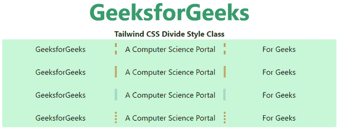

# 顺风 CSS 分割样式

> 原文:[https://www.geeksforgeeks.org/tailwind-css-divide-style/](https://www.geeksforgeeks.org/tailwind-css-divide-style/)

这个类在[顺风 CSS](https://www.geeksforgeeks.org/css-tailwind-introduction/) 中接受很多值，其中所有的属性都以类的形式被覆盖。通过使用这个类，我们可以设置任何划分的划分风格。

**划分风格类别:**

*   **除固:**该类用于设置*固*形态的*除*类。
*   **除虚化:**该类用于设置*虚化*形态中的*除*类。
*   **分割线:**该类用于设置*分割线*形式的*分割线*类。
*   **分双:**该类用于设置*双*形态的*分双*类。
*   **除-无:**此类用于无*除*。

**语法:**

```css
<element class="divide-{style}">...</element>
```

**示例:**

## 超文本标记语言

```css
<!DOCTYPE html> 
<html> 
<head> 
    <link
    href="https://unpkg.com/tailwindcss@^1.0/dist/tailwind.min.css"
    rel="stylesheet"> 
</head> 

<body class="text-center"> 
    <h1 class="text-green-600 text-5xl font-bold"> 
    GeeksforGeeks 
    </h1> 
    <b>Tailwind CSS Divide Style Class</b> 
    <div class="mx-4 bg-green-200 p-2">
        <div class="grid grid-cols-3 divide-x-4 
                    divide-pink-500 divide-dashed">
            <div>GeeksforGeeks</div>
            <div>A Computer Science Portal</div>
            <div>For Geeks</div>
        </div>
        <br>
        <div class="grid grid-cols-3 divide-x-4 
                    divide-yellow-500 divide-solid">
            <div>GeeksforGeeks</div>
            <div>A Computer Science Portal</div>
            <div>For Geeks</div>
        </div>
        <br>
        <div class="grid grid-cols-3 divide-x-4 
                    divide-gray-500 divide-double">
            <div>GeeksforGeeks</div>
            <div>A Computer Science Portal</div>
            <div>For Geeks</div>
        </div>
        <br>
        <div class="grid grid-cols-3 divide-x-4 
                    divide-red-500 divide-dotted">
            <div>GeeksforGeeks</div>
            <div>A Computer Science Portal</div>
            <div>For Geeks</div>
        </div>
    </div>
</body> 
</html>
```

**输出:**



划分样式类