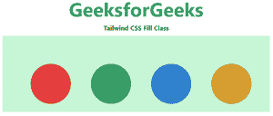

# 顺风 CSS 填充

> 原文:[https://www.geeksforgeeks.org/tailwind-css-fill/](https://www.geeksforgeeks.org/tailwind-css-fill/)

这个类在[顺风 CSS](https://www.geeksforgeeks.org/css-tailwind-introduction/) 中接受很多值，其中所有的属性都以类的形式被覆盖。这个类是一个演示属性，用于设置 SVG 形状的颜色。在 CSS 中，我们已经通过使用 [CSS 填充属性](https://www.geeksforgeeks.org/css-fill-property/)做到了这一点。

**FIll 类:**

*   **填充-当前:**该类用于将一个 SVG 的填充颜色设置为当前文本颜色。通过将此类与现有的文本颜色实用程序相结合，可以轻松设置元素的填充颜色。

**语法:**

```css
<svg class="fill-current">...</svg>
```

**示例:**

## 超文本标记语言

```css
<!DOCTYPE html> 
<html> 
<head> 
    <link href= 
"https://unpkg.com/tailwindcss@^1.0/dist/tailwind.min.css"
        rel="stylesheet"> 
</head> 

<body class="text-center mx-4 space-y-2"> 
    <h1 class="text-green-600 text-5xl font-bold"> 
        GeeksforGeeks 
    </h1> 
    <b>Tailwind CSS Fill Class</b> 
    <div class="bg-green-200 m-4 grid grid-flow-col gap-4 p-5"> 
        <svg height="150px" width="600px"
          xmlns="http://www.w3.org/2000/svg"
          version="1.1"> 
         <circle class="fill-current text-red-600" cx="100"
                cy="100" r="50" /> 
         <circle class="fill-current text-green-600" cx="250"
                cy="100" r="50" /> 
          <circle class="fill-current text-blue-600" cx="400"
                cy="100" r="50" /> 
          <circle class="fill-current text-yellow-600" cx="550"
                cy="100" r="50" /> 
         </svg> 
    </div> 
</body> 

</html> 
```

**输出:**

