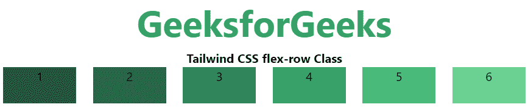
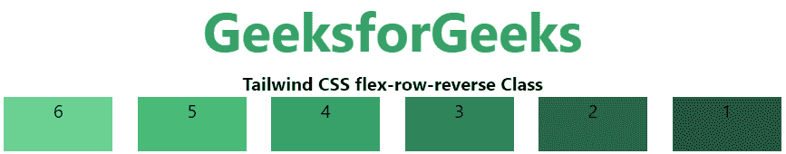
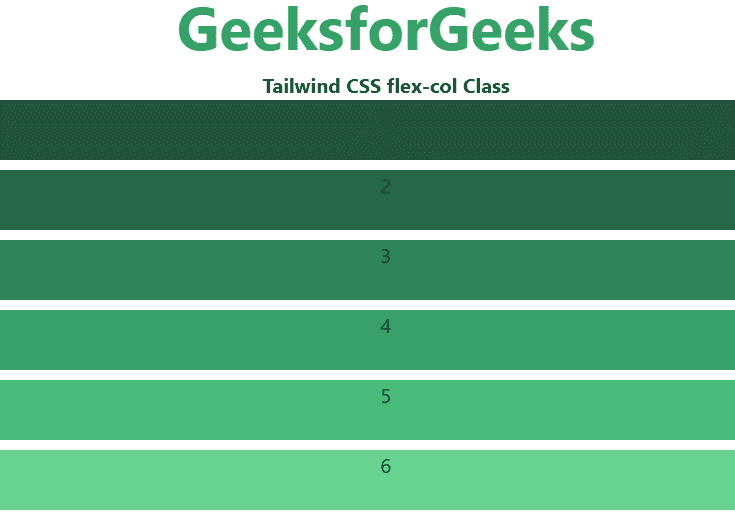
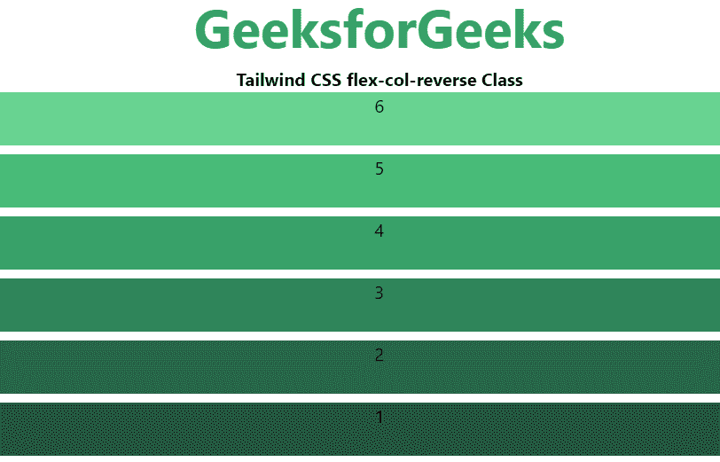

# 泰国风 CSS 弹性方向

> 原文:[https://www.geeksforgeeks.org/tailwind-css-flex-direction/](https://www.geeksforgeeks.org/tailwind-css-flex-direction/)

CSS [flexbox](https://www.geeksforgeeks.org/introduction-to-css-flexbox/) 是开发前端的一个重要特性，CSS 中有四个方向可用，所以在[顺风 CSS](https://www.geeksforgeeks.org/css-tailwind-introduction/) 中，所有属性都以类的形式覆盖。是 [CSS 柔性方向属性](https://www.geeksforgeeks.org/css-flex-direction-property/)的替代品，用于前端的快速开发。

**注意:**要激活伸缩方向，您必须在伸缩方向类之前将伸缩类包含在元素中。

**弯曲方向:**

*   **伸缩排**
*   **弯曲-行-反转**
*   **flex-col**
*   **挠曲-压缩-反转**

以下是每个方向的示例代码和输出:

**flex-row:** 它按照与文本方向相同的方式排列行。伸缩方向的默认值是一行。它用于指定该项具有正常的文本方向。它使项目在行中遵循正常的文本方向。

**语法:**

```css
<element class="flex flex-row"> Contents... </element>
```

**示例:**

## 超文本标记语言

```css
<!DOCTYPE html> 

<head> 
    <title>Tailwind flex-row Class</title> 

    <link href=
"https://unpkg.com/tailwindcss@^1.0/dist/tailwind.min.css" 
          rel="stylesheet"> 
</head> 

<body class="text-center"> 
    <h1 class="text-green-600 text-5xl font-bold">
        GeeksforGeeks
    </h1> 

    <b>Tailwind CSS flex-row Class</b> 

    <div id="main" class="flex flex-row justify-evenly"> 
        <div class="bg-green-900 w-24 h-12">1</div> 
        <div class="bg-green-800 w-24 h-12">2</div> 
        <div class="bg-green-700 w-24 h-12">3</div> 
        <div class="bg-green-600 w-24 h-12">4</div> 
        <div class="bg-green-500 w-24 h-12">5</div> 
        <div class="bg-green-400 w-24 h-12">6</div> 
    </div> 
</body> 

</html>
```

**输出:**



**flex-row-reverse:** 这个类用来跟随相反的文本方向。正如我们在输出中看到的，它使伸缩项的顺序与文本方向完全相反。

**语法:**

```css
<element class="flex flex-row-reverse"> Contents... </element>
```

**示例:**

## 超文本标记语言

```css
<!DOCTYPE html> 

<head> 
    <title>Tailwind flex-row-reverse Class</title> 

    <link href=
"https://unpkg.com/tailwindcss@^1.0/dist/tailwind.min.css" 
          rel="stylesheet"> 
</head> 

<body class="text-center"> 
    <h1 class="text-green-600 text-5xl font-bold">
        GeeksforGeeks
    </h1> 

    <b>Tailwind CSS flex-row-reverse Class</b> 

    <div id="main" class="flex flex-row-reverse justify-evenly"> 
        <div class="bg-green-900 w-24 h-12">1</div> 
        <div class="bg-green-800 w-24 h-12">2</div> 
        <div class="bg-green-700 w-24 h-12">3</div> 
        <div class="bg-green-600 w-24 h-12">4</div> 
        <div class="bg-green-500 w-24 h-12">5</div> 
        <div class="bg-green-400 w-24 h-12">6</div> 
    </div> 
</body> 

</html> 
```

**输出:**



**flex-col:** 它将行排列为与文本方向相同但从上到下的列。它用于指定项目具有正常的从上到下方向。正如我们在输出中看到的，它使项目遵循正常的从上到下的方向。

**语法:**

```css
<element class="flex flex-col"> Contents... </element>
```

**示例:**

## 超文本标记语言

```css
<!DOCTYPE html> 

<head> 
    <title>Tailwind flex-col Class</title> 

    <link href=
"https://unpkg.com/tailwindcss@^1.0/dist/tailwind.min.css" 
          rel="stylesheet"> 
</head> 

<body class="text-center"> 
    <h1 class="text-green-600 text-5xl font-bold">
        GeeksforGeeks
    </h1> 

    <b>Tailwind CSS flex-col Class</b> 

    <div id="main" class="flex flex-col gap-y-2"> 
        <div class="bg-green-900 w-30 h-12">1</div> 
        <div class="bg-green-800 w-30 h-12">2</div> 
        <div class="bg-green-700 w-30 h-12">3</div> 
        <div class="bg-green-600 w-30 h-12">4</div> 
        <div class="bg-green-500 w-30 h-12">5</div> 
        <div class="bg-green-400 w-30 h-12">6</div> 
    </div> 
</body> 

</html> 
```

**输出:**



**flex-col-reverse:** 它将该行排列为与 row-reverse 从下到上相同的列。它用于指定项目具有从底部到顶部的正常方向。正如我们在输出中看到的，它使项目遵循正常的从下到上的方向。

**语法:**

```css
<element class="flex flex-col-reverse"> Contents... </element>
```

**示例:**

## 超文本标记语言

```css
<!DOCTYPE html> 

<head> 
    <title>Tailwind flex-col-reverse Class</title> 

    <link href=
"https://unpkg.com/tailwindcss@^1.0/dist/tailwind.min.css" 
          rel="stylesheet"> 
</head> 

<body class="text-center"> 
    <h1 class="text-green-600 text-5xl font-bold">
        GeeksforGeeks
    </h1> 

    <b>Tailwind CSS flex-col-reverse Class</b> 

    <div id="main" class="flex flex-col-reverse gap-y-2"> 
        <div class="bg-green-900 w-30 h-12">1</div> 
        <div class="bg-green-800 w-30 h-12">2</div> 
        <div class="bg-green-700 w-30 h-12">3</div> 
        <div class="bg-green-600 w-30 h-12">4</div> 
        <div class="bg-green-500 w-30 h-12">5</div> 
        <div class="bg-green-400 w-30 h-12">6</div> 
    </div> 
</body> 

</html> 
```

**输出:**

