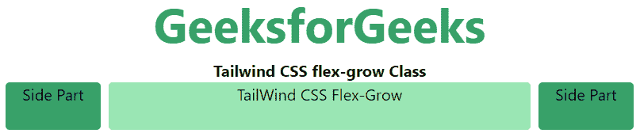

# 顺风 CSS 伸缩生长

> 原文:[https://www.geeksforgeeks.org/tailwind-css-flex-grow/](https://www.geeksforgeeks.org/tailwind-css-flex-grow/)

CSS [flexbox](https://www.geeksforgeeks.org/introduction-to-css-flexbox/) 是开发前端的一个重要特性，在 tailwind CSS 中有两个 flex-grow 可用，所有属性都以类的形式覆盖。为了前端的快速发展，它是 [CSS flex grow Property](https://www.geeksforgeeks.org/css-flex-grow-property/) 的替代品。此类指定与容器中的其他项目相比，项目将增长多少。换句话说，它是一个项目相对于同一个容器中的其他项目增长的能力。

**弯曲生长:**

*   **flex-grow-0**
*   **弯曲生长**

**flex-grow-0:** 这个类限制了增长特性，与同一个容器中的内容相比，它具有项目增长的能力。

**语法:**

```
<element class="flex-grow-0"> Contents... </element>
```

**示例:**

## 超文本标记语言

```
<!DOCTYPE html> 
<html>

<head> 
    <title>Tailwind flex-grow-0 Class</title> 

    <link href=
"https://unpkg.com/tailwindcss@^1.0/dist/tailwind.min.css" 
          rel="stylesheet"> 
</head> 

<body class="text-center"> 
    <h1 class="text-green-600 text-5xl font-bold">
        GeeksforGeeks
    </h1> 

    <b>Tailwind CSS flex-grow-0 Class</b> 

    <div id="main" class="flex justify-evenly space-x-2 ml-12 mr-12">
        <div class="rounded bg-green-600 flex-grow h-12 ">
            Side Part</div> 
        <div class="rounded bg-green-300 flex-grow-0 h-12">
            Flex-Grow-0
        </div> 
        <div class="rounded bg-green-600 flex-grow h-12 mr-12">
            Side Part</div> 
    </div> 
</body> 

</html>
```

**输出:**


**flex-grow:** 这个类并不限制生长特性，它拥有一个物品相对于屏幕上剩余空间的生长能力。

**语法:**

```
<element class="flex-grow"> Contents... </element>
```

**示例:**

## 超文本标记语言

```
<!DOCTYPE html>
<html>

<head> 
    <title>Tailwind flex-grow Class</title> 

    <link href=
"https://unpkg.com/tailwindcss@^1.0/dist/tailwind.min.css" 
          rel="stylesheet"> 
</head> 

<body class="text-center"> 
    <h1 class="text-green-600 text-5xl font-bold">
        GeeksforGeeks
    </h1> 

    <b>Tailwind CSS flex-grow Class</b> 

    <div id="main" class="flex justify-evenly space-x-2 ml-12 mr-12"> 
        <div class="rounded bg-green-600  w-24 h-12 ">Side Part</div> 
        <div class="rounded bg-green-300 flex-grow h-12">
            TailWind CSS Flex-Grow
        </div> 
        <div class="rounded bg-green-600  w-24 h-12 mr-12">Side Part</div>
    </div> 
</body> 

</html>
```

**输出:**

