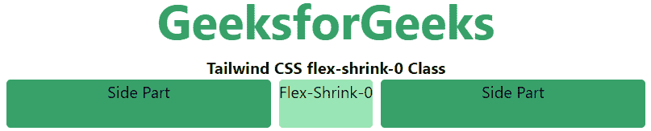
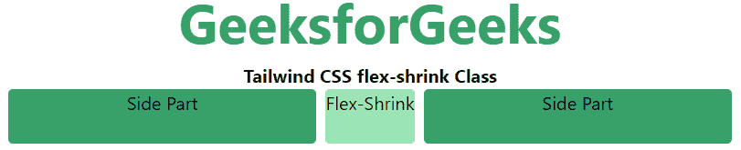

# 顺风 CSS 伸缩收缩

> 原文:[https://www.geeksforgeeks.org/tailwind-css-flex-shrink/](https://www.geeksforgeeks.org/tailwind-css-flex-shrink/)

CSS [flexbox](https://www.geeksforgeeks.org/introduction-to-css-flexbox/) 是开发前端的一个重要特性，在 tailwind CSS 中有两个 flex-shrink 可用，所有属性都以类的形式覆盖。为了前端的快速发展，它是 [CSS 伸缩属性](https://www.geeksforgeeks.org/css-flex-shrink-property/)的替代品。此类指定与容器中的其他项相比，该项将缩小多少。它定义了一个元素相对于放置在同一个容器中的其他元素收缩的能力。

**挠曲收缩:**

*   **伸缩-收缩-0**
*   **伸缩**

**flex-shrink-0:** 这个类限制了收缩特性，与同一个容器中的内容相比，它具有收缩项目的能力。

**语法:**

```html
<element class="flex-shrink-0"> Contents... </element>
```

**示例:**

## 超文本标记语言

```html
<!DOCTYPE html> 
<html>

<head> 
    <title>Tailwind flex-shrink-0 Class</title> 

    <link href=
"https://unpkg.com/tailwindcss@^1.0/dist/tailwind.min.css" 
          rel="stylesheet"> 
</head> 

<body class="text-center"> 
    <h1 class="text-green-600 text-5xl font-bold">
        GeeksforGeeks
    </h1> 

    <b>Tailwind CSS flex-shrink-0 Class</b> 

    <div id="main" class="flex justify-evenly space-x-2 ml-12 mr-12"> 
        <div class="rounded bg-green-600 flex-1 h-12 ">
            Side Part</div> 
        <div class="rounded bg-green-300 flex-shrink-0 h-12">
            Flex-Shrink-0
        </div> 
        <div class="rounded bg-green-600 flex-1 h-12 mr-12">
            Side Part</div> 
    </div> 
</body> 

</html>
```

**输出:**



**伸缩:**该类不限制收缩功能。与屏幕上剩余的空间相比，它能够缩小一个项目，并适应剩余的空间。

**语法:**

```html
<element class="flex-shrink">..</element>
```

**示例:**

## 超文本标记语言

```html
<!DOCTYPE html>
<html>

<head> 
    <title>Tailwind flex-shrink Class</title> 

    <link href=
"https://unpkg.com/tailwindcss@^1.0/dist/tailwind.min.css" 
          rel="stylesheet"> 
</head> 

<body class="text-center"> 
    <h1 class="text-green-600 text-5xl font-bold">
        GeeksforGeeks
    </h1> 

    <b>Tailwind CSS flex-shrink Class</b> 

    <div id="main" class="flex justify-evenly space-x-2 ml-12 mr-12"> 
        <div class="rounded bg-green-600 flex-grow w-16 h-12 ">
            Side Part</div> 
        <div class="rounded bg-green-300 flex-shrink h-12">
            Flex-Shrink
        </div> 
        <div class="rounded bg-green-600 flex-grow w-16 h-12">
            Side Part</div> 
    </div> 
</body> 

</html>
```

**输出:**

