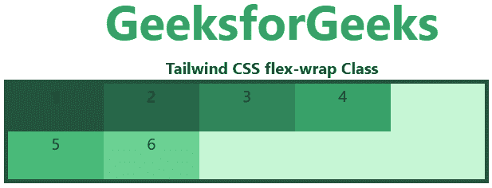
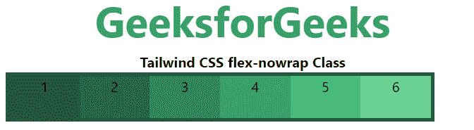
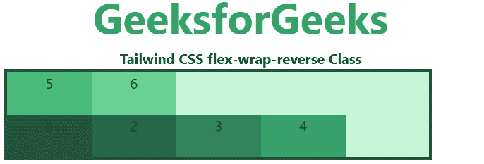

# 顺风 CSS 伸缩缠绕

> 原文:[https://www.geeksforgeeks.org/tailwind-css-flex-wrap/](https://www.geeksforgeeks.org/tailwind-css-flex-wrap/)

CSS [flexbox](https://www.geeksforgeeks.org/introduction-to-css-flexbox/) 是开发前端的一个重要特性，CSS 中有三个包装，所以在顺风 CSS 中所有的属性都以类的形式被覆盖。是 [CSS 柔包属性](https://www.geeksforgeeks.org/css-flex-wrap-property/)的替代品，用于前端的快速开发。

**注意:**要激活 flex-wrap，您必须在 flex-wrap 类之前将 flex 类包含在元素中。

**弯曲包装:**

*   **软包**
*   **弹性新 rap**
*   **flex-wrap-reversal**

**折绕:**该类用于将折绕项拆分成多行。它使弹性项根据弹性项宽度换行到多行。

**语法:**

```css
<element class="flex flex-wrap"> Contents... </element>
```

**示例:**

## 超文本标记语言

```css
<!DOCTYPE html> 
<html>

<head> 
    <title>Tailwind flex-wrap Class</title> 

    <link href=
"https://unpkg.com/tailwindcss@^1.0/dist/tailwind.min.css" 
          rel="stylesheet"> 
</head> 

<body class="text-center"> 
    <h1 class="text-green-600 text-5xl font-bold">
        GeeksforGeeks
    </h1> 

    <b>Tailwind CSS flex-wrap Class</b> 

    <div id="main" class="ml-24 h-28 w-2/3 flex flex-wrap 
                          bg-green-200 border-solid border-4 
                          border-green-900"> 
        <div class="bg-green-900 w-24 h-12">1</div> 
        <div class="bg-green-800 w-24 h-12">2</div> 
        <div class="bg-green-700 w-24 h-12">3</div> 
        <div class="bg-green-600 w-24 h-12">4</div> 
        <div class="bg-green-500 w-24 h-12">5</div> 
        <div class="bg-green-400 w-24 h-12">6</div> 
    </div> 
</body> 

</html>
```

**输出:**



**flex-nowrap:**wrap-flex 的默认值是 nowrap。它用于指定项目没有包装。它使项目换行。

**语法:**

```css
<element class="flex flex-nowrap"> Contents... </element>
```

**示例:**

## 超文本标记语言

```css
<!DOCTYPE html> 
<html>

<head> 
    <title>Tailwind flex-nowrap Class</title> 

    <link href=
"https://unpkg.com/tailwindcss@^1.0/dist/tailwind.min.css" 
          rel="stylesheet"> 
</head> 

<body class="text-center"> 
    <h1 class="text-green-600 text-5xl font-bold">
        GeeksforGeeks
    </h1> 

    <b>Tailwind CSS flex-nowrap Class</b> 

    <div id="main" class="ml-24 h-28 w-2/3 flex flex-nowrap 
                          bg-green-200 border-solid border-4 
                          border-green-900"> 
        <div class="bg-green-900 w-24 h-12">1</div> 
        <div class="bg-green-800 w-24 h-12">2</div> 
        <div class="bg-green-700 w-24 h-12">3</div> 
        <div class="bg-green-600 w-24 h-12">4</div> 
        <div class="bg-green-500 w-24 h-12">5</div> 
        <div class="bg-green-400 w-24 h-12">6</div> 
    </div> 
</body> 

</html>
```

**输出:**



**折绕-反转:**当折绕项目折绕到新行时，此类用于反转折绕项目的流程。

**语法:**

```css
<element class="flex flex-wrap-reverse"> Contents... </element>
```

**示例:**

## 超文本标记语言

```css
<!DOCTYPE html> 
<html>

<head> 
    <title>Tailwind flex-wrap-reverse Class</title> 

    <link href=
"https://unpkg.com/tailwindcss@^1.0/dist/tailwind.min.css" 
          rel="stylesheet"> 
</head> 

<body class="text-center"> 
    <h1 class="text-green-600 text-5xl font-bold">
        GeeksforGeeks
    </h1> 

    <b>Tailwind CSS flex-wrap-reverse Class</b> 

    <div id="main" class="ml-24 h-28 w-2/3 flex 
        flex-wrap-reverse bg-green-200 border-solid 
        border-4 border-green-900"> 
        <div class="bg-green-900 w-24 h-12">1</div> 
        <div class="bg-green-800 w-24 h-12">2</div> 
        <div class="bg-green-700 w-24 h-12">3</div> 
        <div class="bg-green-600 w-24 h-12">4</div> 
        <div class="bg-green-500 w-24 h-12">5</div> 
        <div class="bg-green-400 w-24 h-12">6</div> 
    </div> 
</body> 

</html>
```

**输出:**

