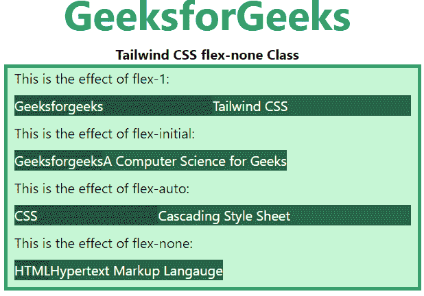

# 泰风 CSS Flex

> 原文:[https://www.geeksforgeeks.org/tailwind-css-flex/](https://www.geeksforgeeks.org/tailwind-css-flex/)

CSS [flexbox](https://www.geeksforgeeks.org/introduction-to-css-flexbox/) 是开发前端的一个重要特性，在 tailwind CSS 中有四个 flex 可用，所有属性都以类的形式覆盖。是 [CSS flex Property](https://www.geeksforgeeks.org/css-flex-property/) 的替代品，用于前端的快速开发。用于设置柔性物品的长度。flex 类响应速度快，对移动设备友好。很容易定位子元素和主容器。页边距不会随着内容页边距而折叠。无需编辑 HTML 部分，任何元素的顺序都可以轻松更改。

弹性:

*   flex-1
*   **弯曲-初始**
*   **灵活车**
*   **柔性-无**

**flex-1:** 指定项目相对于其余灵活项目增长多少的比率。它已被用于允许灵活项目根据需要增长和收缩，忽略其初始大小。

**语法:**

```css
 <element class="flex-1"> Contents... </element>
```

**示例:**

## 超文本标记语言

```css
<!DOCTYPE html> 
<html>

<head> 
    <title>Tailwind flex-1 Class</title> 

    <link href=
"https://unpkg.com/tailwindcss@^1.0/dist/tailwind.min.css" 
          rel="stylesheet"> 
</head> 

<body> 
    <h1 class="text-center text-green-600 text-5xl font-bold">
        GeeksforGeeks
    </h1> 

    <p class="text-center font-bold">Tailwind CSS flex-1 Class</p>

    <div id="main" class="bg-green-200 border-4 
                          border-green-600 w-2/3 ml-32"> 
        <p class="ml-2">This is the effect of flex-1:</p>

        <div class="flex m-2 text-white">
            <div class="bg-green-900 flex-1">
                Geeksforgeeks
            </div> 
            <div class="bg-green-800 flex-1">
                Tailwind CSS
            </div> 
        </div>
        <p class="ml-2">
                This is the effect of flex-initial:
         </p>

        <div class="flex m-2 text-white">
            <div class="bg-green-900 flex-initial">
                Geeksforgeeks
            </div> 
            <div class="bg-green-800 flex-initial">
                A Computer Science for Geeks
            </div> 
        </div>
        <p class="ml-2">
            This is the effect of flex-auto:
        </p>

        <div class="flex m-2 text-white">
            <div class="bg-green-900 flex-auto">
                CSS
            </div> 
            <div class="bg-green-800 flex-auto">
                Cascading Style Sheet
            </div> 
        </div>
        <p class="ml-2">
                This is the effect of flex-none:
        </p>

        <div class="flex m-2 text-white">
            <div class="bg-green-900 flex-none">
                HTML
            </div> 
            <div class="bg-green-800 flex-none">
                Hypertext Markup Langauge
            </div> 
        </div>
    </div> 
</body> 

</html>
```

**输出:**


**flex-initial:** 这个类定义了该项目相对于其他灵活项目将增长多少。考虑到它的初始大小，它已经被用来允许伸缩项收缩但不增长

**语法:**

```css
  <element class="flex-initial">..</element>
```

**示例:**

## 超文本标记语言

```css
<!DOCTYPE html> 
<html>

<head> 
    <title>Tailwind flex-initial Class</title> 

    <link href=
"https://unpkg.com/tailwindcss@^1.0/dist/tailwind.min.css" 
          rel="stylesheet"> 
</head> 

<body> 
    <h1 class="text-center text-green-600 text-5xl font-bold">
        GeeksforGeeks
    </h1> 

    <p class="text-center font-bold">Tailwind CSS flex-initial Class</p>

    <div id="main" class="bg-green-200 border-4 
                          border-green-600 w-2/3 ml-32"> 
        <p class="ml-2">This is the effect of flex-1:</p>

        <div class="flex m-2 text-white">
            <div class="bg-green-900 flex-1">
                Geeksforgeeks
            </div> 
            <div class="bg-green-800 flex-1">
                Tailwind CSS
            </div> 
        </div>
        <p class="ml-2">
                This is the effect of flex-initial:
         </p>

        <div class="flex m-2 text-white">
            <div class="bg-green-900 flex-initial">
                Geeksforgeeks
            </div> 
            <div class="bg-green-800 flex-initial">
                A Computer Science for Geeks
            </div> 
        </div>
        <p class="ml-2">
            This is the effect of flex-auto:
        </p>

        <div class="flex m-2 text-white">
            <div class="bg-green-900 flex-auto">
                CSS
            </div> 
            <div class="bg-green-800 flex-auto">
                Cascading Style Sheet
            </div> 
        </div>
        <p class="ml-2">
                This is the effect of flex-none:
        </p>

        <div class="flex m-2 text-white">
            <div class="bg-green-900 flex-none">
                HTML
            </div> 
            <div class="bg-green-800 flex-none">
                Hypertext Markup Langauge
            </div> 
        </div>
    </div> 
</body> 

</html>
```

**输出:**


**flex-auto:** 该类指定该项目相对于灵活项目的内容将增长多少。它已被用于允许灵活项目根据需要增长和收缩，忽略其初始大小。

**语法:**

```css
  <element class="flex-auto"> Contents... </element>
```

**示例:**

## 超文本标记语言

```css
<!DOCTYPE html> 
<html>

<head> 
    <title>Tailwind flex-auto Class</title> 

    <link href=
"https://unpkg.com/tailwindcss@^1.0/dist/tailwind.min.css" 
          rel="stylesheet"> 
</head> 

<body> 
    <h1 class="text-center text-green-600 text-5xl font-bold">
        GeeksforGeeks
    </h1> 

    <p class="text-center font-bold">Tailwind CSS flex-auto Class</p>

    <div id="main" class="bg-green-200 border-4 
                          border-green-600 w-2/3 ml-32"> 
        <p class="ml-2">This is the effect of flex-1:</p>

        <div class="flex m-2 text-white">
            <div class="bg-green-900 flex-1">
                Geeksforgeeks
            </div> 
            <div class="bg-green-800 flex-1">
                Tailwind CSS
            </div> 
        </div>
        <p class="ml-2">
                This is the effect of flex-initial:
         </p>

        <div class="flex m-2 text-white">
            <div class="bg-green-900 flex-initial">
                Geeksforgeeks
            </div> 
            <div class="bg-green-800 flex-initial">
                A Computer Science for Geeks
            </div> 
        </div>
        <p class="ml-2">
            This is the effect of flex-auto:
        </p>

        <div class="flex m-2 text-white">
            <div class="bg-green-900 flex-auto">
                CSS
            </div> 
            <div class="bg-green-800 flex-auto">
                Cascading Style Sheet
            </div> 
        </div>
        <p class="ml-2">
                This is the effect of flex-none:
        </p>

        <div class="flex m-2 text-white">
            <div class="bg-green-900 flex-none">
                HTML
            </div> 
            <div class="bg-green-800 flex-none">
                Hypertext Markup Langauge
            </div> 
        </div>
    </div> 
</body> 

</html>
```

**输出:**


**flex-none:** 如果有额外的可用空间或没有额外的可用空间，该类将限制设置为增加或缩小元素。这是为了防止 flex 项目增长或收缩，它只根据内容的大小占用空间

**语法:**

```css
  <element class="flex-none">..</element>
```

**示例:**

## 超文本标记语言

```css
<!DOCTYPE html> 
<html>

<head> 
    <title>Tailwind flex-none Class</title> 

    <link href=
"https://unpkg.com/tailwindcss@^1.0/dist/tailwind.min.css" 
          rel="stylesheet"> 
</head> 

<body> 
    <h1 class="text-center text-green-600 text-5xl font-bold">
        GeeksforGeeks
    </h1> 

    <p class="text-center font-bold">Tailwind CSS flex-none Class</p>

    <div id="main" class="bg-green-200 border-4 
                          border-green-600 w-2/3 ml-32"> 
        <p class="ml-2">This is the effect of flex-1:</p>

        <div class="flex m-2 text-white">
            <div class="bg-green-900 flex-1">
                Geeksforgeeks
            </div> 
            <div class="bg-green-800 flex-1">
                Tailwind CSS
            </div> 
        </div>
        <p class="ml-2">
                This is the effect of flex-initial:
         </p>

        <div class="flex m-2 text-white">
            <div class="bg-green-900 flex-initial">
                Geeksforgeeks
            </div> 
            <div class="bg-green-800 flex-initial">
                A Computer Science for Geeks
            </div> 
        </div>
        <p class="ml-2">
            This is the effect of flex-auto:
        </p>

        <div class="flex m-2 text-white">
            <div class="bg-green-900 flex-auto">
                CSS
            </div> 
            <div class="bg-green-800 flex-auto">
                Cascading Style Sheet
            </div> 
        </div>
        <p class="ml-2">
                This is the effect of flex-none:
        </p>

        <div class="flex m-2 text-white">
            <div class="bg-green-900 flex-none">
                HTML
            </div> 
            <div class="bg-green-800 flex-none">
                Hypertext Markup Langauge
            </div> 
        </div>
    </div> 
</body> 

</html>
```

**输出:**

