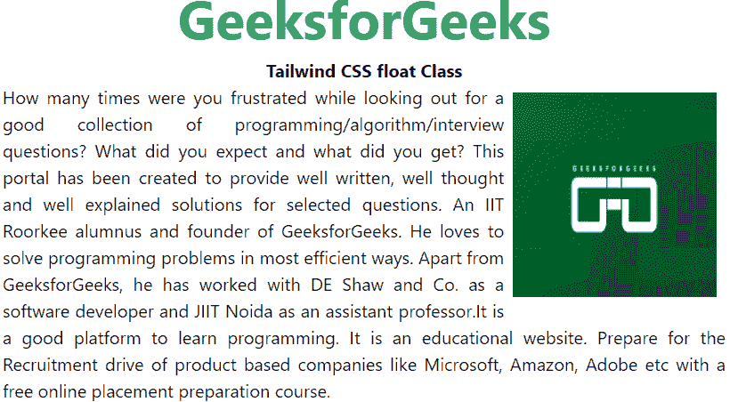
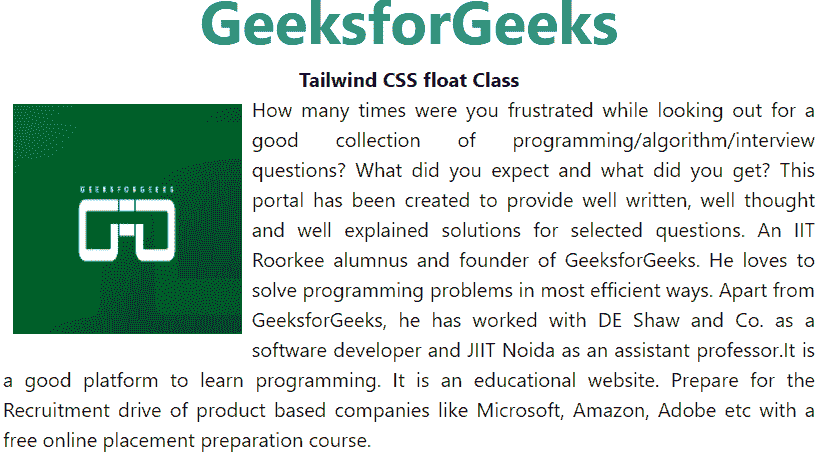
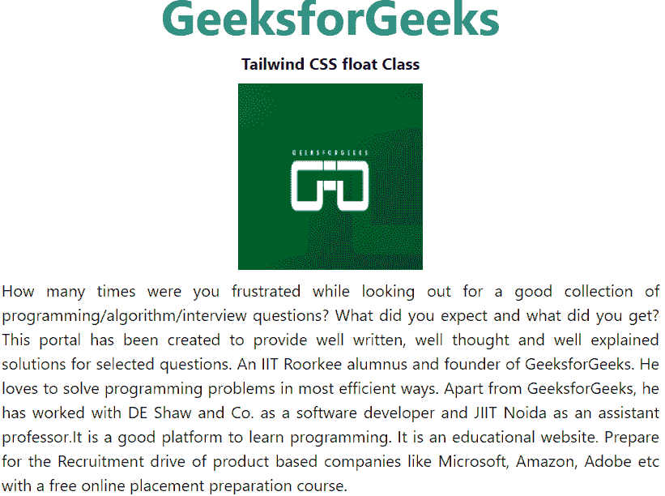

# 顺风 CSS 飘

> 原文:[https://www.geeksforgeeks.org/tailwind-css-float/](https://www.geeksforgeeks.org/tailwind-css-float/)

该类在[顺风 CSS](https://www.geeksforgeeks.org/css-tailwind-introduction/) 中接受多个值。它是 [CSS 浮动属性](https://www.geeksforgeeks.org/css-float/)的替代品。float 类定义了用于控制元素周围内容包装的内容流。

**浮动等级:**

*   向右浮动
*   向左浮动
*   浮动-无

**float-right:** 这个类用于使元素在容器的右侧浮动。

**语法:**

```css
<element class="float-right">...</element>
```

**示例:**

## 超文本标记语言

```css
<!DOCTYPE html> 
<head>    
    <link href=
"https://unpkg.com/tailwindcss@^1.0/dist/tailwind.min.css" 
          rel="stylesheet"> 
</head> 

<body class="text-center"> 
<center>
    <h1 class="text-green-600 text-5xl font-bold">
        GeeksforGeeks
    </h1> 
    <b>Tailwind CSS float Class</b> 
    <div class="mx-10">
    
    <p class="text-justify    ">How many times were you frustrated while looking out  
      for a good collection of programming/algorithm/interview 
      questions? What did you expect and what did you get?  
      This portal has been created to provide well written,  
      well thought and well explained solutions for selected  
      questions. An IIT Roorkee alumnus and founder of  
      GeeksforGeeks. He loves to solve programming problems 
      in most efficient ways. Apart from GeeksforGeeks, he  
      has worked with DE Shaw and Co. as a software developer  
      and JIIT Noida as an assistant professor.It is a good  
      platform to learn programming. It is an educational  
      website. Prepare for the Recruitment drive of product  
      based companies like Microsoft, Amazon, Adobe etc with 
      a free online placement preparation course.</p>

</center>
</body> 

</html>
```

**输出:**



**float-left:** 这个类用于使元素在容器的左侧浮动。

**语法:**

```css
<element class="float-left"">...</element>
```

**示例:**

## 超文本标记语言

```css
<!DOCTYPE html> 
<head> 

    <link href=
"https://unpkg.com/tailwindcss@^1.0/dist/tailwind.min.css" 
          rel="stylesheet"> 
</head> 

<body class="text-center"> 
<center>
    <h1 class="text-green-600 text-5xl font-bold">
        GeeksforGeeks
    </h1> 
    <b>Tailwind CSS float Class</b> 
    <div class="mx-10">
    
    <p class="text-justify    ">How many times were you frustrated while looking out  
      for a good collection of programming/algorithm/interview 
      questions? What did you expect and what did you get?  
      This portal has been created to provide well written,  
      well thought and well explained solutions for selected  
      questions. An IIT Roorkee alumnus and founder of  
      GeeksforGeeks. He loves to solve programming problems 
      in most efficient ways. Apart from GeeksforGeeks, he  
      has worked with DE Shaw and Co. as a software developer  
      and JIIT Noida as an assistant professor.It is a good  
      platform to learn programming. It is an educational  
      website. Prepare for the Recruitment drive of product  
      based companies like Microsoft, Amazon, Adobe etc with 
      a free online placement preparation course.</p>

</center>
</body> 

</html>
```

**输出:**



**float-none:** 这个类用于使元素在默认位置浮动。我们使用中心标签，因此图像被放置在中心。

**语法:**

```css
<element class="float-none">...</element>
```

**示例:**

## 超文本标记语言

```css
<!DOCTYPE html> 
<head>    
    <link href=
"https://unpkg.com/tailwindcss@^1.0/dist/tailwind.min.css" 
          rel="stylesheet"> 
</head> 

<body class="text-center"> 
<center>
    <h1 class="text-green-600 text-5xl font-bold">
        GeeksforGeeks
    </h1> 
    <b>Tailwind CSS float Class</b> 
    <div class="mx-10">
    
    <p class="text-justify    ">How many times were you frustrated while looking out  
      for a good collection of programming/algorithm/interview 
      questions? What did you expect and what did you get?  
      This portal has been created to provide well written,  
      well thought and well explained solutions for selected  
      questions. An IIT Roorkee alumnus and founder of  
      GeeksforGeeks. He loves to solve programming problems 
      in most efficient ways. Apart from GeeksforGeeks, he  
      has worked with DE Shaw and Co. as a software developer  
      and JIIT Noida as an assistant professor.It is a good  
      platform to learn programming. It is an educational  
      website. Prepare for the Recruitment drive of product  
      based companies like Microsoft, Amazon, Adobe etc with 
      a free online placement preparation course.</p>

</center>
</body> 

</html>
```

**输出:**

