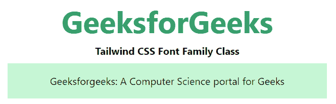
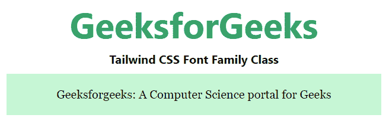
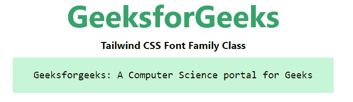

# 顺风 CSS 字体家族

> 原文:[https://www.geeksforgeeks.org/tailwind-css-font-family/](https://www.geeksforgeeks.org/tailwind-css-font-family/)

这个类在[顺风 CSS](https://www.geeksforgeeks.org/css-tailwind-introduction/) 中接受了很多字体名称，其中所有的属性都是以类的形式覆盖的。它是 [CSS 字体家族属性](https://www.geeksforgeeks.org/css-font-family-property/)的替代品。此类用于指定元素的字体。它可以有多种字体作为备份系统，即如果浏览器不支持一种字体，则可以使用另一种字体。

**字体系列类别:**

*   字体-San
*   字体衬线
*   字体-单声道

**字体-San:**本类用于申请网页安全*无衬线*字体系列，如*ui-无衬线*、*系统-ui* 、*苹果系统*、

**语法:**

```html
<element class="font-sans">...</element>
```

**示例:**

## 超文本标记语言

```html
<!DOCTYPE html> 
<head> 
    <link href=
"https://unpkg.com/tailwindcss@^1.0/dist/tailwind.min.css" 
          rel="stylesheet"> 
</head> 

<body class="text-center mx-4 space-y-2"> 
    <h1 class="text-green-600 text-5xl font-bold">
        GeeksforGeeks
    </h1> 
    <b>Tailwind CSS Font Family Class</b> 
    <div class="mx-24 bg-green-200">
        <p class="font-sans p-4">
            Geeksforgeeks: A Computer Science portal for Geeks
        </p>

    </div>
</body> 

</html>
```

**输出:**



**字体衬线:**该类用于应用像 *ui-serif* 、 *Georgia* 、 *Cambria* 、 *Times New Roman* 、 *Times* 、 *serif* 等 websafe 衬线字体系列。

**语法:**

```html
<element class="font-serif">...</element>
```

**示例:**

## 超文本标记语言

```html
<!DOCTYPE html> 
<head> 
    <link href=
"https://unpkg.com/tailwindcss@^1.0/dist/tailwind.min.css" 
          rel="stylesheet"> 
</head> 

<body class="text-center mx-4 space-y-2"> 
    <h1 class="text-green-600 text-5xl font-bold">
        GeeksforGeeks
    </h1> 
    <b>Tailwind CSS Font Family Class</b> 
    <div class="mx-24 bg-green-200">
        <p class="font-serif  p-4">
            Geeksforgeeks: A Computer Science portal for Geeks
        </p>

    </div>
</body> 

</html> 
```

**输出:**



**字体-mono:** 此类用于应用 websafe 等等宽字体系列*ui-等宽*、*SFMono-常规*、 *Menlo* 、*摩纳哥*、 *Consolas* 、“*解放 Mono* 、“*快递新品*、*等宽字体系列。*

**语法:**

```html
<element class="font-mono">...</element>
```

**示例:**

## 超文本标记语言

```html
<!DOCTYPE html> 
<head> 
    <link href=
"https://unpkg.com/tailwindcss@^1.0/dist/tailwind.min.css" 
          rel="stylesheet"> 
</head> 

<body class="text-center mx-4 space-y-2"> 
    <h1 class="text-green-600 text-5xl font-bold">
        GeeksforGeeks
    </h1> 
    <b>Tailwind CSS Font Family Class</b> 
    <div class="mx-24 bg-green-200">
        <p class="font-mono p-4">
            Geeksforgeeks: A Computer Science portal for Geeks
        </p>

    </div>
</body> 

</html> 
```

**输出:**

