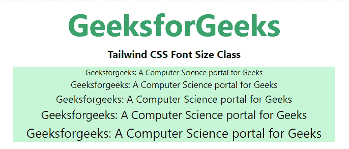

# 泰风 CSS 字体大小

> 原文:[https://www.geeksforgeeks.org/tailwind-css-font-size/](https://www.geeksforgeeks.org/tailwind-css-font-size/)

这个类在[顺风 CSS](https://www.geeksforgeeks.org/css-tailwind-introduction/) 中接受很多值，其中所有的属性都以类的形式被覆盖。它是 [CSS 字号属性](https://www.geeksforgeeks.org/css-font-size-property/)的替代品。此类用于设置 HTML 文档中文本的字体大小。

**字体大小类别:**

*   **text-xs:** 这个类将文本大小定义为超小。
*   **text-sm:** 这个类将文本大小定义为小。
*   **文本基:**这个类将文本大小定义为基大小。
*   **text-lg:** 这个类将文本大小定义为大。
*   **text-xl:** 这个类将文本大小定义为超大。
*   **文本-2xl:** 这个类定义文本大小为 2 倍超大。
*   **text-3xl:** 这个类将文本大小定义为 3 倍超大。
*   **text-4xl:** 这个类将文本大小定义为 4 倍超大。
*   **text-5xl:** 这个类将文本大小定义为 5 倍超大。
*   **text-6xl:** 这个类将文本大小定义为 6 倍超大。
*   **文本-7xl:** 这个类将文本大小定义为 7 倍超大。
*   **text-8xl:** 这个类将文本大小定义为 8 倍超大。
*   **text-9xl:** 这个类将文本大小定义为 9 倍超大。

**注意:**用上述要求的尺寸改变组件中的尺寸。

**语法:**

```html
<element class="text-size">...</element>
```

**示例:**

## 超文本标记语言

```html
<!DOCTYPE html> 
<head> 
    <link href=
"https://unpkg.com/tailwindcss@^1.0/dist/tailwind.min.css" 
          rel="stylesheet"> 
</head> 

<body class="text-center mx-4 space-y-2"> 
    <h1 class="text-green-600 text-5xl font-bold">
        GeeksforGeeks
    </h1> 
    <b>Tailwind CSS Font Size Class</b> 
    <div class="mx-24 bg-green-200">
        <p class="text-xs">
            Geeksforgeeks: A Computer Science portal for Geeks
        </p>

        <p class="text-sm">
            Geeksforgeeks: A Computer Science portal for Geeks
        </p>

        <p class="text-base">
            Geeksforgeeks: A Computer Science portal for Geeks
        </p>

        <p class="text-lg">
            Geeksforgeeks: A Computer Science portal for Geeks
        </p>

        <p class="text-xl">
            Geeksforgeeks: A Computer Science portal for Geeks
        </p>

    </div>
</body> 

</html> 
```

**输出:**

