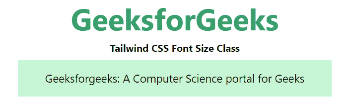

# 泰风 CSS 字体平滑

> 哎哎哎:# t0]https://www . geeksforgeeks . org/taiwind-CSS-font-smoothing/

这个类在[顺风 CSS](https://www.geeksforgeeks.org/css-tailwind-introduction/) 中接受很多值，其中所有的属性都以类的形式被覆盖。它是 CSS *字体平滑*属性的替代。此类用于控制元素的字体平滑。

**字体平滑类:**

*   抗锯齿
*   子像素抗锯齿

**注:**本职业不显示任何效果。

**抗锯齿:**该工具用于使用灰度抗锯齿渲染文本。

**语法:**

```html
<element class="antialiased">...</element>
```

**示例:**

## 超文本标记语言

```html
<!DOCTYPE html> 
<head> 
    <link href=
"https://unpkg.com/tailwindcss@^1.0/dist/tailwind.min.css" 
          rel="stylesheet"> 
</head> 

<body class="text-center mx-4 space-y-2"> 
    <h1 class="text-green-600 text-5xl font-bold">
        GeeksforGeeks
    </h1> 
    <b>Tailwind CSS Font Size Class</b> 
    <div class="mx-24 bg-green-200">
        <p class="text-lg p-4 antialiased">
            Geeksforgeeks: A Computer 
            Science portal for Geeks
        </p>
    </div>
</body> 

</html> 
```

**输出:**



错认假频伪信号

**子像素抗锯齿:**这个工具是使用子像素抗锯齿来渲染文本。

**语法:**

```html
<element class="subpixel-antialiased">...</element>
```

**示例:**

## 超文本标记语言

```html
<!DOCTYPE html> 
<head> 
    <link href=
"https://unpkg.com/tailwindcss@^1.0/dist/tailwind.min.css" 
          rel="stylesheet"> 
</head> 

<body class="text-center mx-4 space-y-2"> 
    <h1 class="text-green-600 text-5xl font-bold">
        GeeksforGeeks
    </h1> 

    <b>Tailwind CSS Font Size Class</b> 

    <div class="mx-24 bg-green-200">
        <p class="text-lg p-4 subpixel-antialiased">
            Geeksforgeeks: A Computer 
            Science portal for Geeks
        </p>
    </div>
</body> 

</html> 
```

**输出:**


亚像素反放大