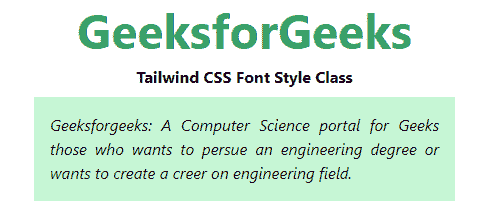
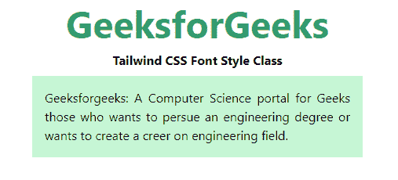

# 泰风 CSS 字体风格

> 原文:[https://www.geeksforgeeks.org/tailwind-css-font-style/](https://www.geeksforgeeks.org/tailwind-css-font-style/)

这个类在[顺风 CSS](https://www.geeksforgeeks.org/css-tailwind-introduction/) 中接受很多值，其中所有的属性都以类的形式被覆盖。它是 [CSS 字体属性](https://www.geeksforgeeks.org/css-font-style-property/)的替代品。如果我们想给任何类型的文本设计，那么我们可以使用顺风 CSS 字体样式类。它有助于创造更好的用户体验。

**字体样式类:**

*   斜体的
*   非斜体

**斜体:**该类用于将字体样式设置为*斜体*。

**语法:**

```
<element class="italic">...</element>
```

**示例:**

## 超文本标记语言

```
<!DOCTYPE html>
<head>
    <link href=
"https://unpkg.com/tailwindcss@^1.0/dist/tailwind.min.css"
        rel="stylesheet">
</head>

<body class="text-center mx-4 space-y-2">
    <h1 class="text-green-600 text-5xl font-bold">
        GeeksforGeeks
    </h1>
    <b>Tailwind CSS Font Style Class</b>
    <div class="mx-24 bg-green-200">
        <p class="p-4 italic text-justify">
            Geeksforgeeks: A Computer Science portal
            for Geeks those who wants to persue an engineering
            degree or wants to create a career on engineering field.
        </p>

    </div>
</body>

</html>                   
```

**输出:**



斜体字体样式

**非斜体:**这基本上是默认字体，用于在不同断点处重置斜体文本。

**语法:**

```
<element class="non-italic">...</element>
```

**示例:**

## 超文本标记语言

```
<!DOCTYPE html>
<head>
    <link href=
"https://unpkg.com/tailwindcss@^1.0/dist/tailwind.min.css"
        rel="stylesheet">
</head>

<body class="text-center mx-4 space-y-2">
    <h1 class="text-green-600 text-5xl font-bold">
        GeeksforGeeks
    </h1>
    <b>Tailwind CSS Font Style Class</b>
    <div class="mx-24 bg-green-200">
        <p class="p-4 non-italic text-justify">
            Geeksforgeeks: A Computer Science portal
            for Geeks those who wants to persue an engineering
            degree or wants to create a career on engineering field.
        </p>

    </div>
</body>

</html>                   
```

**输出:**

