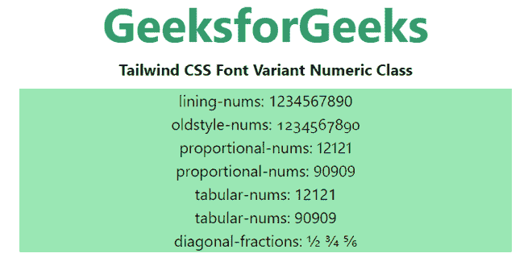

# 顺风 CSS 字体变体数字

> 原文:[https://www . geesforgeks . org/tail wind-CSS-font-variant-numeric/](https://www.geeksforgeeks.org/tailwind-css-font-variant-numeric/)

这个类在[顺风 CSS](https://www.geeksforgeeks.org/css-tailwind-introduction/) 中接受很多值，其中所有的属性都以类的形式被覆盖。它是 [CSS 字体变体数字属性](https://www.geeksforgeeks.org/css-font-variant-numeric-property/)的替代。此类用于控制替代字形的使用。这是根据单位或标记，如数字或分数来完成的。

**字体变体数字类:**

*   **正常-nums:** 使用*正常-nums* 将移除*字体变体数字*类的每个效果。
*   **序数:**该值直接表示开放式值，即*或*。该术语使用特殊的符号作为序数标记。
*   **砍零:**这个类*砍零*用了一个带斜线的零，证明在区分 0 和 o 的时候非常有用
*   **衬里编号:**该等级对应于开放类型值，即 *lnum* 。该关键字激活基线上的数字。
*   **oldstyle-nums:** 此类对应于开放类型值，即 *onum* 。此关键字激活一些数字有后代的图形集。
*   **比例数:**这个类激活那些不是每个数都是相同大小的规范。其开型值为 *pnum* 。
*   **表格-nums:** 该类开放类型值为 *tnum* 。它激活那些一组数字大小相同的数字组。
*   **对角分数:**它的开型值是 *frac* 。这将激活那些分子和分母变小并用斜线隔开的数字集。
*   **堆叠分数:**它的开型值是 arac。这将激活那些分子和分母变小、堆叠并由水平线隔开的图形集。

**语法:**

```css
<element class="Font-Variant-Numeric">...</element>
```

**示例:**

## 超文本标记语言

```css
<!DOCTYPE html> 
<head> 
    <link href=
"https://unpkg.com/tailwindcss@^1.0/dist/tailwind.min.css" 
          rel="stylesheet"> 
</head> 

<body class="text-center mx-4 space-y-2"> 
    <h1 class="text-green-600 text-5xl font-bold">
        GeeksforGeeks
    </h1> 
    <b>Tailwind CSS Font Variant Numeric Class</b> 
    <div class="bg-green-300 mx-24 h-full">
        <p class="lining-nums">lining-nums: 1234567890</p>

        <p class="oldstyle-nums">oldstyle-nums: 1234567890</p>

        <p class="proportional-nums">proportional-nums: 12121</p>

        <p class="proportional-nums">proportional-nums: 90909</p>

        <p class="tabular-nums">tabular-nums: 12121</p>

        <p class="tabular-nums">tabular-nums: 90909</p>

        <p class="diagonal-fractions">
            diagonal-fractions: 1/2 3/4 5/6
        </p>
    </div>
</body> 

</html>
```

**输出:**

