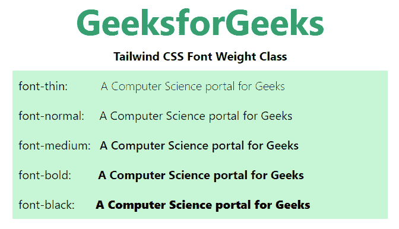

# 顺风 CSS 字体粗细

> 原文:[https://www.geeksforgeeks.org/tailwind-css-font-weight/](https://www.geeksforgeeks.org/tailwind-css-font-weight/)

这个类在[顺风 CSS](https://www.geeksforgeeks.org/css-tailwind-introduction/) 中接受很多值，其中所有的属性都以类的形式被覆盖。它是 [CSS 字体粗细属性](https://www.geeksforgeeks.org/css-font-weight-property/)的替代品。此类用于设置与 HTML 文本一起使用的字体的粗细。应用的字体粗细将取决于浏览器中使用的*字体系列*。例如，某些*字体系列*仅在特定权重下可用。

**字体粗细等级:**

*   **字体粗细:**该类将*字体粗细*设置为 100。
*   **字体-超亮:**该类将*字体-粗细*设置为 200。
*   **字体-亮:**本类设置*字体-重*为 300。
*   **字体-正常:**该类将*字体-粗细*设置为 400。
*   **字体-中:**该类将*字体-粗细*设置为 500。
*   **字体半粗体:**该类将*字体粗细*设置为 600。
*   **字体加粗:**该类将*字体粗细*设置为 700。
*   **字体加粗:**该类将*字体粗细*设置为 800。
*   **字体-黑色:**该类将*字体-粗细*设置为 900。

**注:**用上述要求的重量改变组件中的重量。

**语法:**

```
<element class="font-{weight}">...</element>
```

**示例:**

## 超文本标记语言

```
<!DOCTYPE html>

<head>
    <link href=
"https://unpkg.com/tailwindcss@^1.0/dist/tailwind.min.css"
        rel="stylesheet">
</head>

<body class="text-center mx-4 space-y-2">
    <h1 class="text-green-600 text-5xl font-bold">
        GeeksforGeeks
    </h1>

    <b>Tailwind CSS Font Weight Class</b>

    <div class="mx-24 bg-green-200">
        <p class="p-2 text-justify">
            font-thin:
            <span class="font-thin pl-10">
                A Computer Science portal for Geeks
            </span>
        </p>

        <p class="p-2 text-justify">font-normal:
            <span class="font-normal pl-4">
                A Computer Science portal for Geeks
            </span>
        </p>

        <p class="p-2 text-justify">font-medium:
            <span class="font-medium pl-2">
                A Computer Science portal for Geeks
            </span>
        </p>

        <p class="p-2 text-justify">font-bold:
            <span class="font-bold pl-8">
                A Computer Science portal for Geeks
            </span>
        </p>

        <p class="p-2 text-justify">font-black:
            <span class="font-black pl-6">
                A Computer Science portal for Geeks
            </span>
        </p>
    </div>
</body>

</html>
```

**输出:**

