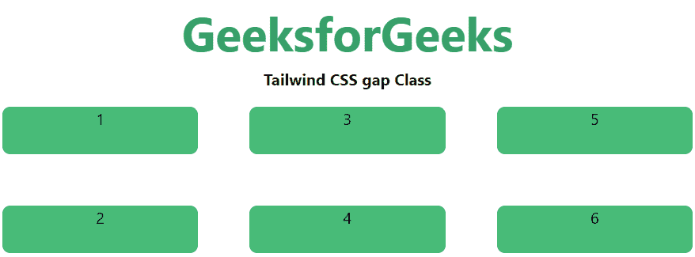
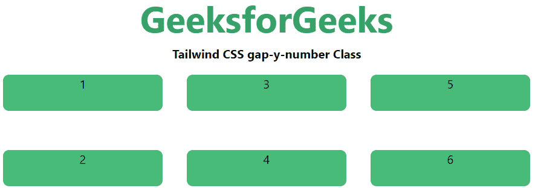

# 泰风 CSS 间隙

> 原文:[https://www.geeksforgeeks.org/tailwind-css-gap/](https://www.geeksforgeeks.org/tailwind-css-gap/)

这个类在 tailwind CSS 中接受多个值，所有的属性都以类的形式被覆盖。它是 [CSS 间隙属性](https://www.geeksforgeeks.org/css-grid-auto-rows-property/)的替代。这个类用于设置行和列之间的间距。就像分别使用列间隙和行间隙一样，这样就可以简单地使用可以给定列间隙和行间隙的间隙属性。

**间隙:**间隙共有 105 类，x 轴和 y 轴也分别包含在内。

*   **间隙-0**
*   **间隙-x-0**
*   **间隙-y-0**
*   **间隙-0.5**
*   **间隙-x-0.5**
*   **间隙-y-0.5**
*   **间隙-1**
*   **间隙-x-1**
*   **间隙-y-1**
*   **间隙-1.5**
*   **间隙-x-1.5**
*   **间隙-y-1.5**
*   **间隙-2**
*   **间隙-x-2**
*   **间隙-y-2**
*   **间隙-2.5**
*   **间隙-x-2.5**
*   **间隙-y-2.5**
*   **间隙-3**
*   **间隙-x-3**
*   **间隙-y-3**
*   **间隙-3.5**
*   **间隙-x-3.5**
*   **间隙-y-3.5**
*   **间隙-4**
*   **间隙-x-4**
*   **间隙-y-4**
*   **间隙-5**
*   **间隙-x-5**
*   **间隙-y-5**
*   **间隙-6**
*   **间隙-x-6**
*   **间隙-y-6**
*   **间隙-7**
*   **间隙-x-7**
*   **间隙-y-7**
*   **间隙-8**
*   **间隙-x-8**
*   **间隙-y-8**
*   **间隙-9**
*   **间隙-x-9**
*   **间隙-y-9**
*   **间隙-10**
*   **间隙-x-10**
*   **间隙-y-10**
*   **间隙-11**
*   **间隙-x-11**
*   **间隙-y-11**
*   **间隙-12**
*   **间隙-x-12**
*   **间隙-y-12**
*   **间隙-14**
*   **间隙-x-14**
*   **间隙-y-14**
*   **间隙-16**
*   **间隙-x-16**
*   **间隙-y-16**
*   **间隙-20**
*   **间隙-x-20**
*   **间隙-y-20**
*   **间隙-24**
*   **间隙-x-24**
*   **间隙-y-24**
*   **间隙-28**
*   **间隙-x-28**
*   **间隙-y-28**
*   **间隙-32**
*   **间隙-x-32**
*   **间隙-y-32**
*   **间隙-36**
*   **间隙-x-36**
*   **间隙-y-36**
*   **间隙-40**
*   **间隙-x-40**
*   **间隙-y-40**
*   **间隙-44**
*   **间隙-x-44**
*   **间隙-y-44**
*   **间隙-48**
*   **间隙-x-48**
*   **间隙-y-48**
*   **间隙-52**
*   **间隙-x-52**
*   **间隙-y-52**
*   **间隙-56**
*   **间隙-x-56**
*   **间隙-y-56**
*   **间隙-60**
*   **间隙-x-60**
*   **间隙-y-60**
*   **间隙-64**
*   **间隙-x-64**
*   **间隙-y-64**
*   **间隙-72**
*   **间隙-x-72**
*   **间隙-y-72**
*   **间隙-80**
*   **间隙-x-80**
*   **间隙-y-80**
*   **间隙-96**
*   **间隙-x-96**
*   **间隙-y-96**
*   **间隙-px**
*   **间隙-x-px**
*   **间隙-y-px**

**间隙-编号:**通过仅使用间隙类而不提及轴，将根据提及的编号保持在两个轴中:

**语法:**

```
<element class="gap-number"> Contents... </element>
```

**参数:**该类接受一个如上所述的单一值，如下所述:

*   **编号:**保存元素的间隙大小。

**示例:**

## 超文本标记语言

```
<!DOCTYPE html>
<html>

<head>
    <title>Tailwind gap Class</title>
    <link href=
"https://unpkg.com/tailwindcss@^1.0/dist/tailwind.min.css"
          rel="stylesheet">
</head>

<body class="text-center">
    <h1 class="text-green-600 text-5xl font-bold">
        GeeksforGeeks
    </h1>

    <b>Tailwind CSS gap Class</b>

    <div id="main" class="grid grid-rows-2
                          grid-flow-col gap-5">
        <div class="bg-green-500 rounded-lg m-4 h-12">1</div>
        <div class="bg-green-500 rounded-lg m-4 h-12">2</div>
        <div class="bg-green-500 rounded-lg m-4 h-12">3</div>
        <div class="bg-green-500 rounded-lg m-4 h-12">4</div>
        <div class="bg-green-500 rounded-lg m-4 h-12">5</div>
        <div class="bg-green-500 rounded-lg m-4 h-12">6</div>
    </div>
</body>

</html>
```

**输出:**



**gap-x-number:** 通过使用 gap-x 类将间隙保持在 x 轴上根据提到的数字:

**语法:**

```
<element class="gap-x-number"> Contents... </element>
```

**示例:**

## 超文本标记语言

```
<!DOCTYPE html>
<html>

<head>
    <title>Tailwind gap-x-number Class</title>
    <link href=
"https://unpkg.com/tailwindcss@^1.0/dist/tailwind.min.css"
          rel="stylesheet">
</head>

<body class="text-center">
    <h1 class="text-green-600 text-5xl font-bold">
        GeeksforGeeks
    </h1>

    <b>Tailwind CSS gap-x-number Class</b>

    <div id="main" class="grid grid-rows-2
                          grid-flow-col gap-x-5">
        <div class="bg-green-500 rounded-lg m-4 h-12">1</div>
        <div class="bg-green-500 rounded-lg m-4 h-12">2</div>
        <div class="bg-green-500 rounded-lg m-4 h-12">3</div>
        <div class="bg-green-500 rounded-lg m-4 h-12">4</div>
        <div class="bg-green-500 rounded-lg m-4 h-12">5</div>
        <div class="bg-green-500 rounded-lg m-4 h-12">6</div>
    </div>
</body>

</html>
```

**输出:**


**gap-y-number:** 通过使用 gap-y 类将间隙保持在 x 轴上根据提到的数字:

**语法:**

```
<element class="gap-y-number"> Contents... </element>
```

**示例:**

## 超文本标记语言

```
<!DOCTYPE html>
<html>

<head>
    <title>Tailwind gap-y-number Class</title>
    <link href=
"https://unpkg.com/tailwindcss@^1.0/dist/tailwind.min.css"
          rel="stylesheet">
</head>

<body class="text-center">
    <h1 class="text-green-600 text-5xl font-bold">
        GeeksforGeeks
    </h1>

    <b>Tailwind CSS gap-y-number Class</b>

    <div id="main" class="grid grid-rows-2
                          grid-flow-col gap-y-5">
        <div class="bg-green-500 rounded-lg m-4 h-12">1</div>
        <div class="bg-green-500 rounded-lg m-4 h-12">2</div>
        <div class="bg-green-500 rounded-lg m-4 h-12">3</div>
        <div class="bg-green-500 rounded-lg m-4 h-12">4</div>
        <div class="bg-green-500 rounded-lg m-4 h-12">5</div>
        <div class="bg-green-500 rounded-lg m-4 h-12">6</div>
    </div>
</body>

</html>
```

**输出:**

