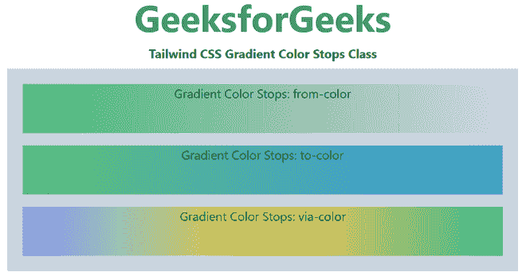

# 顺风 CSS 渐变颜色停止

> 原文:[https://www . geesforgeks . org/tail wind-CSS-gradient-color-stops/](https://www.geeksforgeeks.org/tailwind-css-gradient-color-stops/)

该类在[顺风 CSS](https://www.geeksforgeeks.org/css-tailwind-introduction/) 中接受多个值。所有的属性都包含在类的形式中。它是 [CSS 渐变属性](https://www.geeksforgeeks.org/css-gradients/)的替代品。

**渐变颜色停止类:**

*   **从-透明:**此类用于设置起始颜色透明度。
*   **从-当前:**该类用于采用将用作起始颜色的元素的父颜色。
*   **起始色号:**这个类用来设置渐变的起始色。
*   **过孔透明:**该类用于设置过孔颜色透明度。
*   **通孔电流:**该类用于采用将用作通孔颜色的元素的父颜色。
*   **via-color-number:** 该类用于设置 via 渐变的颜色。
*   **至-透明:**此类用于设置结束颜色透明度。
*   **to-current:** 此类用于采用将用作结束颜色的元素的父颜色。
*   **到色号:**这个类用来设置渐变的结束颜色。

**注意:**所有颜色都可以用(9 色)，这里的数字从 50、100、200 开始，以此类推直到 900。您可以从 [CSS Colors](https://www.geeksforgeeks.org/css-colors/) 中查看颜色的可用性。

**语法:**

```
<element class="gradient-color-stops">...</element>
```

**示例:**

## 超文本标记语言

```
<!DOCTYPE html>
<html>
<head>
    <link href=
"https://unpkg.com/tailwindcss@^1.0/dist/tailwind.min.css"
        rel="stylesheet">
</head>

<body class="text-center mx-4 space-y-2">
    <h1 class="text-green-600 text-5xl font-bold">
        GeeksforGeeks
    </h1>
    <b>Tailwind CSS Gradient Color Stops Class</b>
    <div class="bg-gray-400 m-4 grid grid-flow-row gap-4 p-5">
         <div class="bg-gradient-to-r from-green-500 h-16">
             Gradient Color Stops: from-color
         </div>
         <div class="bg-gradient-to-r from-green-500
                     to-blue-500 h-16">
             Gradient Color Stops: to-color
         </div>
         <div class="bg-gradient-to-r from-indigo-400
                     via-yellow-500 to-green-500 h-16">
             Gradient Color Stops: via-color
         </div>

    </div>
</body>

</html>
```

**输出:**



渐变颜色停止