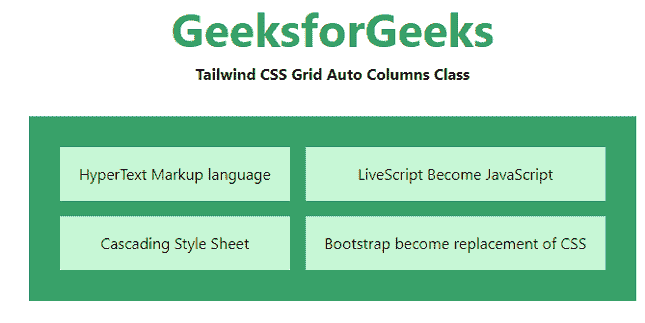
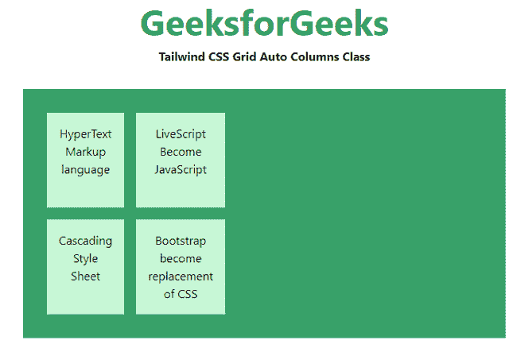
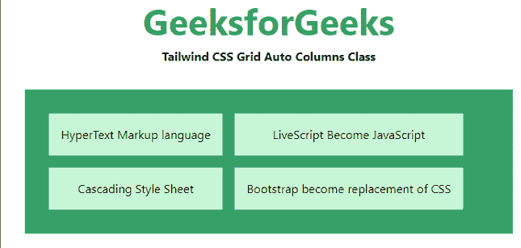
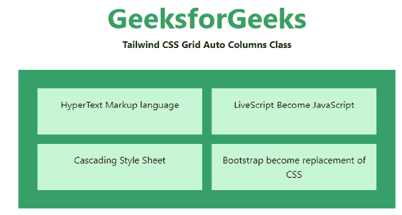

# 顺风 CSS 网格自动列

> 原文:[https://www . geesforgeks . org/tail wind-CSS-grid-auto-columns/](https://www.geeksforgeeks.org/tailwind-css-grid-auto-columns/)

该类在[顺风 CSS](https://www.geeksforgeeks.org/css-tailwind-introduction/) 中接受多个值，其中所有属性都以类的形式覆盖。它是 [CSS 网格自动列属性](https://www.geeksforgeeks.org/css-grid-auto-columns-property/)的替代品。此类用于指定隐式生成的网格容器的列大小。此类用于实用程序来控制隐式创建的网格列的大小。

**网格自动列类:**

*   **自动 cols-auto**
*   **自动最小 cols**
*   **自动 cols-max**
*   **自动 cols-fr**

**自动-cols-auto:** 为默认值。大小根据容器的大小隐式确定。

**语法:**

```css
<element class="auto-cols-auto">..</element>
```

**示例:**

## 超文本标记语言

```css
<!DOCTYPE html> 
<html> 
    <head> 
    <link href= 
"https://unpkg.com/tailwindcss@^1.0/dist/tailwind.min.css"
        rel="stylesheet"> 
</head> 

<body class="text-center"> 
    <h1 class="text-green-600 text-5xl font-bold"> 
        GeeksforGeeks 
    </h1> 

    <b>Tailwind CSS Grid Auto Columns Class</b> 
        <div class ="m-8 p-8 grid bg-green-600 grid-rows-2 
                     grid-flow-col gap-4 auto-cols-auto"> 
            <div class = "p-4 bg-green-200">
                HyperText Markup language
            </div> 
            <div class = "p-4 bg-green-200">
                Cascading Style Sheet
            </div> 
            <div class = "p-4 bg-green-200">
                LiveScript Become JavaScript
            </div> 
            <div class = "p-4 bg-green-200">
                Bootstrap become replacement of CSS
            </div> 
        </div> 
    </body> 
</html> 
```

**输出:**



自动列分类

**自动 cols-min:** 根据容器中最小的物品指定尺寸。

**语法:**

```css
<element class="auto-cols-min">..</element>
```

**示例:**

## 超文本标记语言

```css
<!DOCTYPE html> 
<html> 
    <head> 
    <link href= 
"https://unpkg.com/tailwindcss@^1.0/dist/tailwind.min.css"
        rel="stylesheet"> 
</head> 

<body class="text-center"> 
    <h1 class="text-green-600 text-5xl font-bold"> 
        GeeksforGeeks 
    </h1> 

    <b>Tailwind CSS Grid Auto Columns Class</b> 
        <div class ="m-8 p-8 grid bg-green-600 grid-rows-2 
                     grid-flow-col gap-4 auto-cols-min"> 
            <div class = "p-4 bg-green-200">
                HyperText Markup language
            </div> 
            <div class = "p-4 bg-green-200">
                Cascading Style Sheet
            </div> 
            <div class = "p-4 bg-green-200">
                LiveScript Become JavaScript
            </div> 
            <div class = "p-4 bg-green-200">
                Bootstrap become replacement of CSS
            </div> 
        </div> 
    </body> 
</html>
```

**输出:**



**auto-cols-max:** 它根据容器中最大的物品指定尺寸。

**语法:**

```css
<element class="auto-cols-max">..</element>
```

**示例:**

## 超文本标记语言

```css
<!DOCTYPE html> 
<html> 
    <head> 
    <link href= 
"https://unpkg.com/tailwindcss@^1.0/dist/tailwind.min.css"
        rel="stylesheet"> 
</head> 

<body class="text-center"> 
    <h1 class="text-green-600 text-5xl font-bold"> 
        GeeksforGeeks 
    </h1> 

    <b>Tailwind CSS Grid Auto Columns Class</b> 
        <div class ="m-8 p-8 grid bg-green-600 grid-rows-2 
                     grid-flow-col gap-4 auto-cols-max"> 
            <div class = "p-4 bg-green-200">
                HyperText Markup language
            </div> 
            <div class = "p-4 bg-green-200">
                Cascading Style Sheet
            </div> 
            <div class = "p-4 bg-green-200">
                LiveScript Become JavaScript
            </div> 
            <div class = "p-4 bg-green-200">
                Bootstrap become replacement of CSS
            </div> 
        </div> 
    </body> 
</html> 
```

**输出:**



**auto-cols-fr:** 指定大于或等于 *min* 且小于或等于 *max* 范围内的尺寸。

**语法:**

```css
<element class="auto-cols-fr">..</element>
```

**示例:**

## 超文本标记语言

```css
<!DOCTYPE html> 
<html> 
    <head> 
    <link href= 
"https://unpkg.com/tailwindcss@^1.0/dist/tailwind.min.css"
        rel="stylesheet"> 
</head> 

<body class="text-center"> 
    <h1 class="text-green-600 text-5xl font-bold"> 
        GeeksforGeeks 
    </h1> 

    <b>Tailwind CSS Grid Auto Columns Class</b> 
        <div class ="m-8 p-8 grid bg-green-600 grid-rows-2 
                     grid-flow-col gap-4 auto-cols-fr"> 
            <div class = "p-4 bg-green-200">
                HyperText Markup language
            </div> 
            <div class = "p-4 bg-green-200">
                Cascading Style Sheet
            </div> 
            <div class = "p-4 bg-green-200">
                LiveScript Become JavaScript
            </div> 
            <div class = "p-4 bg-green-200">
                Bootstrap become replacement of CSS
            </div> 
        </div> 
    </body> 
</html> 
```

**输出:**



自动列分类