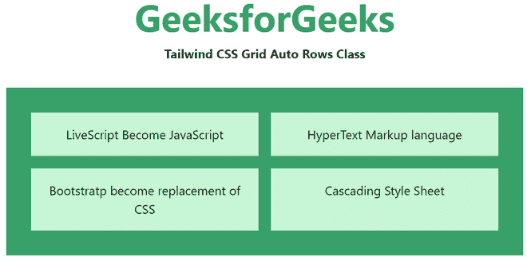
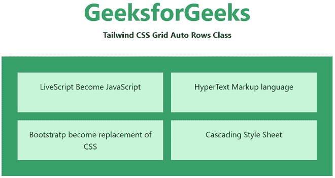

# 顺风 CSS 网格自动行

> 原文:[https://www.geeksforgeeks.org/tailwind-css-grid-auto-rows/](https://www.geeksforgeeks.org/tailwind-css-grid-auto-rows/)

这个类在[顺风 CSS](https://www.geeksforgeeks.org/css-tailwind-introduction/) 中接受多个值，其中所有的属性都以类的形式被覆盖。它是 [CSS 网格自动行属性](https://www.geeksforgeeks.org/css-grid-auto-rows-property/)的替代品。此类用于指定隐式生成的网格容器的行的大小。此类用于实用程序来控制隐式创建的网格行的大小。

**网格自动行类:**

1.  **自动排-自动**
2.  **自动最小行数**
3.  **自动最大行数**
4.  **自动行-fr**

**自动行-自动:**为默认值。大小根据容器的大小隐式确定。

**语法:**

```
<element class="auto-rows-auto">..</element>
```

**示例:**

## 超文本标记语言

```
<!DOCTYPE html> 
<html> 
    <head> 
    <link href= 
"https://unpkg.com/tailwindcss@^1.0/dist/tailwind.min.css"
        rel="stylesheet"> 
</head> 

<body class="text-center"> 
    <h1 class="text-green-600 text-5xl font-bold"> 
        GeeksforGeeks 
    </h1> 

    <b>Tailwind CSS Grid Auto Rows Class</b> 
        <div class ="m-8 p-8 grid bg-green-600 grid-cols-2 
                     grid-flow-row gap-4 auto-rows-auto">
            <div class = "p-4 bg-green-200">
                LiveScript Become JavaScript
            </div> 
            <div class = "p-4 bg-green-200">
                HyperText Markup language

            </div>  
            <div class = "p-4 bg-green-200">
                Bootstratp become replacement of CSS
            </div> 
            <div class = "p-4 bg-green-200">
                Cascading Style Sheet
            </div> 

        </div> 
    </body> 
</html> 
```

**输出:**



**自动最小行数:**它根据容器中最小的项目指定大小。

**语法:**

```
<element class="auto-rows-min">..</element>
```

**示例:**

## 超文本标记语言

```
<!DOCTYPE html> 
<html> 
    <head> 
    <link href= 
"https://unpkg.com/tailwindcss@^1.0/dist/tailwind.min.css"
        rel="stylesheet"> 
</head> 

<body class="text-center"> 
    <h1 class="text-green-600 text-5xl font-bold"> 
        GeeksforGeeks 
    </h1> 

    <b>Tailwind CSS Grid Auto Rows Class</b> 
        <div class ="m-8 p-8 grid bg-green-600 grid-cols-2 
                     grid-flow-row gap-4 auto-rows-min">
            <div class = "p-4 bg-green-200">
                LiveScript Become JavaScript
            </div> 
            <div class = "p-4 bg-green-200">
                HyperText Markup language

            </div>  
            <div class = "p-4 bg-green-200">
                Bootstratp become replacement of CSS
            </div> 
            <div class = "p-4 bg-green-200">
                Cascading Style Sheet
            </div> 

        </div> 
    </body> 
</html> 
```

**输出:**


**自动最大行数:**它根据容器中最大的项目指定大小。

**语法:**

```
<element class="auto-rows-max">..</element>
```

**示例:**

## 超文本标记语言

```
<!DOCTYPE html> 
<html> 
    <head> 
    <link href= 
"https://unpkg.com/tailwindcss@^1.0/dist/tailwind.min.css"
        rel="stylesheet"> 
</head> 

<body class="text-center"> 
    <h1 class="text-green-600 text-5xl font-bold"> 
        GeeksforGeeks 
    </h1> 

    <b>Tailwind CSS Grid Auto Rows Class</b> 
        <div class ="m-8 p-8 grid bg-green-600 grid-cols-2 
                     grid-flow-row gap-4 auto-rows-max">
            <div class = "p-4 bg-green-200">
                LiveScript Become JavaScript
            </div> 
            <div class = "p-4 bg-green-200">
                HyperText Markup language

            </div>  
            <div class = "p-4 bg-green-200">
                Bootstratp become replacement of CSS
            </div> 
            <div class = "p-4 bg-green-200">
                Cascading Style Sheet
            </div> 

        </div> 
    </body> 
</html> 
```

**输出:**


**自动行-fr:** 指定大于或等于*最小*且小于或等于*最大*范围内的尺寸。

**语法:**

```
<element class="auto-rows-fr">..</element>
```

**示例:**

## 超文本标记语言

```
<!DOCTYPE html> 
<html> 
    <head> 
    <link href= 
"https://unpkg.com/tailwindcss@^1.0/dist/tailwind.min.css"
        rel="stylesheet"> 
</head> 

<body class="text-center"> 
    <h1 class="text-green-600 text-5xl font-bold"> 
        GeeksforGeeks 
    </h1> 

    <b>Tailwind CSS Grid Auto Rows Class</b> 
        <div class ="m-8 p-8 grid bg-green-600 grid-cols-2 
                     grid-flow-row gap-4 auto-rows-fr">
            <div class = "p-4 bg-green-200">
                LiveScript Become JavaScript
            </div> 
            <div class = "p-4 bg-green-200">
                HyperText Markup language

            </div>  
            <div class = "p-4 bg-green-200">
                Bootstratp become replacement of CSS
            </div> 
            <div class = "p-4 bg-green-200">
                Cascading Style Sheet
            </div> 

        </div> 
    </body> 
</html>
```

**输出:**



自动行