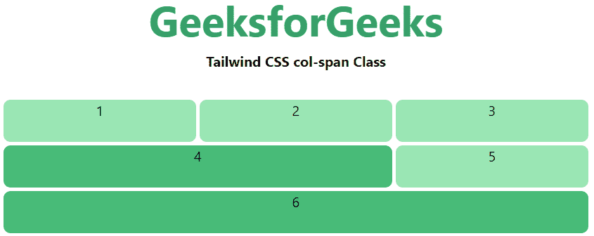
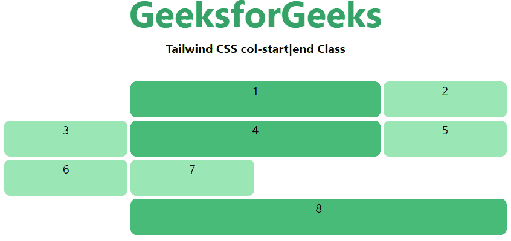

# 顺风 CSS 网格柱开始/结束

> 原文:[https://www . geesforgeks . org/tail wind-CSS-grid-column-start-end/](https://www.geeksforgeeks.org/tailwind-css-grid-column-start-end/)

这个类在 tailwind CSS 中接受多个值，所有的属性都以类的形式被覆盖。它是 CSS 中 [CSS 网格-列属性](https://www.geeksforgeeks.org/css-grid-column-property/)的替代，用于描述允许使用 Tailwind CSS 设计网格结构和控制网格项目放置的属性数量。它可以改变网格项目的布局，而不考虑它们的源顺序，这允许移动网格项目以适应这些变化的上下文，而不必修改底层标记。而是为了前端的快速发展。列的数量由给这个类的值的数量来设置。

**网格列开始/结束:**

*   **col-auto**
*   **col-span-1**
*   **col-span-2**
*   **col-span-3**
*   **col-span-4**
*   **col-span-5**
*   **col-span-6**
*   **col-span-7**
*   **col-span-8**
*   **col-span-9**
*   **col-span-10**
*   **col-span-11**
*   **col-span-12**
*   **col-span-full**
*   **col-start-1**
*   **col-start-2**
*   **col-start-3**
*   **col-start-4**
*   **col-start-5**
*   **col-start-6**
*   **col-start-7**
*   **col-start-8**
*   **col-start-9**
*   **col-start-10**
*   **col-start-11**
*   **col-start-12**
*   **col-start-13**
*   **col-start-auto**
*   **col-end-1**
*   **col-end-2**
*   **col-end-3**
*   **col-end-4**
*   **col-end-5**
*   **col-end-6**
*   **col-end-7**
*   **col-end-8**
*   **col-end-9**
*   **col-end-10**
*   **col-end-11**
*   **col-end-12**
*   **col-end-13**
*   **col-end-自动**

**跨越柱(col-span):** 这个类会覆盖跨度面积，提到数字后这个类会保存一个跨度的面积，我们都知道有 12 个网格柱或者你可以说 12 个网格跨度。

**语法:**

```css
<element class="col-span-number"> Contents... </element>
```

**类网格值:**该类接受如上所述的单个值，如下所述:

*   **数字:**它代表一个网格列的跨度数。

**示例:**

## 超文本标记语言

```css
<!DOCTYPE html>

<head>
    <title>Tailwind col-span Class</title>

    <link href=
"https://unpkg.com/tailwindcss@^1.0/dist/tailwind.min.css"
          rel="stylesheet">
</head>

<body class="text-center">
    <h1 class="text-green-600 text-5xl font-bold">
        GeeksforGeeks
    </h1>

    <b>Tailwind CSS col-span Class</b>

    <div id="main" class="m-8 grid grid-cols-3 gap-1 justify-evenly">
        <div class="bg-green-300 rounded-lg h-12">1</div>
        <div class="bg-green-300 rounded-lg h-12">2</div>
        <div class="bg-green-300 rounded-lg h-12">3</div>
        <div class="bg-green-500 col-span-2 rounded-lg h-12">4</div>
        <div class="bg-green-300 rounded-lg h-12">5</div>
        <div class="bg-green-500 col-span-3 rounded-lg h-12">6</div>
    </div>
</body>

</html>
```

**输出:**



**起始线和结束线(col-start|end):** 此类用于使元素在第 n 个网格线开始或结束。这些还可以与 col-span-number 实用程序结合使用，以跨越特定数量的列。

**注意:**我们可以将这个类和上述的类(span columns(col-span))合并，下面的例子会给你一个如何使用的思路。

**语法:**

```css
<element class="col-start|end-number">..</element>
```

**参数:**这个类接受一个参数，如上所述，如下所述:

*   **编号:**此参数定义网格列或普通列的开始或结束位置。

**示例:**

## 超文本标记语言

```css
<!DOCTYPE html>

<head>
    <title>Tailwind col-start|end Class</title>

    <link href=
"https://unpkg.com/tailwindcss@^1.0/dist/tailwind.min.css"
          rel="stylesheet">
</head>

<body class="text-center">
    <h1 class="text-green-600 text-5xl font-bold">
        GeeksforGeeks
    </h1>

    <b>Tailwind CSS col-start|end Class</b>

    <div id="main" class="m-8 grid grid-cols-4 gap-1 justify-evenly">
        <div class="bg-green-500 col-start-2 col-span-2
                    rounded-lg h-12">1</div>
        <div class="bg-green-300 rounded-lg h-12">2</div>
        <div class="bg-green-300 rounded-lg h-12">3</div>
        <div class="bg-green-500 col-start-2 col-end-4
                    rounded-lg h-12">4</div>
        <div class="bg-green-300 rounded-lg h-12">5</div>
        <div class="bg-green-300 rounded-lg h-12">6</div>
        <div class="bg-green-300 rounded-lg h-12">7</div>
        <div class="bg-green-500 col-start-2 col-span-3
                    rounded-lg h-12">8</div>
    </div>
</body>

</html>
```

**输出:**

