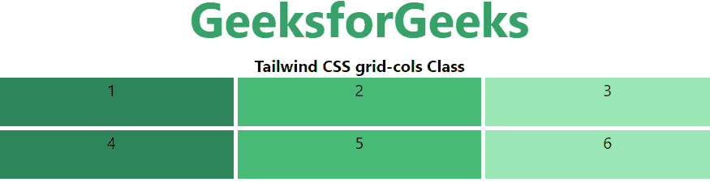

# 顺风 CSS 网格模板列

> 原文:[https://www . geesforgeks . org/tail wind-CSS-grid-template-columns/](https://www.geeksforgeeks.org/tailwind-css-grid-template-columns/)

这个类在 tailwind CSS 中接受多个值，所有的属性都以类的形式被覆盖。是 CSS 中 [CSS 网格-模板-列](https://www.geeksforgeeks.org/css-grid-template-columns-property/)属性的替代。它用于设置网格的列数和列的大小，这里我们也将这样做，但是为了前端的快速开发。列的数量由给这个类的值的数量来设置。

**网格模板列:**

*   **网格-列-1:** 每行只包含一列。
*   **网格-列-2:** 每行仅包含两列。
*   **网格-列-3:** 每行仅包含三列。
*   **网格-列-4:** 每行仅包含四列。
*   **网格-列-5:** 每行仅包含五列。
*   **网格-列-6:** 每行包含六列。
*   **网格列-7:** 每行包含七列。
*   **网格-列-8:** 每行包含八列。
*   **网格-列-9:** 每行包含 9 列。
*   **网格-列-10:** 每行包含十列。
*   **网格-列-11:** 每行包含 11 列。
*   **网格-列-12:** 每行包含 12 列。
*   **网格-列-无:**不遵循网格-列属性。

**语法:**

```
<element class="grid grid-cols-number"> Contents... </element>
```

**示例:**

## 超文本标记语言

```
<!DOCTYPE html> 
<html>

<head> 
    <title>Tailwind grid-cols Class</title> 

    <link href=
"https://unpkg.com/tailwindcss@^1.0/dist/tailwind.min.css" 
          rel="stylesheet"> 
</head> 

<body class="text-center"> 
    <h1 class="text-green-600 text-5xl font-bold">
        GeeksforGeeks
    </h1> 

    <b>Tailwind CSS grid-cols Class</b> 

    <div id="main" class="grid grid-cols-3 gap-1 justify-evenly"> 
        <div class="bg-green-700 w-26 h-12">1</div> 
        <div class="bg-green-500 w-26 h-12">2</div> 
        <div class="bg-green-300 w-26 h-12">3</div> 
        <div class="bg-green-700 w-26 h-12">4</div> 
        <div class="bg-green-500 w-26 h-12">5</div> 
        <div class="bg-green-300 w-26 h-12">6</div> 
    </div> 
</body> 

</html>
```

**输出:**

