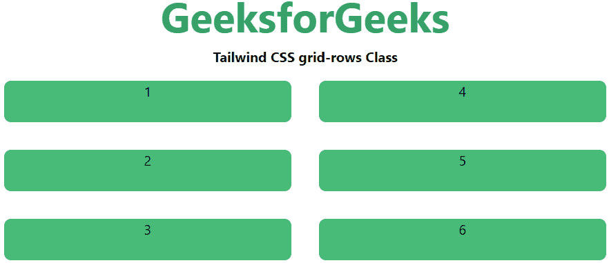
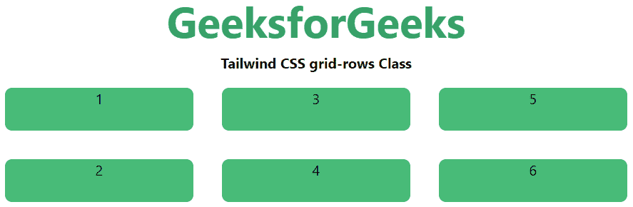

# 顺风 CSS 网格模板行

> 原文:[https://www . geesforgeks . org/tail wind-CSS-grid-template-rows/](https://www.geeksforgeeks.org/tailwind-css-grid-template-rows/)

这个类在 tailwind CSS 中接受多个值，所有的属性都以类的形式被覆盖。是 CSS 中 [CSS 网格-模板-行](https://www.geeksforgeeks.org/css-grid-row-property/)属性的替代。它用于设置网格的行数和行数的大小，这里我们也将这样做，但是为了前端的快速发展。行数由给这个类的值的数量来设置。

**网格模板行:**

*   **网格-行-1:** 每行只让出一行。
*   **网格-行-2:** 每行只让出两行。
*   **网格-行-3:** 每行只让出三行。
*   **网格-行-4:** 每行只让出四行。
*   **网格-行-5:** 每行只让出 5 行。
*   **网格-行-6:** 每行让步 6 行。
*   **网格行-无:**不遵循网格行属性。

**语法:**

```
<element class="grid grid-rows-number"> Contents... </element>
```

**例 1:**

## 超文本标记语言

```
<!DOCTYPE html> 

<head> 
    <title>Tailwind grid-rows Class</title> 

    <link href=
"https://unpkg.com/tailwindcss@^1.0/dist/tailwind.min.css" 
          rel="stylesheet"> 
</head> 

<body class="text-center"> 
    <h1 class="text-green-600 text-5xl font-bold">
        GeeksforGeeks
    </h1> 

    <b>Tailwind CSS grid-rows Class</b> 

    <div id="main" class="grid grid-rows-3 grid-flow-col"> 
        <div class="bg-green-500 rounded-lg m-4 h-12">1</div> 
        <div class="bg-green-500 rounded-lg m-4 h-12">2</div> 
        <div class="bg-green-500 rounded-lg m-4 h-12">3</div> 
        <div class="bg-green-500 rounded-lg m-4 h-12">4</div> 
        <div class="bg-green-500 rounded-lg m-4 h-12">5</div> 
        <div class="bg-green-500 rounded-lg m-4 h-12">6</div> 
    </div> 
</body> 

</html>
```

**输出:**



**例 2:**

## 超文本标记语言

```
<!DOCTYPE html> 

<head> 
    <title>Tailwind grid-rows Class</title> 

    <link href=
"https://unpkg.com/tailwindcss@^1.0/dist/tailwind.min.css" 
          rel="stylesheet"> 
</head> 

<body class="text-center"> 
    <h1 class="text-green-600 text-5xl font-bold">
        GeeksforGeeks
    </h1> 

    <b>Tailwind CSS grid-rows Class</b> 

    <div id="main" class="grid grid-rows-2 grid-flow-col"> 
        <div class="bg-green-500 rounded-lg m-4 h-12">1</div> 
        <div class="bg-green-500 rounded-lg m-4 h-12">2</div> 
        <div class="bg-green-500 rounded-lg m-4 h-12">3</div> 
        <div class="bg-green-500 rounded-lg m-4 h-12">4</div> 
        <div class="bg-green-500 rounded-lg m-4 h-12">5</div> 
        <div class="bg-green-500 rounded-lg m-4 h-12">6</div> 
    </div> 
</body> 

</html>
```

**输出:**

