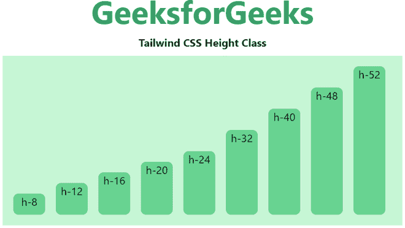

# 顺风 CSS 高度

> 原文:[https://www.geeksforgeeks.org/tailwind-css-height/](https://www.geeksforgeeks.org/tailwind-css-height/)

这个类在[顺风 CSS](https://www.geeksforgeeks.org/css-tailwind-introduction/) 中接受很多值，其中所有的属性都以类的形式被覆盖。它是 [CSS 高度属性](https://www.geeksforgeeks.org/css-height-property/)的替代品。此类用于设置元素的高度。height 类不包含填充、边距和元素边框。

**身高等级:**

*   **h-0:** 该类将*高度*设置为零。
*   **h-auto:** 该类根据内容设置*高度*。
*   **h-px:** 此类用于在 1px 固定中设置*高度*。
*   **h-1/2:** 该类将*高度*设置为窗户的一半。
*   **h-1/3:** 该类将*高度*设置为窗户的三分之一。
*   **h-1/4:** 该类将*高度*设置为窗户的四分之一。
*   **h-1/5:** 该类将*高度*设置为窗户的五分之一。
*   **h-1/6:** 该类将高度设置为窗户的六分之一。
*   **h-full:** 这个类将元素的高度设置为其父元素的 100%，只要父元素有定义的高度。
*   **h-screen:** 这个类用来让一个元素跨越视口的整个高度。

**注意:**您可以用有效的“rem”值更改数字或设置百分比值。

**h-0:** 此类用于设置任意元素的具体高度，可以用有效的 rem 单位数来更改数字，以固定元素的高度。

**语法:**

```
<element class="h-0">...</element>
```

**示例:**

## 超文本标记语言

```
<!DOCTYPE html> 
<head> 
    <link href=
"https://unpkg.com/tailwindcss@^1.0/dist/tailwind.min.css" 
          rel="stylesheet"> 
</head> 

<body class="text-center mx-4 space-y-2"> 
    <h1 class="text-green-600 text-5xl font-bold">
        GeeksforGeeks
    </h1> 
    <b>Tailwind CSS Height Class</b> 
    <div class="flex flex-wrap-reverse p-4 mx-12 
                space-x-4 h-64 bg-green-200">
        <div class="h-8 w-12 bg-green-400 
                    rounded-lg">h-8</div>
        <div class="h-12 w-12 bg-green-400 
                    rounded-lg">h-12</div>
        <div class="h-16 w-12 bg-green-400 
                    rounded-lg">h-16</div>
        <div class="h-20 w-12 bg-green-400 
                    rounded-lg">h-20</div>
        <div class="h-24 w-12 bg-green-400 
                    rounded-lg">h-24</div>
        <div class="h-32 w-12 bg-green-400 
                    rounded-lg">h-32</div>
        <div class="h-40 w-12 bg-green-400 
                    rounded-lg">h-40</div>
        <div class="h-48 w-12 bg-green-400 
                    rounded-lg">h-48</div>
        <div class="h-52 w-12 bg-green-400 
                    rounded-lg">h-52</div>
    </div>
</body> 

</html>
```

**输出:**



**h-auto:** 这个类用来让浏览器确定元素的高度。

**语法:**

```
<element class="h-auto">...</element>
```

**示例:**

## 超文本标记语言

```
<!DOCTYPE html> 
<head> 
    <link href=
"https://unpkg.com/tailwindcss@^1.0/dist/tailwind.min.css" 
          rel="stylesheet"> 
</head> 

<body class="text-center mx-4 space-y-2"> 
    <h1 class="text-green-600 text-5xl font-bold">
        GeeksforGeeks
    </h1> 
    <b>Tailwind CSS Height Class</b> 
    <div class="mx-48 bg-green-200 p-8">
        <div class="h-auto bg-green-400 
                    rounded-lg">h-auto</div>
    </div>
</body> 

</html>
```

**输出:**


**h-screen:** 这个类用来让一个元素跨越视口的整个高度。

**语法:**

```
<element class="h-screen">...</element>
```

**示例:**

## 超文本标记语言

```
<!DOCTYPE html> 
<head> 
    <link href=
"https://unpkg.com/tailwindcss@^1.0/dist/tailwind.min.css" 
          rel="stylesheet"> 
</head> 

<body class="text-center mx-4 space-y-2"> 
    <h1 class="text-green-600 text-5xl font-bold">
        GeeksforGeeks
    </h1> 
    <b>Tailwind CSS Height Class</b> 
    <div class="mx-48 bg-green-200 p-8">
        <div class="h-screen bg-green-400 
                    rounded-lg">h-screen</div>
    </div>
</body> 

</html>
```

**输出:**


**h-full:** 这个类用于将元素的高度设置为其父元素的 100%，只要父元素有定义的高度。

**语法:**

```
<element class="h-full">...</element>
```

**示例:**

## 超文本标记语言

```
<!DOCTYPE html> 
<head> 
    <link href=
"https://unpkg.com/tailwindcss@^1.0/dist/tailwind.min.css" 
          rel="stylesheet"> 
</head> 

<body class="text-center mx-4 space-y-2"> 
    <h1 class="text-green-600 text-5xl font-bold">
        GeeksforGeeks
    </h1> 
    <b>Tailwind CSS Height Class</b> 
    <div class="mx-48 h-48 bg-green-200 p-8">
        <div class="h-full bg-green-400 
                    rounded-lg">h-full</div>
    </div>
</body> 

</html>
```

**输出:**

