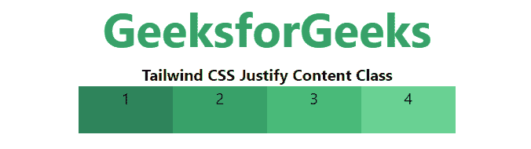
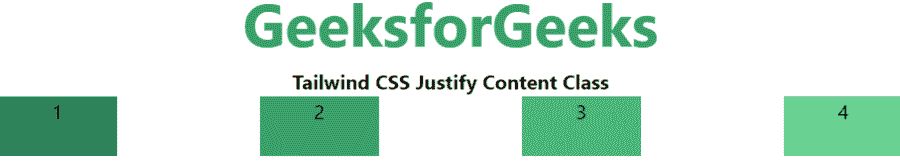
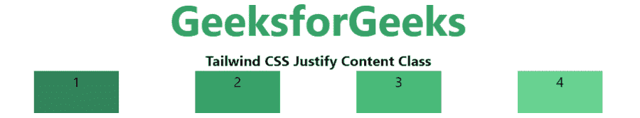
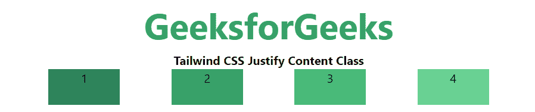

# 顺风 CSS 对齐内容

> 原文:[https://www.geeksforgeeks.org/tailwind-css-justify-content/](https://www.geeksforgeeks.org/tailwind-css-justify-content/)

这个类在 tailwind CSS 中接受两个值。它是 [CSS 调整内容属性](https://www.geeksforgeeks.org/css-justify-content-property/#:~:text=The%20justify%2Dcontent%20property%20in,containers%20along%20the%20vertical%20axis.)的替代。该类用于描述柔性盒容器的对齐。它包含沿着 flex 容器主轴的内容项之间和周围的空间。它主要用于控制 flex 和 grid 项如何沿着容器的主轴定位。

**调整内容类别:**

*   调整开始
*   两端对齐
*   居中对齐
*   介于两者之间
*   辩护
*   平均对齐

**对齐-开始:**用于从容器开始对齐伸缩项。

**语法:**

```
<element class="justify-start">...</element>
```

**示例:**

## 超文本标记语言

```
<!DOCTYPE html> 
<head> 
    <link href=
"https://unpkg.com/tailwindcss@^1.0/dist/tailwind.min.css" 
          rel="stylesheet"> 
</head> 

<body class="text-center"> 
    <h1 class="text-green-600 text-5xl font-bold">
        GeeksforGeeks
    </h1> 
    <b>Tailwind CSS Justify Content Class</b> 
    <div id="main" class="flex justify-start flex-row"> 
        <div class="bg-green-700 w-24 h-12">1</div> 
        <div class="bg-green-600 w-24 h-12">2</div> 
        <div class="bg-green-500 w-24 h-12">3</div> 
        <div class="bg-green-400 w-24 h-12">4</div> 
    </div> 
</body> 

</html>
```

**输出:**


**对齐-结束:**用于从容器末端对齐弯曲项目。

**语法:**

```
<element class="justify-end">...</element>
```

**示例:**

## 超文本标记语言

```
<!DOCTYPE html> 
<head> 
    <link href=
"https://unpkg.com/tailwindcss@^1.0/dist/tailwind.min.css" 
          rel="stylesheet"> 
</head> 

<body class="text-center"> 
    <h1 class="text-green-600 text-5xl font-bold">
        GeeksforGeeks
    </h1> 
    <b>Tailwind CSS Justify Content Class</b> 
    <div id="main" class="flex justify-end flex-row"> 
        <div class="bg-green-700 w-24 h-12">1</div> 
        <div class="bg-green-600 w-24 h-12">2</div> 
        <div class="bg-green-500 w-24 h-12">3</div> 
        <div class="bg-green-400 w-24 h-12">4</div> 
    </div> 
</body> 

</html>
```

**输出:**


**居中对齐:**用于从容器的中心对齐柔性物品。

**语法:**

```
<element class="justify-center">...</element>
```

**示例:**

## 超文本标记语言

```
<!DOCTYPE html> 
<head> 
    <link href=
"https://unpkg.com/tailwindcss@^1.0/dist/tailwind.min.css" 
          rel="stylesheet"> 
</head> 

<body class="text-center"> 
    <h1 class="text-green-600 text-5xl font-bold">
        GeeksforGeeks
    </h1> 
    <b>Tailwind CSS Justify Content Class</b> 
    <div id="main" class="flex justify-center flex-row"> 
        <div class="bg-green-700 w-24 h-12">1</div> 
        <div class="bg-green-600 w-24 h-12">2</div> 
        <div class="bg-green-500 w-24 h-12">3</div> 
        <div class="bg-green-400 w-24 h-12">4</div> 
    </div> 
</body> 

</html>
```

**输出:**



**对齐-介于:**弹性项目以均匀的间距放置，项目被推到开始，最后一个项目被推到结束。

**语法:**

```
<element class="justify-between">...</element>
```

**示例:**

## 超文本标记语言

```
<!DOCTYPE html> 
<head> 
    <link href=
"https://unpkg.com/tailwindcss@^1.0/dist/tailwind.min.css" 
          rel="stylesheet"> 
</head> 

<body class="text-center"> 
    <h1 class="text-green-600 text-5xl font-bold">
        GeeksforGeeks
    </h1> 
    <b>Tailwind CSS Justify Content Class</b> 
    <div id="main" class="flex justify-between flex-row"> 
        <div class="bg-green-700 w-24 h-12">1</div> 
        <div class="bg-green-600 w-24 h-12">2</div> 
        <div class="bg-green-500 w-24 h-12">3</div> 
        <div class="bg-green-400 w-24 h-12">4</div> 
    </div> 
</body> 

</html>
```

**输出:**



**左右对齐:**弯曲的物品放置在彼此间距相等的角落。

**语法:**

```
<element class="justify-around">...</element>
```

**示例:**

## 超文本标记语言

```
<!DOCTYPE html> 
<head> 
    <link href=
"https://unpkg.com/tailwindcss@^1.0/dist/tailwind.min.css" 
          rel="stylesheet"> 
</head> 

<body class="text-center"> 
    <h1 class="text-green-600 text-5xl font-bold">
        GeeksforGeeks
    </h1> 
    <b>Tailwind CSS Justify Content Class</b> 
    <div id="main" class="flex justify-around flex-row"> 
        <div class="bg-green-700 w-24 h-12">1</div> 
        <div class="bg-green-600 w-24 h-12">2</div> 
        <div class="bg-green-500 w-24 h-12">3</div> 
        <div class="bg-green-400 w-24 h-12">4</div> 
    </div> 
</body> 

</html>
```

**输出:**



**均匀对齐:**项目之间的间距相等，但与角的间距不同。

**语法:**

```
<element class="justify-evenly">...</element>
```

**示例:**

## 超文本标记语言

```
<!DOCTYPE html> 
<head> 
    <link href=
"https://unpkg.com/tailwindcss@^1.0/dist/tailwind.min.css" 
          rel="stylesheet"> 
</head> 

<body class="text-center"> 
    <h1 class="text-green-600 text-5xl font-bold">
        GeeksforGeeks
    </h1> 
    <b>Tailwind CSS Justify Content Class</b> 
    <div id="main" class="flex justify-evenly flex-row"> 
        <div class="bg-green-700 w-24 h-12">1</div> 
        <div class="bg-green-600 w-24 h-12">2</div> 
        <div class="bg-green-500 w-24 h-12">3</div> 
        <div class="bg-green-400 w-24 h-12">4</div> 
    </div> 
</body> 

</html>
```

**输出:**

