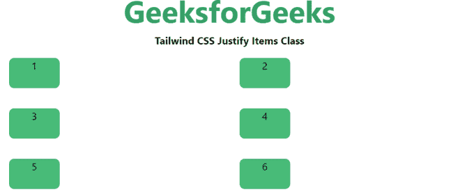
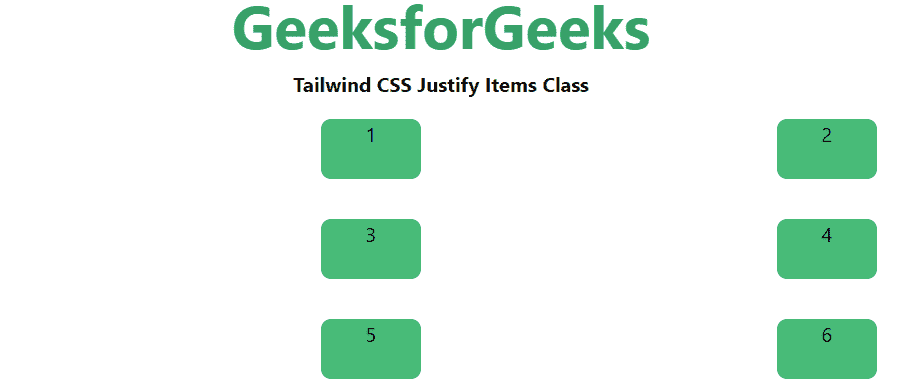
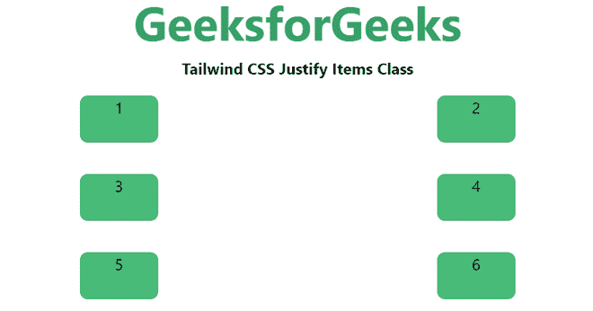
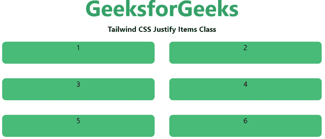

# 顺风 CSS 对齐项目

> 原文:[https://www.geeksforgeeks.org/tailwind-css-justify-items/](https://www.geeksforgeeks.org/tailwind-css-justify-items/)

这个类在 tailwind CSS 中接受两个值。它是 CSS *对齐项*属性的替代。此类用于控制网格项如何沿其内联轴对齐。

**调整项目:**

*   自动调整项目
*   调整-项目-开始
*   调整项目结束
*   居中对齐项目
*   对齐-项目-拉伸

**自动对齐项目:**该类用于自动对齐网格项目的内联轴。

**语法:**

```html
<element class="justify-items-auto">...</element>
```

**示例:**

## 超文本标记语言

```html
<!DOCTYPE html> 
<head>     
    <link href=
"https://unpkg.com/tailwindcss@^1.0/dist/tailwind.min.css" 
          rel="stylesheet"> 
</head> 

<body class="text-center"> 
    <h1 class="text-green-600 text-5xl font-bold">
        GeeksforGeeks
    </h1> 
    <b>Tailwind CSS Justify Items Class</b> 
    <div id="main" class="grid justify-items-auto grid-cols-2"> 
        <div class="bg-green-500 rounded-lg m-4 h-12">1</div> 
        <div class="bg-green-500 rounded-lg m-4 h-12">2</div> 
        <div class="bg-green-500 rounded-lg m-4 h-12">3</div> 
        <div class="bg-green-500 rounded-lg m-4 h-12">4</div>
        <div class="bg-green-500 rounded-lg m-4 h-12">5</div> 
        <div class="bg-green-500 rounded-lg m-4 h-12">6</div>
    </div> 
</body> 

</html>
```

**输出:**


**对齐-项目-开始:**该类用于相对于网格项目的内联轴的开始对齐网格项目。

**语法:**

```html
<element class="justify-items-start">...</element>
```

**示例:**

## 超文本标记语言

```html
<!DOCTYPE html> 
<head>    
    <link href=
"https://unpkg.com/tailwindcss@^1.0/dist/tailwind.min.css" 
    rel="stylesheet"> 
</head> 

<body class="text-center"> 
    <h1 class="text-green-600 text-5xl font-bold">
        GeeksforGeeks
    </h1> 
    <b>Tailwind CSS Justify Items Class</b> 
    <div id="main" class="grid justify-items-start grid-cols-2"> 
        <div class="bg-green-500 rounded-lg m-4 w-20 h-12">1</div> 
        <div class="bg-green-500 rounded-lg m-4 w-20 h-12">2</div> 
        <div class="bg-green-500 rounded-lg m-4 w-20 h-12">3</div> 
        <div class="bg-green-500 rounded-lg m-4 w-20 h-12">4</div>
        <div class="bg-green-500 rounded-lg m-4 w-20 h-12">5</div> 
        <div class="bg-green-500 rounded-lg m-4 w-20 h-12">6</div>
    </div> 
</body> 
</html>
```

**输出:**



**对齐-项目-结束:**该类用于相对于网格项目的内联轴的末端对齐网格项目。

**语法:**

```html
<element class="justify-items-end">...</element>
```

**示例:**

## 超文本标记语言

```html
<!DOCTYPE html> 
<head>    
    <link href=
"https://unpkg.com/tailwindcss@^1.0/dist/tailwind.min.css" 
          rel="stylesheet"> 
</head> 

<body class="text-center"> 
    <h1 class="text-green-600 text-5xl font-bold">
        GeeksforGeeks
    </h1> 
    <b>Tailwind CSS Justify Items Class</b> 
    <div id="main" class="grid justify-items-end grid-cols-2"> 
        <div class="bg-green-500 rounded-lg m-4 w-20 h-12">1</div> 
        <div class="bg-green-500 rounded-lg m-4 w-20 h-12">2</div> 
        <div class="bg-green-500 rounded-lg m-4 w-20 h-12">3</div> 
        <div class="bg-green-500 rounded-lg m-4 w-20 h-12">4</div>
        <div class="bg-green-500 rounded-lg m-4 w-20 h-12">5</div> 
        <div class="bg-green-500 rounded-lg m-4 w-20 h-12">6</div>
    </div> 
</body> 

</html>
```

**输出:**



**对齐-项目-中心:**该类用于沿着网格项目的内联轴对齐网格项目。

**语法:**

```html
<element class="jjustify-items-center">...</element>
```

**示例:**

## 超文本标记语言

```html
<!DOCTYPE html> 
<head>    
    <link href=
"https://unpkg.com/tailwindcss@^1.0/dist/tailwind.min.css" 
     rel="stylesheet"> 
</head> 

<body class="text-center"> 
    <h1 class="text-green-600 text-5xl font-bold">
        GeeksforGeeks
    </h1> 
    <b>Tailwind CSS Justify Items Class</b> 
    <div id="main" class="grid justify-items-center grid-cols-2"> 
        <div class="bg-green-500 rounded-lg m-4 w-20 h-12">1</div> 
        <div class="bg-green-500 rounded-lg m-4 w-20 h-12">2</div> 
        <div class="bg-green-500 rounded-lg m-4 w-20 h-12">3</div> 
        <div class="bg-green-500 rounded-lg m-4 w-20 h-12">4</div>
        <div class="bg-green-500 rounded-lg m-4 w-20 h-12">5</div> 
        <div class="bg-green-500 rounded-lg m-4 w-20 h-12">6</div>
    </div> 
</body> 

</html>
```

**输出:**



**对齐-项目-拉伸:**该类用于沿着项目的内联轴拉伸项目。

**语法:**

```html
<element class="justify-items-stretch">...</element>
```

**示例:**

## 超文本标记语言

```html
<!DOCTYPE html> 
<head>    
    <link href=
"https://unpkg.com/tailwindcss@^1.0/dist/tailwind.min.css" 
          rel="stylesheet"> 
</head> 

<body class="text-center"> 
    <h1 class="text-green-600 text-5xl font-bold">
        GeeksforGeeks
    </h1> 
    <b>Tailwind CSS Justify Items Class</b> 
    <div id="main" class="grid justify-items-stretch grid-cols-2"> 
        <div class="bg-green-500 rounded-lg m-4 h-12">1</div> 
        <div class="bg-green-500 rounded-lg m-4 h-12">2</div> 
        <div class="bg-green-500 rounded-lg m-4 h-12">3</div> 
        <div class="bg-green-500 rounded-lg m-4 h-12">4</div>
        <div class="bg-green-500 rounded-lg m-4 h-12">5</div> 
        <div class="bg-green-500 rounded-lg m-4 h-12">6</div>
    </div> 
</body> 

</html>
```

**输出:**

