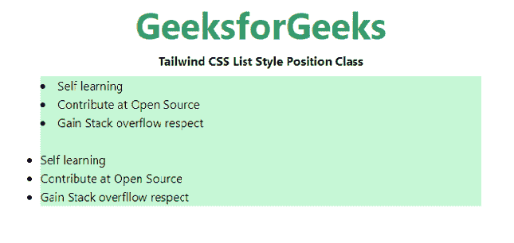

# 顺风 CSS 列表样式位置

> 原文:[https://www . geesforgeks . org/tail wind-CSS-list-style-position/](https://www.geeksforgeeks.org/tailwind-css-list-style-position/)

这个类在 [<u>顺风 CSS</u>](https://www.geeksforgeeks.org/css-tailwind-introduction/) 中接受大量的值，其中所有的属性都以类的形式被覆盖。它是 [<u>CSS 列表样式位置属性</u>](https://www.geeksforgeeks.org/css-list-style-position-property/) 的替代。此类指定标记框相对于主块框的位置。

**列出样式位置类别:**

*   **列表-内部:**在该值中，标记是列表项内容中的第一个元素，即项目符号将位于列表项内部。
*   **列表-外部:**在该值中，标记在主块框之外，即项目符号点将在列表项目之外。这是默认值。

**语法:**

```
<element class="List Style Position">...</element>
```

**示例:**

## 超文本标记语言

```
<!DOCTYPE html> 
<head> 
    <link href=
"https://unpkg.com/tailwindcss@^1.0/dist/tailwind.min.css" 
          rel="stylesheet"> 
</head> 

<body class="text-center mx-4 space-y-2"> 
    <h1 class="text-green-600 text-5xl font-bold">
        GeeksforGeeks
    </h1> 
    <b>Tailwind CSS List Style Position Class</b> 
    <div class="mx-24 bg-green-200 text-justify">
        <ul class="list-disc list-inside ">
            <li>Self learning</li>
            <li>Contribute at Open Source</li>
            <li>Gain Stack overflow respect</li>
        </ul>
        <br>
        <ul class="list-disc list-outside ">
            <li>Self learning</li>
            <li>Contribute at Open Source</li>
            <li>Gain Stack overflow respect</li>        
        </ul>
    </div>
</body> 

</html> 
```

**输出:**



列表样式位置