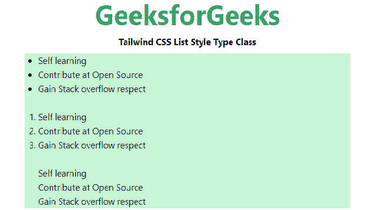

# 顺风 CSS 列表样式类型

> 原文:[https://www.geeksforgeeks.org/tailwind-css-list-style-type/](https://www.geeksforgeeks.org/tailwind-css-list-style-type/)

这个类在 [<u>顺风 CSS</u>](https://www.geeksforgeeks.org/css-tailwind-introduction/) 中接受大量的值，其中所有的属性都以类的形式被覆盖。它是 [<u>CSS 列表样式类型属性</u>](https://www.geeksforgeeks.org/css-list-style-type-property/) 的替代。如果“列表样式图像”的值为“无”，则此类指定列表项标记的外观(如光盘、字符或自定义计数器样式)。

**列出样式类型类别:**

*   **列表-无:**此模式下不显示标记。
*   **列表-盘:**这是默认值。标记是一个实心圆。
*   **列表-小数:**标记是一个小数，以 1 开头。

**语法:**

```css
<element class="List Style Type">...</element>
```

**示例:**

## 超文本标记语言

```css
<!DOCTYPE html> 
<head> 
    <link href=
"https://unpkg.com/tailwindcss@^1.0/dist/tailwind.min.css" 
          rel="stylesheet"> 
</head> 

<body class="text-center mx-4 space-y-2"> 
    <h1 class="text-green-600 text-5xl font-bold">
        GeeksforGeeks
    </h1> 
    <b>Tailwind CSS List Style Type Class</b> 
    <div class="mx-24 bg-green-200 text-justify px-6">
        <ul class="list-disc">
            <li>Self learning</li>
            <li>Contribute at Open Source</li>
            <li>Gain Stack overflow respect</li>
        </ul>
        <br>
        <ol class="list-decimal">
            <li>Self learning</li>
            <li>Contribute at Open Source</li>
            <li>Gain Stack overflow respect</li>        
        </ol>
        <br>
        <ul class="list-none">
            <li>Self learning</li>
            <li>Contribute at Open Source</li>
            <li>Gain Stack overflow respect</li>        
        </ul>
    </div>
</body> 

</html> 
```

**输出:**



列表样式类型