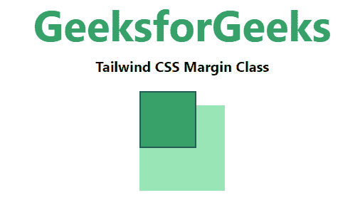

# 顺风 CSS 边距

> 原文:[https://www.geeksforgeeks.org/tailwind-css-margin/](https://www.geeksforgeeks.org/tailwind-css-margin/)

这个类在[顺风 CSS](https://www.geeksforgeeks.org/css-tailwind-introduction/) 中接受很多值，其中所有的属性都包含在类的形式中。它是 [CSS 保证金房产](https://www.geeksforgeeks.org/css-margins-padding/#:~:text=CSS%20Padding,properties%20to%20implement%20padding%20properties.)的替代品。此类用于在元素周围创建空间，位于任何已定义的边框之外。我们可以为各个边(上、右、下、左)设置不同的边距。添加边框属性以实现边距类非常重要。用于边距的 CSS 属性有很多，如 CSS *填充-顶部*、CSS *填充-底部*、CSS *填充-右侧*、CSS *填充-左侧*等。

**保证金类别:**

*   **m-0:** 此类用于定义所有边的边距。
*   **-m-0:** 此类用于定义所有边的负边距。
*   **my-0:** 此类用于定义 y 轴上的边距，即*边距-顶部*和*边距-底部*。
*   **-my-0:** 此类用于定义 y 轴上的负边距，即*边距-顶部*和*边距-底部*。
*   **mx-0:** 此类用于定义 x 轴上的边距，即*边距-左侧*和*边距-右侧*。
*   **-mx-0:** 此类用于在右侧添加负边距。
*   **mt-0:** 这个类专门用来在顶部增加一个边距。
*   **-mt-0:** 这个类专门用来在顶部增加负边距。
*   **mr-0:** 这个类专门用来在右边加一个边距。
*   **-mr-0:** 这个类是专门用来在右边加负边距的。
*   **mb-0:** 这个类专门用来在底部增加一个边距。
*   **-mb-0:** 这个类专门用来在底部增加负边距。
*   **ml-0:** 这个类专门用来在左边加一个边距。
*   **-ml-0:** 这个类专门用来在左边加负边距。

**注意:**可以用有效的“rem”值更改数字“0”。

**m-0:** 此类用于定义所有边的边距。

**语法:**

```html
<element class="m-0">...</element>
```

**示例:**

## 超文本标记语言

```html
<!DOCTYPE html> 
<head> 
    <link href=
"https://unpkg.com/tailwindcss@^1.0/dist/tailwind.min.css" 
          rel="stylesheet"> 
</head> 

<body class="text-center"> 
    <h1 class="text-green-600 text-5xl font-bold">
        GeeksforGeeks
    </h1> 
    <b>Tailwind CSS Margin Class</b> 
    <div class="flex justify-center">
    <div class="m-8 bg-green-300 w-24 h-24">
        <div class="m-4 border-2 border-green-800 
                    bg-green-600 w-16 h-16">

        </div>
    </div>
    </div>
</body> 

</html>
```

**输出:**


**-m-0:** 此类用于定义所有边的负边距。

**语法:**

```html
<element class="-m-0">...</element>
```

**示例:**

## 超文本标记语言

```html
<!DOCTYPE html> 
<head> 
    <link href=
"https://unpkg.com/tailwindcss@^1.0/dist/tailwind.min.css" 
          rel="stylesheet"> 
</head> 

<body class="text-center"> 
    <h1 class="text-green-600 text-5xl font-bold">
        GeeksforGeeks
    </h1> 
    <b>Tailwind CSS Margin Class</b> 
    <div class="flex justify-center">
    <div class="m-8 bg-green-300 w-24 h-24">
        <div class="-m-4 border-2 border-green-800 
                    bg-green-600 w-16 h-16">

        </div>
    </div>
    </div>
</body> 

</html>
```

**输出:**


**my-0:** 此类用于定义 y 轴上的边距，即*边距-顶部*和*边距-底部*。

**语法:**

```html
<element class="my-0">...</element>
```

**示例:**

## 超文本标记语言

```html
<!DOCTYPE html> 
<head> 
    <link href=
"https://unpkg.com/tailwindcss@^1.0/dist/tailwind.min.css" 
          rel="stylesheet"> 
</head> 

<body class="text-center"> 
    <h1 class="text-green-600 text-5xl font-bold">
        GeeksforGeeks
    </h1> 
    <b>Tailwind CSS Margin Class</b> 
    <div class="flex justify-center">
    <div class="m-8 bg-green-300 w-24 h-24">
        <div class="my-4 border-2 border-green-800 
                    bg-green-600 w-16 h-16">

        </div>
    </div>
    </div>
</body> 

</html>
```

**输出:**


**-my-0:** 此类用于定义 y 轴上的负边距，即*边距-顶部*和*边距-底部*。

**语法:**

```html
<element class="-my-0">...</element>
```

**示例:**

## 超文本标记语言

```html
<!DOCTYPE html> 
<head> 
    <link href=
"https://unpkg.com/tailwindcss@^1.0/dist/tailwind.min.css" 
          rel="stylesheet"> 
</head> 

<body class="text-center"> 
    <h1 class="text-green-600 text-5xl font-bold">
        GeeksforGeeks
    </h1> 
    <b>Tailwind CSS Margin Class</b> 
    <div class="flex justify-center">
    <div class="m-8 bg-green-300 w-24 h-24">
        <div class="-my-4 border-2 border-green-800 
                    bg-green-600 w-16 h-16">

        </div>
    </div>
    </div>
</body> 

</html>
```

**输出:**



**mx-0:** 此类用于定义 x 轴上的边距，即*边距-左侧*和*边距-右侧*。

**语法:**

```html
<element class="mx-0">...</element>
```

**示例:**

## 超文本标记语言

```html
<!DOCTYPE html> 
<head> 
    <link href=
"https://unpkg.com/tailwindcss@^1.0/dist/tailwind.min.css" 
          rel="stylesheet"> 
</head> 

<body class="text-center"> 
    <h1 class="text-green-600 text-5xl font-bold">
        GeeksforGeeks
    </h1> 
    <b>Tailwind CSS Margin Class</b> 
    <div class="flex justify-center">
    <div class="m-8 bg-green-300 w-24 h-24">
        <div class="mx-4 border-2 border-green-800 
                    bg-green-600 w-16 h-16">

        </div>
    </div>
    </div>
</body> 

</html>
```

**输出:**


**-mx-0:** 此类用于定义 x 轴上的负边距，即*边距-左侧*和*边距-右侧*。

**语法:**

```html
<element class="-mx-0">...</element>
```

**示例:**

## 超文本标记语言

```html
<!DOCTYPE html> 
<head> 
    <link href=
"https://unpkg.com/tailwindcss@^1.0/dist/tailwind.min.css" 
          rel="stylesheet"> 
</head> 

<body class="text-center"> 
    <h1 class="text-green-600 text-5xl font-bold">
        GeeksforGeeks
    </h1> 
    <b>Tailwind CSS Margin Class</b> 
    <div class="flex justify-center">
    <div class="m-8 bg-green-300 w-24 h-24">
        <div class="-mx-4 border-2 border-green-800 
                    bg-green-600 w-16 h-16">

        </div>
    </div>
    </div>
</body> 

</html>
```

**输出:**


**mt-0:** 这个类专门用来在顶部增加一个边距。

**语法:**

```html
<element class="mt-0">...</element>
```

**示例:**

## 超文本标记语言

```html
<!DOCTYPE html> 
<head> 
    <link href=
"https://unpkg.com/tailwindcss@^1.0/dist/tailwind.min.css" 
          rel="stylesheet"> 
</head> 

<body class="text-center"> 
    <h1 class="text-green-600 text-5xl font-bold">
        GeeksforGeeks
    </h1> 
    <b>Tailwind CSS Margin Class</b> 
    <div class="flex justify-center">
    <div class="m-8 bg-green-300 w-24 h-24">
        <div class="mt-4 border-2 border-green-800 
                    bg-green-600 w-16 h-16">

        </div>
    </div>
    </div>
</body> 

</html>
```

**输出:**


**-mt-0:** 这个类专门用来在顶部增加负边距。

**语法:**

```html
<element class="-mt-0">...</element>
```

**示例:**

## 超文本标记语言

```html
<!DOCTYPE html> 
<head> 
    <link href=
"https://unpkg.com/tailwindcss@^1.0/dist/tailwind.min.css" 
          rel="stylesheet"> 
</head> 

<body class="text-center"> 
    <h1 class="text-green-600 text-5xl font-bold">
        GeeksforGeeks
    </h1> 
    <b>Tailwind CSS Margin Class</b> 
    <div class="flex justify-center">
    <div class="m-8 bg-green-300 w-24 h-24">
        <div class="-mt-4 border-2 border-green-800 
                    bg-green-600 w-16 h-16">

        </div>
    </div>
    </div>
</body> 

</html>
```

**输出:**

