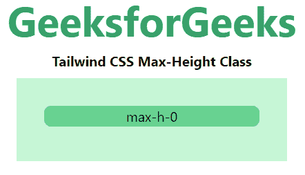
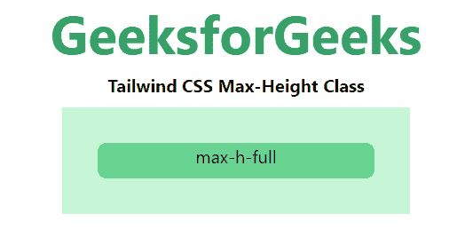

# 顺风 CSS 最大高度

> 原文:[https://www.geeksforgeeks.org/tailwind-css-max-height/](https://www.geeksforgeeks.org/tailwind-css-max-height/)

这个类在[顺风 CSS](https://www.geeksforgeeks.org/css-tailwind-introduction/) 中接受很多值，其中所有的属性都以类的形式被覆盖。它是 [CSS 最大高度属性](https://www.geeksforgeeks.org/css-max-height-property/)的替代品。此类用于设置元素的最大高度。如果元素的内容大于指定的最大高度，则内容将溢出，否则没有效果。如果元素的内容比它小，则没有效果。*高度*等级值可以被*最大高度*等级覆盖。

**最大高度等级:**

*   最大-h-0
*   max-h-px
*   最大 h 满
*   最大 h 屏幕

**注意:**可以用有效的“rem”值来更改数字。

**max-h-0:** 该类用于设置任意元素的最大比高度。

**语法:**

```
<element class="max-h-0">...</element>
```

**示例:**

## 超文本标记语言

```
<!DOCTYPE html> 
<head> 
    <link href=
"https://unpkg.com/tailwindcss@^1.0/dist/tailwind.min.css" 
          rel="stylesheet"> 
</head> 

<body class="text-center mx-4 space-y-2"> 
    <h1 class="text-green-600 text-5xl font-bold">
        GeeksforGeeks
    </h1> 
    <b>Tailwind CSS Max-Height Class</b> 
    <div class="mx-48 h-24 bg-green-200 p-8">
        <div class="max-h-0 bg-green-400 
                    rounded-lg">max-h-0</div>
    </div>
</body> 

</html>
```

**输出:**



**max-h-px:** 该类用于设置任意元素的 1px 特定高度。

**语法:**

```
<element class="max-h-px">...</element>
```

**示例:**

## 超文本标记语言

```
<!DOCTYPE html> 
<head> 
    <link href=
"https://unpkg.com/tailwindcss@^1.0/dist/tailwind.min.css" 
          rel="stylesheet"> 
</head> 

<body class="text-center mx-4 space-y-2"> 
    <h1 class="text-green-600 text-5xl font-bold">
        GeeksforGeeks
    </h1> 
    <b>Tailwind CSS Max-Height Class</b> 
    <div class="mx-48 h-24 bg-green-200 p-8">
        <div class="max-h-px bg-green-400 
                    rounded-lg">max-h-px</div>
    </div>
</body> 

</html>
```

**输出:**


**max-h-full:** 该类用于根据父元素设置已满元素的最大高度。

**语法:**

```
<element class="max-h-full">...</element>
```

**示例:**

## 超文本标记语言

```
<!DOCTYPE html> 
<head> 
    <link href=
"https://unpkg.com/tailwindcss@^1.0/dist/tailwind.min.css" 
          rel="stylesheet"> 
</head> 

<body class="text-center mx-4 space-y-2"> 
    <h1 class="text-green-600 text-5xl font-bold">
        GeeksforGeeks
    </h1> 
    <b>Tailwind CSS Max-Height Class</b> 
    <div class="mx-48 h-24 bg-green-200 p-8">
        <div class="h-48 max-h-full bg-green-400 
                    rounded-lg">max-h-full</div>
    </div>
</body> 

</html>
```

**输出:**



**max-h-screen:** 这个类用来使一个元素最大限度地跨越视口的整个高度。要在特定断点处控制元素的*最大高度*，请向任何现有的*最大高度*实用程序添加“屏幕”前缀。

**语法:**

```
<element class="max-h-screen">...</element>
```

**示例:**

## 超文本标记语言

```
<!DOCTYPE html> 
<head> 
    <link href=
"https://unpkg.com/tailwindcss@^1.0/dist/tailwind.min.css" 
          rel="stylesheet"> 
</head> 

<body class="text-center mx-4 space-y-2"> 
    <h1 class="text-green-600 text-5xl font-bold">
        GeeksforGeeks
    </h1> 
    <b>Tailwind CSS Max-Height Class</b> 
    <div class="mx-48 h-48 bg-green-200 p-8">
        <div class="max-h-screen bg-green-400 
                    rounded-lg">max-h-screen</div>
    </div>
</body> 

</html>
```

**输出:**

