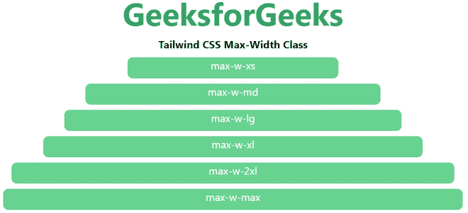

# 泰国风 CSS 最大宽度

> 原文:[https://www.geeksforgeeks.org/tailwind-css-max-width/](https://www.geeksforgeeks.org/tailwind-css-max-width/)

这个类在[顺风 CSS](https://www.geeksforgeeks.org/css-tailwind-introduction/) 中接受很多值，其中所有的属性都以类的形式被覆盖。它是 [CSS 最大宽度属性](https://www.geeksforgeeks.org/css-max-width-property/)的替代品。此类用于定义元素的最大宽度。宽度值不能大于*最大宽度*的值。如果元素内指定的内容较大，*最大宽度*保持指定的最大宽度。

在这个类中，我们将看到一个新的 CSS 属性表示，散文类。它已经被用来有一个最佳的阅读宽度。如果你熟悉“排版插件”，那么你可以猜测这个类的工作。

**最大宽度等级:**

*   **最大-w-0:** 该类用于将屏幕宽度设置为*最大宽度:0rem* 。
*   **最大-w-无:**该类用于将屏幕宽度设置为*最大-宽度:无*。
*   **最大-w-xs:** 该类用于将屏幕宽度设置为*最大宽度:20 雷姆*。
*   **最大-w-sm:** 该类用于将屏幕宽度设置为*最大宽度:24 μm*。
*   **最大-w-md:** 该类用于将屏幕宽度设置为*最大宽度:28 雷姆*。
*   **最大-w-lg:** 该类用于将屏幕宽度设置为*最大宽度:32 雷姆*。
*   **最大-w-xl:** 该类用于将屏幕宽度设置为*最大宽度:36 雷姆*。
*   **最大-w-2xl:** 该类用于将屏幕宽度设置为*最大宽度:42 雷姆*；
*   **最大-w-3xl:** 该类用于将屏幕宽度设置为*最大宽度:48 雷姆*。
*   **最大-w-4xl:** 该类用于将屏幕宽度设置为*最大宽度:56 雷姆*。
*   **最大-w-5xl:** 该类用于将屏幕宽度设置为*最大宽度:64 μm*。
*   **最大-w-6xl:** 该类用于将屏幕宽度设置为*最大宽度:72 雷姆*。
*   **最大-w-7xl:** 该类用于将屏幕宽度设置为*最大宽度:80 雷姆*。
*   **最大-w-full:** 该类用于将屏幕宽度设置为*最大-宽度:100%* 。
*   **最大-最大-最小:**该类用于将屏幕宽度设置为*最大-宽度:最小-内容*。
*   **最大宽度:最大宽度:**该类用于将屏幕宽度设置为*最大宽度:最大内容*。
*   **最大宽度:**该类用于将屏幕宽度设置为*最大宽度:65ch* 。
*   **最大-w-screen-sm:** 该类用于将屏幕宽度设置为*最大宽度:640px* 。
*   **最大-w-screen-md:** 该类用于将屏幕宽度设置为*最大宽度:768px* 。
*   **最大-w-屏幕-lg:** 该类用于将屏幕宽度设置为*最大宽度:1024px* 。
*   **最大-w-screen-xl:** 该类用于将屏幕宽度设置为*最大宽度:1280px* 。
*   **最大-w-屏幕-2xl:** 该类用于将屏幕宽度设置为*最大宽度:1536px* 。

**语法:**

```html
<element class="max-w-0">...</element>
```

**示例:**

## 超文本标记语言

```html
<!DOCTYPE html> 
<head> 
    <link href=
"https://unpkg.com/tailwindcss@^1.0/dist/tailwind.min.css" 
          rel="stylesheet"> 
</head> 

<body class="text-center mx-4 space-y-2"> 
    <h1 class="text-green-600 text-5xl font-bold">
        GeeksforGeeks
    </h1> 
    <b>Tailwind CSS Max-Width Class</b> 
    <div class="h-8 max-w-xs mx-auto bg-green-400 rounded-lg text-white">
        max-w-xs
    </div>
    <div class="h-8 max-w-md mx-auto bg-green-400 rounded-lg text-white">
        max-w-md
    </div>
    <div class="h-8 max-w-lg mx-auto bg-green-400 rounded-lg text-white">
        max-w-lg
    </div>
    <div class="h-8 max-w-xl mx-auto bg-green-400 rounded-lg text-white">
        max-w-xl
    </div>
    <div class="h-8 max-w-2xl mx-auto bg-green-400 rounded-lg text-white">
        max-w-2xl
    </div>
    <div class="h-8 max-w-max mx-auto bg-green-400 rounded-lg text-white">
        max-w-max
    </div>
</body> 

</html>
```

**输出:**



最大宽度类