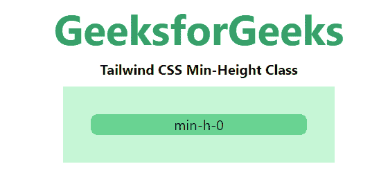
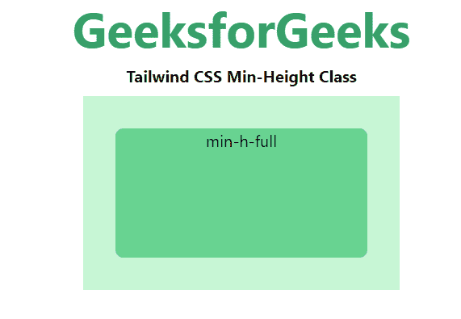
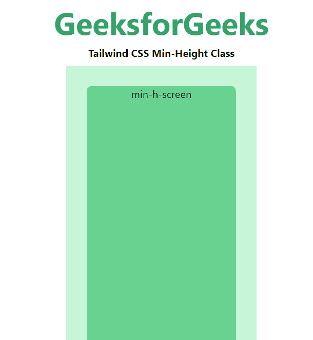

# 顺风 CSS 最小高度

> 原文:[https://www.geeksforgeeks.org/tailwind-css-min-height/](https://www.geeksforgeeks.org/tailwind-css-min-height/)

这个类在[顺风 CSS](https://www.geeksforgeeks.org/css-tailwind-introduction/) 中接受很多值，其中所有的属性都以类的形式被覆盖。它是 [CSS 最小高度属性](https://www.geeksforgeeks.org/css-min-height-property/)的替代品。此类用于设置元素的最小高度。当元素含量小于*最小高度*时，使用*最小高度*类，如果元素含量大于*最小高度，*则无效。该等级确保*高度*等级的值不小于所考虑元素的指定*最小高度*值。

**最小高度等级:**

*   最小 h-0
*   最小 h 满
*   最小屏幕

**min-h-0:** 此类用于设置任意元素的最小特定高度。

**语法:**

```css
<element class="min-h-0">...</element>
```

**示例:**

## 超文本标记语言

```css
<!DOCTYPE html> 
<head> 
    <link href=
"https://unpkg.com/tailwindcss@^1.0/dist/tailwind.min.css" 
          rel="stylesheet"> 
</head> 

<body class="text-center mx-4 space-y-2"> 
    <h1 class="text-green-600 text-5xl font-bold">
        GeeksforGeeks
    </h1> 
    <b>Tailwind CSS Min-Height Class</b> 
    <div class="mx-48 bg-green-200 p-8">
        <div class="min-h-0 bg-green-400 
                    rounded-lg">min-h-0</div>
    </div>
</body> 

</html>
```

**输出:**



**min-h-full:** 此类用于设置元素已满的最小高度，具体取决于父元素。

**语法:**

```css
<element class="min-h-full">...</element>
```

**示例:**

## 超文本标记语言

```css
<!DOCTYPE html> 
<head> 
    <link href=
"https://unpkg.com/tailwindcss@^1.0/dist/tailwind.min.css" 
          rel="stylesheet"> 
</head> 

<body class="text-center mx-4 space-y-2"> 
    <h1 class="text-green-600 text-5xl font-bold">
        GeeksforGeeks
    </h1> 
    <b>Tailwind CSS Min-Height Class</b> 
    <div class="mx-48 h-48 bg-green-200 p-8">
        <div class="min-h-full bg-green-400 
                    rounded-lg">min-h-full</div>
    </div>
</body> 

</html>
```

**输出:**



**min-h-screen:** 这个类用来使一个元素跨度视口的整个高度最小。

**语法:**

```css
<element class="min-h-screen">...</element>
```

**示例:**

## 超文本标记语言

```css
<!DOCTYPE html> 
<head> 
    <link href=
"https://unpkg.com/tailwindcss@^1.0/dist/tailwind.min.css" 
          rel="stylesheet"> 
</head> 

<body class="text-center mx-4 space-y-2"> 
    <h1 class="text-green-600 text-5xl font-bold">
        GeeksforGeeks
    </h1> 
    <b>Tailwind CSS Min-Height Class</b> 
    <div class="mx-48 bg-green-200 p-8">
        <div class="min-h-screen bg-green-400 
                    rounded-lg">min-h-screen</div>
    </div>
</body> 

</html>
```

**输出:**

