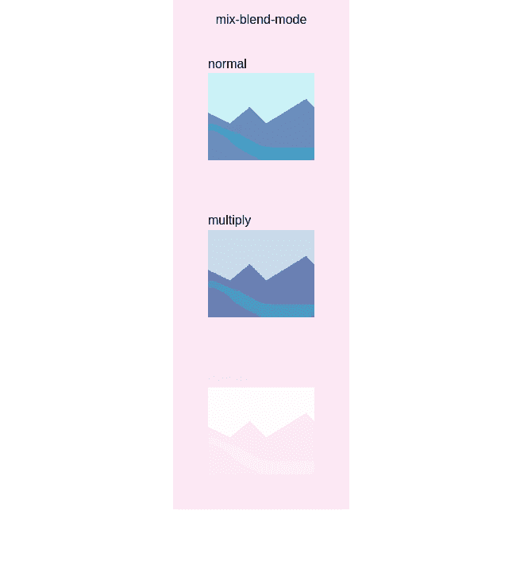
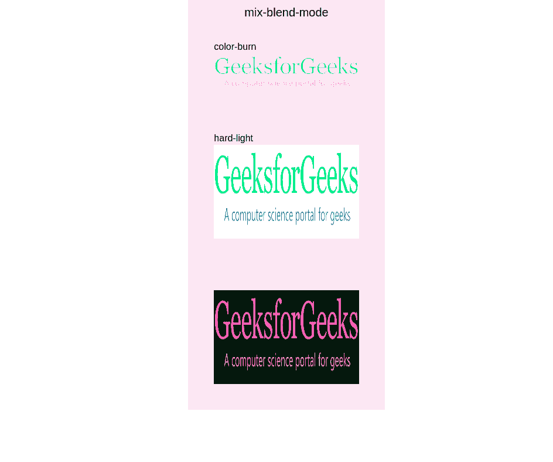

# 顺风 CSS 混合混合模式

> 原文:[https://www.geeksforgeeks.org/tailwind-css-mix-blend-mode/](https://www.geeksforgeeks.org/tailwind-css-mix-blend-mode/)

这个类在[顺风 CSS](https://www.geeksforgeeks.org/introduction-to-tailwind-css/) 中接受很多值，其中所有的属性都以类的形式被覆盖。此类用于指定元素内容应如何与背景混合。在 CSS 中，我们可以通过使用 CSS [混合模式属性来实现。](https://www.geeksforgeeks.org/css-mix-blend-mode-property/)

**混合混合模式类别:**

*   **混合-混合-正常:**不对元素应用混合。
*   **混合-混合-相乘:**这将元素的颜色与背景相乘。产生的颜色总是和背景一样暗。
*   **混合-混合-屏幕:**这将元素的颜色与背景相乘，然后补充结果。生成的颜色总是像混合层一样明亮。
*   **混合-混合-排除:**这将从元素的最亮颜色中减去两种颜色中的较暗颜色。结果类似于“差异”，但对比度较低。
*   **混合-混合-叠加:**这将对元素中较亮的颜色应用“倍增”，对较暗的颜色应用“屏蔽”。这种效果实际上与“强光”相反。
*   **混合-混合-变暗:**这将背景替换为元素颜色较暗的部分。
*   **混合-混合-变亮:**这将背景替换为元素颜色较亮的部分。
*   **mix-blend-color-dodge:** 这将使背景颜色变浅，以反映元素的颜色。
*   **混合-混合-颜色-燃烧:**这会使背景颜色变暗，以反映图像的自然颜色。结果增加了元素和背景之间的对比度。
*   **混合-混合-强光:**这将对较亮的颜色应用“倍增”，对较暗的元素应用“屏蔽”。这种效果实际上与“叠加”相反。
*   **混合-混合-柔光:**这将对较亮的颜色应用“倍增”，对元素中较暗的颜色应用“屏蔽”。产生的效果比“叠加”更柔和。
*   **混合-混合-差异:**这将减去背景颜色和元素颜色之间的绝对差异。
*   **混合-混合-色调:**这将元素的色调应用于背景的饱和度和亮度。
*   **混合-混合-饱和度:**这将元素的饱和度应用于背景的色调和亮度。
*   **混合-混合-颜色:**这将元素的色调和饱和度应用于背景的亮度。
*   **混合-混合-亮度:**这将元素的亮度应用于背景的色调和饱和度。

**语法:**

```html
<div class="mix-blend-{mode}" >
    ...
</div>
```

**注意:***混合-混合-模式* CSS 属性设置元素的内容应该如何与元素的父元素和元素背景的内容混合。

**示例 1:** 以下代码使用类*混合-混合-正常、混合-混合-相乘、混合-混合-叠加*。

## 超文本标记语言

```html
<!DOCTYPE html>
<html>

<head>
    <link href=
"https://unpkg.com/tailwindcss@^1.0/dist/tailwind.min.css"
        rel="stylesheet">
</head>

<body>
    <div class="m-auto bg-pink-100 w-2/6 h-25 p-3">
        <h3 class="text-center">
            mix-blend-mode
        </h3>

        <div class="mix-blend-normal p-8">
            <h1>normal</h1>
            
        </div>

        <div class="mix-blend-multiply p-8">
            <h1>multiply</h1>
            
        </div>

        <div class="mix-blend-overlay p-8">
            <h1>overlay</h1>
            
        </div>
    </div>
</body>

</html>
```

**输出:**



**例 2:** 以下代码使用*混合-混合-排除，混合-混合-颜色-燃烧*和*混合-混合-硬-轻*。

## 超文本标记语言

```html
<!DOCTYPE html>
<html>

<head>
    <link href=
"https://unpkg.com/tailwindcss@^1.0/dist/tailwind.min.css"
        rel="stylesheet">
</head>

<body>
    <div class="m-auto bg-pink-100 w-2/6 h-25 p-3">
        <h1 class="text-center text-xl ">
            mix-blend-mode
        </h1>

        <div class="mix-blend-color-burn  p-8">
            <h1>color-burn</h1>
            
        </div>

        <div class="mix-blend-hard-light p-8">
            <h1>hard-light</h1>
            
        </div>

        <div class="mix-blend-exclusion p-8">
            <h1>exclusion</h1>
            
        </div>
    </div>
</body>

</html>
```

**输出:**

