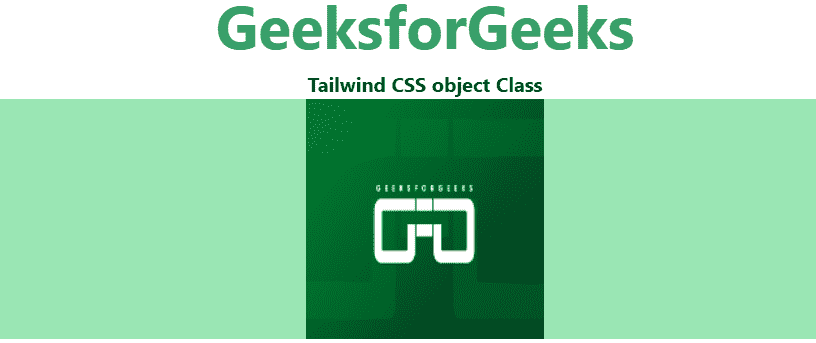
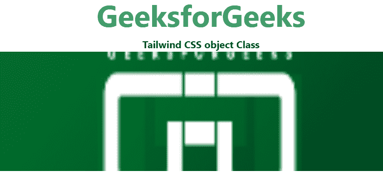
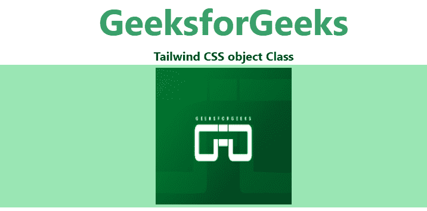

# 顺风 CSS 对象拟合

> 原文:[https://www.geeksforgeeks.org/tailwind-css-object-fit/](https://www.geeksforgeeks.org/tailwind-css-object-fit/)

这个类在顺风 CSS 中接受多个值。所有的属性都包含在类的形式中。它是 [CSS 对象适配属性](https://www.geeksforgeeks.org/css-the-object-fit-property/)的替代。此类用于指定应该如何调整图像或视频的大小以适合其内容框，从而控制被替换元素的内容大小。

**对象拟合类:**

*   对象包含
*   物体盖
*   对象填充
*   对象-无
*   对象缩小

**对象-包含:**此类替换图像保留了原始图像的纵横比，同时适合内容框。调整元素内容的大小，使其保持在容器中。

**语法:**

```html
<element class="object-contain">...</element>
```

**例 1:**

## 超文本标记语言

```html
<!DOCTYPE html> 
<head>    
    <link href=
"https://unpkg.com/tailwindcss@^1.0/dist/tailwind.min.css" 
     rel="stylesheet"> 
</head> 

<body class="text-center"> 
<center>
    <h1 class="text-green-600 text-5xl font-bold">
        GeeksforGeeks
    </h1> 
    <b>Tailwind CSS object Class</b> 
    <div class="bg-green-300 w-full h-full">
        

</center>
</body> 

</html>
```

**输出:**



**对象-封面:**此类在内容框中拟合时，保留原始图像的纵横比作为替换图像。有时，当原始图像的纵横比与内容框的纵横比不匹配时，会对其进行剪裁以适合。使用此类调整元素内容的大小以覆盖其容器。

**语法:**

```html
<element class="object-cover">...</element>
```

**例 2:**

## 超文本标记语言

```html
<!DOCTYPE html> 
<head>     
    <link href=
"https://unpkg.com/tailwindcss@^1.0/dist/tailwind.min.css" 
    rel="stylesheet"> 
</head> 

<body class="text-center"> 
<center>
    <h1 class="text-green-600 text-5xl font-bold">
        GeeksforGeeks
    </h1> 
    <b>Tailwind CSS object Class</b> 
    <div class="bg-green-300 w-full h-full">
        

</center>
</body> 

</html>
```

**输出:**



**对象填充:**此类替换图像被拉伸以适合内容框。被替换的图像将完全填满盒子，而不需要它的长宽比。使用类拉伸元素的内容以适合其容器。

**语法:**

```html
<element class="object-fill">...</element>
```

**例 3:**

## 超文本标记语言

```html
<!DOCTYPE html> 
<head>    
    <link href=
"https://unpkg.com/tailwindcss@^1.0/dist/tailwind.min.css" 
    rel="stylesheet"> 
</head> 

<body class="text-center"> 
<center>
    <h1 class="text-green-600 text-5xl font-bold">
        GeeksforGeeks
    </h1> 
    <b>Tailwind CSS object Class</b> 
    <div class="bg-green-300 w-full h-full">
        

</center>
</body> 

</html>
```

**输出:**


**对象-无:**在这个类中，被替换的图像将忽略原始图像的纵横比。因此，它不会调整大小。该类以元素的原始大小显示元素的内容，忽略容器大小。

**语法:**

```html
<element class="object-none">...</element>
```

**例 4:**

## 超文本标记语言

```html
<!DOCTYPE html> 
<head>    
    <link href=
"https://unpkg.com/tailwindcss@^1.0/dist/tailwind.min.css" 
          rel="stylesheet"> 
</head> 

<body class="text-center"> 
<center>
    <h1 class="text-green-600 text-5xl font-bold">
        GeeksforGeeks
    </h1> 
    <b>Tailwind CSS object Class</b> 
    <div class="bg-green-300 w-full h-full">
        

</center>
</body> 

</html>
```

**输出:**



**对象-缩小:**此类替换图像的大小会被调整，就像没有指定或指定了包含一样，并导致最小的对象大小。该类以元素的原始大小显示元素的内容，但会将其缩小以适合其容器。

**语法:**

```html
<element class="object-scale-down">...</element>
```

**例 5:**

## 超文本标记语言

```html
<!DOCTYPE html> 
<head>    
    <link href=
"https://unpkg.com/tailwindcss@^1.0/dist/tailwind.min.css" 
          rel="stylesheet"> 
</head> 

<body class="text-center"> 
<center>
    <h1 class="text-green-600 text-5xl font-bold">
        GeeksforGeeks
    </h1> 
    <b>Tailwind CSS object Class</b> 
    <div class="bg-green-300 w-full h-full">
    

</center>
</body> 

</html>
```

**输出:**

