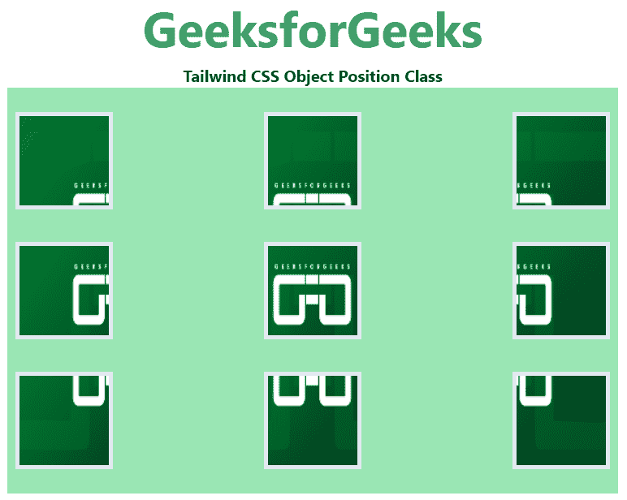

# 顺风 CSS 对象位置

> 原文:[https://www.geeksforgeeks.org/tailwind-css-object-position/](https://www.geeksforgeeks.org/tailwind-css-object-position/)

这个类在顺风 CSS 中接受多个值。所有的属性都包含在类的形式中。它是 [CSS 对象位置属性](https://www.geeksforgeeks.org/css-object-position-property/)的替代。此类用于指定图像或视频元素如何在其内容框内用 x/y 坐标定位。它还控制元素在其容器中的内容位置的替换。

**物体位置等级:**

*   **对象-左上方:**位于图像或视频的左上方。
*   **对象-顶部:**它位于图像或视频的顶部。
*   **对象-右上方:**位于图像或视频的右上方。
*   **对象-左侧:**它位于图像或视频的左侧。
*   **物体中心:**它位于图像或视频的中心。
*   **对象-右侧:**它位于图像或视频的右侧。
*   **对象-左下方:**位于图像或视频的左下方。
*   **对象-底部:**它位于图像或视频的底部。
*   **对象-右下方:**位于图像或视频的右下方。

**注:**以下示例中使用了所有类。

**示例:**

## 超文本标记语言

```
<!DOCTYPE html>
<html>
  <head>   
    <link
      href="https://unpkg.com/tailwindcss@^1.0/dist/tailwind.min.css"
      rel="stylesheet">
  </head>

  <body class="text-center">
    <h1 class="text-green-600 text-5xl font-bold">
      GeeksforGeeks
    </h1>
    <b>Tailwind CSS Object Position Class</b>
    <div class="bg-green-300 
                mx-16
                space-y-4
                p-2
                justify-between
                grid grid-rows-3 
                grid-flow-col">
      
      
      

      
      
      

      
      

      
    </div>
  </body>
</html>
```

**输出:**可以将鼠标悬停在输出图像上，每个图像都会在工具提示中显示其对象位置。

