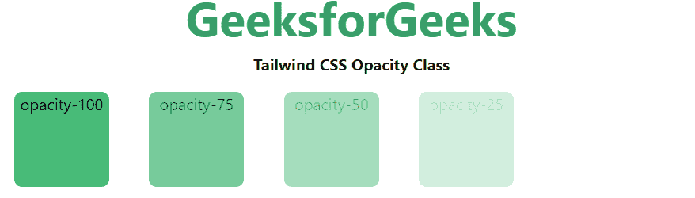

# 泰风 CSS 不透明

> 哎哎哎:# t0]https://www . geeksforgeeks . org/taiwind-CSS-opacity/

这个类在[顺风 CSS](https://www.geeksforgeeks.org/css-tailwind-introduction/) 中接受很多值，其中所有的属性都以类的形式被覆盖。通过使用这个类，我们可以设置任何元素的不透明度。在 CSS 中，我们通过使用 [CSS 不透明度属性](https://www.geeksforgeeks.org/css-opacity-transparency/)来做到这一点。

**不透明度等级:**

*   **不透明度-0:** 控制元素的不透明度。

**注意:**不透明度的数量可以在 0 到 100 之间变化，跨度为 5。

**语法:**

```
<element class="opacity-{number}">...</element>
```

**示例:**

## 超文本标记语言

```
<!DOCTYPE html> 
<html>
<head> 
    <link href= 
"https://unpkg.com/tailwindcss@^1.0/dist/tailwind.min.css"
        rel="stylesheet"> 
</head> 

<body class="text-center mx-4 space-y-2"> 
    <h1 class="text-green-600 text-5xl font-bold"> 
        GeeksforGeeks 
    </h1> 
    <b>Tailwind CSS Opacity Class</b> 
    <div class="grid grid-flow-col text-center p-2"> 
        <div class="opacity-100  w-24 h-24 bg-green-500 
                    rounded-lg">opacity-100
        </div>
        <div class="opacity-75 w-24 h-24 bg-green-500 
                    rounded-lg">opacity-75
        </div>
        <div class="opacity-50 w-24 h-24 bg-green-500 
                    rounded-lg">opacity-50
        </div>
        <div class="opacity-25 w-24 h-24 bg-green-500 
                    rounded-lg">opacity-25
        </div>
        <div class="opacity-0  w-24 h-24 bg-green-500 
                    rounded-lg">opacity-0
        </div>
    </div> 
</body> 

</html> 
```

**输出:**



顺风 CSS 不透明度类