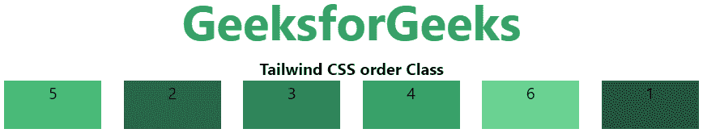

# 顺风 CSS 命令

> 原文:[https://www.geeksforgeeks.org/tailwind-css-order/](https://www.geeksforgeeks.org/tailwind-css-order/)

顺序是顺风 CSS 最好的特性之一，通过使用这个类，我们可以根据自己的需求对 flex 和 grid 项进行排序。有很多订单类。该类用于以不同于 DOM 中显示的顺序呈现 flex 和 grid 项。

**顺序:**

*   **订单-1**
*   **订单-2**
*   **订单-3**
*   **订单-4**
*   **订单-5**
*   **订单-6**
*   **订单-7**
*   **订单-8**
*   **订单-9**
*   **订单-10**
*   **订单-11**
*   **订单-12**
*   **订单优先**
*   **订单-最后**
*   **订单-无**

**语法:**

```html
<element order- number | string >
```

**参数:**这个类接受两种类型的参数，但是一次一个，只能跟随着订单号或者你要提到的位置。

*   **数字:**跟随订单索引的整数。
*   **字符串:**在词序索引位置，只接受倒数第一。

**示例:**在本例中，我们在第一个弹性项上设置了 order-last，在第五个弹性项上设置了 order-first，现在可以看到订单列表与正常不同。

## 超文本标记语言

```html
<!DOCTYPE html>
<html>

<head>
    <title>Tailwind order Class</title>

    <link href=
"https://unpkg.com/tailwindcss@^1.0/dist/tailwind.min.css"
          rel="stylesheet">
</head>

<body class="text-center">
    <h1 class="text-green-600 text-5xl font-bold">
        GeeksforGeeks
    </h1>

    <b>Tailwind CSS order Class</b>

    <div id="main" class="flex flex-row justify-evenly">
        <div class="bg-green-900 order-last w-24 h-12">1</div>
        <div class="bg-green-800 w-24 h-12">2</div>
        <div class="bg-green-700 w-24 h-12">3</div>
        <div class="bg-green-600 w-24 h-12">4</div>
        <div class="bg-green-500 order-first w-24 h-12">5</div>
        <div class="bg-green-400 w-24 h-12">6</div>
    </div>
</body>

</html>
```

**输出:**

