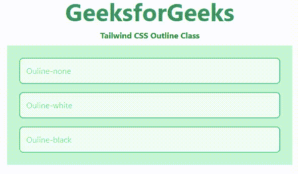

# 顺风 CSS 轮廓

> 原文:[https://www.geeksforgeeks.org/tailwind-css-outline/](https://www.geeksforgeeks.org/tailwind-css-outline/)

这个类在[顺风 CSS](https://www.geeksforgeeks.org/css-tailwind-introduction/) 中接受很多值，其中所有的属性都以类的形式被覆盖。此类用于控制元素的轮廓。

**大纲类别:**

*   **轮廓-无:**该类用于隐藏聚焦元素上的默认浏览器轮廓。
*   **轮廓-白色:**这个类用于在一个有 2px 偏移量的元素周围添加一个白色 2px 点状边框。
*   **轮廓-黑色:**这个类用于在一个有 2px 偏移量的元素周围添加一个黑色 2px 点状边框。

**语法:**

```css
<element class="outline-{style}">...</element>
```

**示例:**

## 超文本标记语言

```css
<!DOCTYPE html>
<html>
<head> 
    <link href= 
"https://unpkg.com/tailwindcss@^1.0/dist/tailwind.min.css"
        rel="stylesheet"> 
</head> 

<body class="text-center mx-4 space-y-2"> 
    <h1 class="text-green-600 text-5xl font-bold"> 
        GeeksforGeeks 
    </h1> 
    <b>Tailwind CSS Outline Class</b> 
    <div class="mx-6 bg-green-200 grid grid-rows-3
                grid-flow-col text-justify p-4"> 

        <input class="placeholder-gray-500 p-3 m-2 rounded-lg 
                    border-2 border-green-400 bg-green-100
                    focus:outline-none" 
               placeholder="Ouline-none"> 
        <input class="placeholder-gray-500 p-3 m-2 rounded-lg 
                      border-2 border-green-400 bg-green-100
                      focus:outline-white" 
               placeholder="Ouline-white"> 

        <input class="placeholder-gray-500 p-3 m-2 rounded-lg 
                    border-2 border-green-400 bg-green-100
                    focus:outline-black" 
               placeholder="Ouline-black"> 
    </div> 
</body> 

</html> 
```

**输出:**

