# 顺风 CSS 溢出

> 原文:[https://www.geeksforgeeks.org/tailwind-css-overflow/](https://www.geeksforgeeks.org/tailwind-css-overflow/)

这个类在 Tailwind CSS 中接受多个值。它是 [**CSS 溢出属性**](https://www.geeksforgeeks.org/css-overflow/) **的替代品。**该溢出用于控制如何处理对于容器来说太大的元素内容。它告诉您是剪辑内容还是添加滚动条

[**CSS Overflow-x**](https://www.geeksforgeeks.org/css-overflow-x-property/) 和[**CSS Overflow-y**](https://www.geeksforgeeks.org/css-overflow-y-property/)**在 CSS 中有单独的属性**

****溢出类:****

*   **溢出自动**
*   **溢出隐藏**
*   **溢出可见**
*   **溢出滚动**
*   **溢出-x-自动**
*   **自动溢出**
*   **溢出-x-隐藏**
*   **溢出 y 隐藏**
*   **溢出-x-可见**
*   **溢出-y-可见**
*   **溢出-x-滚动**
*   **溢出-y-滚动**

****溢出自动:**它会在需要时自动添加滚动条。当元素的内容溢出元素边界时，此类将滚动条添加到该元素。**

****语法:****

```html
<element class="overflow-auto">...</element>
```

****示例:****

## **超文本标记语言**

```html
<!DOCTYPE html>

<head>
    <link href=
"https://unpkg.com/tailwindcss@^1.0/dist/tailwind.min.css"
        rel="stylesheet">
</head>

<body class="text-center">
    <center>
        <h1 class="text-green-600 text-5xl font-bold">
            GeeksforGeeks
        </h1>

        <b>Tailwind CSS Overflow Class</b>

        <div class="overflow-auto bg-green-200 
                    p-4 mx-16 h-24 text-justify">
            How many times were you frustrated while 
            looking out for a good collection of 
            programming/algorithm/interview questions? 
            What did you expect and what did you get? 
            This portal has been created to provide 
            well written, well thought and well 
            explained solutions for selected questions.
            An IIT Roorkee alumnus and founder of 
            GeeksforGeeks. He loves to solve programming
            problems in most efficient ways. Apart from 
            GeeksforGeeks, he has worked with DE Shaw 
            and Co. as a software developer and JIIT 
            Noida as an assistant professor. It is a 
            good platform to learn programming. It is 
            an educational website. Prepare for the 
            Recruitment drive of product based companies 
            like Microsoft, Amazon, Adobe etc with a 
            free online placement preparation course
        </div>
    </center>
</body>

</html>
```

****输出:****

**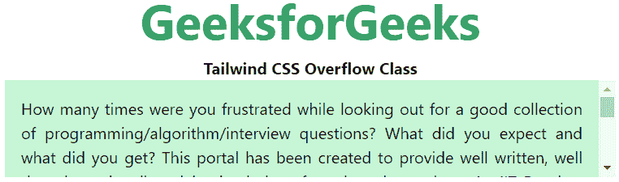**

****溢出-隐藏:**溢出被剪切，其余内容不可见。此类用于剪切元素中溢出该元素边界的任何内容。**

****语法:****

```html
<element class="overflow-hidden">...</element>
```

****示例:****

## **超文本标记语言**

```html
<!DOCTYPE html>

<head>
    <link href=
"https://unpkg.com/tailwindcss@^1.0/dist/tailwind.min.css"
        rel="stylesheet">
</head>

<body class="text-center">
    <center>
        <h1 class="text-green-600 text-5xl font-bold">
            GeeksforGeeks
        </h1>
        <b>Tailwind CSS Overflow Class</b>
        <div class="overflow-hidden bg-green-200 
                p-4 mx-16 h-24 text-justify">
            How many times were you frustrated while 
            looking out for a good collection of 
            programming/algorithm/interview questions? 
            What did you expect and what did you get? 
            This portal has been created to provide 
            well written, well thought and well 
            explained solutions for selected questions.
            An IIT Roorkee alumnus and founder of 
            GeeksforGeeks. He loves to solve programming
            problems in most efficient ways. Apart from 
            GeeksforGeeks, he has worked with DE Shaw 
            and Co. as a software developer and JIIT 
            Noida as an assistant professor. It is a 
            good platform to learn programming. It is 
            an educational website. Prepare for the 
            Recruitment drive of product based companies 
            like Microsoft, Amazon, Adobe etc with a 
            free online placement preparation course
        </div>
    </center>
</body>

</html>
```

****输出:****

**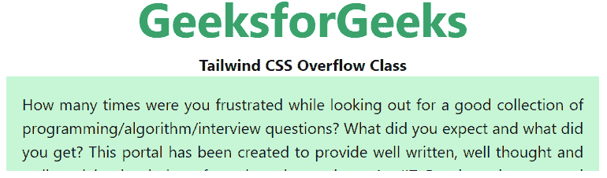**

****溢出-可见:**内容在元素框外不被裁剪和可见。此类用于防止元素中的内容被剪切。**

****语法:****

```html
<element class="overflow-visible">...</element>
```

****示例:****

## **超文本标记语言**

```html
<!DOCTYPE html>

<head>
    <link href=
"https://unpkg.com/tailwindcss@^1.0/dist/tailwind.min.css"
        rel="stylesheet">
</head>

<body class="text-center">
    <center>
        <h1 class="text-green-600 text-5xl font-bold">
            GeeksforGeeks
        </h1>
        <b>Tailwind CSS Overflow Class</b>
        <div class="overflow-visible bg-green-200 
                p-4 mx-16 h-24 text-justify">
            How many times were you frustrated while 
            looking out for a good collection of 
            programming/algorithm/interview questions? 
            What did you expect and what did you get? 
            This portal has been created to provide 
            well written, well thought and well 
            explained solutions for selected questions.
            An IIT Roorkee alumnus and founder of 
            GeeksforGeeks. He loves to solve programming
            problems in most efficient ways. Apart from 
            GeeksforGeeks, he has worked with DE Shaw 
            and Co. as a software developer and JIIT 
            Noida as an assistant professor. It is a 
            good platform to learn programming. It is 
            an educational website. Prepare for the 
            Recruitment drive of product based companies 
            like Microsoft, Amazon, Adobe etc with a 
            free online placement preparation course
        </div>
    </center>
</body>

</html>
```

****输出:****

**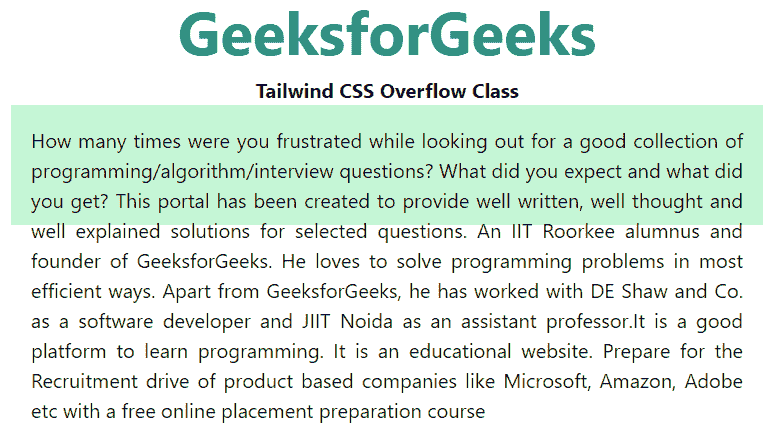**

****溢出-滚动:**溢出被剪切，但添加了滚动条来查看其余内容。滚动条可以是水平的也可以是垂直的。这个类在你需要显示滚动条的时候使用，这个工具只有在需要滚动的时候才会显示。**

****语法:****

```html
<element class="overflow-scroll">...</element>
```

****示例:****

## **超文本标记语言**

```html
<!DOCTYPE html>

<head>
    <link href=
"https://unpkg.com/tailwindcss@^1.0/dist/tailwind.min.css"
        rel="stylesheet">
</head>

<body class="text-center">
    <center>
        <h1 class="text-green-600 text-5xl font-bold">
            GeeksforGeeks
        </h1>
        <b>Tailwind CSS Overflow Class</b>
        <div class="overflow-scroll bg-green-200 
            p-4 mx-16 h-24 text-justify">
            How many times were you frustrated while 
            looking out for a good collection of 
            programming/algorithm/interview questions? 
            What did you expect and what did you get?
        </div>
    </center>
</body>

</html>
```

****输出:****

**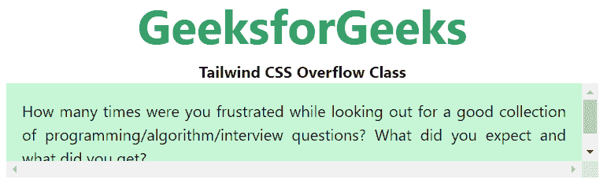**

****Overflow-x:** 此类指定当块级元素在左右边缘溢出时，是添加滚动条、剪辑内容还是显示溢出内容。**

****溢出-x-auto:** 为溢出的盒子提供了滚动机制。**

****语法:****

```html
<element class="overflow-x-auto">...</element>
```

****示例:****

## **超文本标记语言**

```html
<!DOCTYPE html>

<head>
    <link href=
"https://unpkg.com/tailwindcss@^1.0/dist/tailwind.min.css"
        rel="stylesheet">
</head>

<body class="text-center">
    <center>
        <h1 class="text-green-600 text-5xl font-bold">
            GeeksforGeeks
        </h1>

        <b>Tailwind CSS Overflow-x Class</b>

        <div class="overflow-x-auto bg-green-200 
            p-4 mx-16 h-24 text-justify">
            How many times were you frustrated while 
            looking out for a good collection of 
            programming/algorithm/interview questions? 
            What did you expect and what did you get?
        </div>
    </center>
</body>

</html>
```

****输出:****

**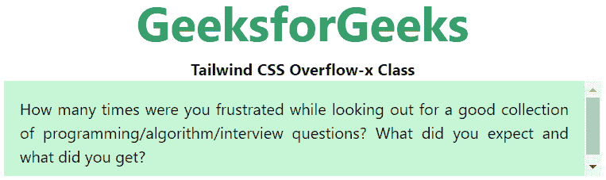**

****overflow-x-hidden:** 用于剪辑内容，x 轴上不提供滚动机制。**

****语法:****

```html
<element class="overflow-x-hidden">...</element>
```

****示例:****

## **超文本标记语言**

```html
<!DOCTYPE html>

<head>
    <link href=
"https://unpkg.com/tailwindcss@^1.0/dist/tailwind.min.css"
        rel="stylesheet">
</head>

<body class="text-center">
    <center>
        <h1 class="text-green-600 text-5xl font-bold">
            GeeksforGeeks
        </h1>

        <b>Tailwind CSS Overflow-x Class</b>

        <div class="overflow-x-hidden bg-green-200 
            p-4 mx-16 h-12 text-justify">
            How many times were you frustrated while 
            looking out for a good collection of 
            programming/algorithm/interview questions? 
            What did you expect and what did you get?
        </div>
    </center>
</body>

</html>
```

****输出:****

**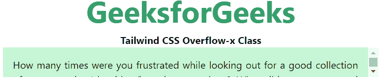**

****overflow-x-visible:** 这个类不剪辑内容。内容可以在左边缘和右边缘之外呈现。**

****语法:****

```html
<element class="overflow-x-visible">...</element>
```

****示例:****

## **超文本标记语言**

```html
<!DOCTYPE html>

<head>
    <link href=
"https://unpkg.com/tailwindcss@^1.0/dist/tailwind.min.css"
        rel="stylesheet">
</head>

<body class="text-center">
    <center>
        <h1 class="text-green-600 text-5xl font-bold">
            GeeksforGeeks
        </h1>

        <b>Tailwind CSS Overflow-x Class</b>

        <div class="overflow-x-visible bg-green-200 
            p-4 mx-16 h-24 text-justify">
            How many times were you frustrated while 
            looking out for a good collection of 
            programming/algorithm/interview questions? 
            What did you expect and what did you get?
        </div>
    </center>
</body>

</html>
```

****输出:****

**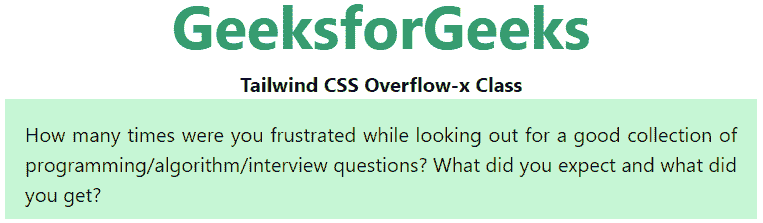**

****overflow-x-scroll:** 用于剪辑内容并提供滚动机制。**

****语法:****

```html
<element class="overflow-x-scroll">...</element>
```

****示例:****

## **超文本标记语言**

```html
<!DOCTYPE html>

<head>
    <link href=
"https://unpkg.com/tailwindcss@^1.0/dist/tailwind.min.css"
        rel="stylesheet">
</head>

<body class="text-center">
    <center>
        <h1 class="text-green-600 text-5xl font-bold">
            GeeksforGeeks
        </h1>

        <b>Tailwind CSS Overflow-x Class</b>

        <div class="overflow-x-scroll bg-green-200 
            p-4 mx-16 h-24 text-justify">
            How many times were you frustrated while 
            looking out for a good collection of 
            programming/algorithm/interview questions? 
            What did you expect and what did you get?
        </div>
    </center>
</body>

</html>
```

****输出:****

**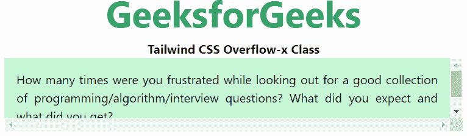**

****Overflow-y:** 此类指定当块级元素的上下边缘溢出时，是添加滚动条、剪辑内容还是显示溢出内容。**

****溢出-y-auto:** 为溢出的盒子提供滚动机制。**

****语法:****

```html
<element class="overflow-y-auto">...</element>
```

****示例:****

## **超文本标记语言**

```html
<!DOCTYPE html>

<head>
    <link href=
"https://unpkg.com/tailwindcss@^1.0/dist/tailwind.min.css"
        rel="stylesheet">
</head>

<body class="text-center">
    <center>
        <h1 class="text-green-600 text-5xl font-bold">
            GeeksforGeeks
        </h1>

        <b>Tailwind CSS Overflow-y Class</b>

        <div class="overflow-y-auto bg-green-200 
            p-4 mx-16 h-24 text-justify">
            How many times were you frustrated while 
            looking out for a good collection of 
            programming/algorithm/interview questions? 
            What did you expect and what did you get?
        </div>
    </center>
</body>

</html>
```

****输出:****

**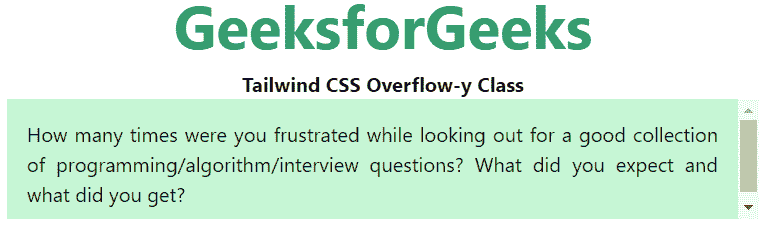**

****overflow-y-hidden:** 用于剪辑内容，y 轴上不提供滚动机制。**

****语法:****

```html
<element class="overflow-y-hidden">...</element>
```

****示例:****

## **超文本标记语言**

```html
<!DOCTYPE html>

<head>
    <link href=
"https://unpkg.com/tailwindcss@^1.0/dist/tailwind.min.css"
        rel="stylesheet">
</head>

<body class="text-center">
    <center>
        <h1 class="text-green-600 text-5xl font-bold">
            GeeksforGeeks
        </h1>

        <b>Tailwind CSS Overflow-y Class</b>

        <div class="overflow-y-hidden bg-green-200
            p-4 mx-16 h-24 text-justify">
            How many times were you frustrated while 
            looking out for a good collection of 
            programming/algorithm/interview questions? 
            What did you expect and what did you get?
        </div>
    </center>
</body>

</html>
```

****输出:****

**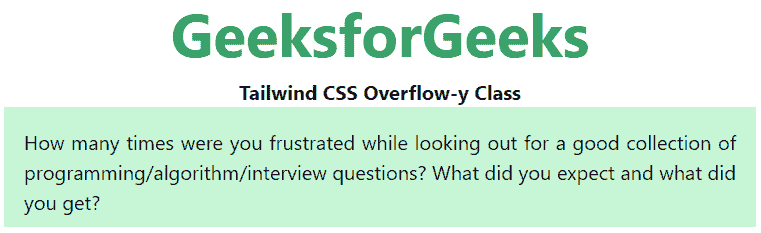**

****overflow-y-visible:** 这个类不剪辑内容。内容可以在左边缘和右边缘之外呈现。**

****语法:****

```html
<element class="overflow-y-visible">...</element>
```

****示例:****

## **超文本标记语言**

```html
<!DOCTYPE html>

<head>
    <link href=
"https://unpkg.com/tailwindcss@^1.0/dist/tailwind.min.css"
        rel="stylesheet">
</head>

<body class="text-center">
    <center>
        <h1 class="text-green-600 text-5xl font-bold">
            GeeksforGeeks
        </h1>
        <b>Tailwind CSS Overflow-y Class</b>
        <div class="overflow-y-visible bg-green-200
            p-4 mx-16 h-24 text-justify">
            How many times were you frustrated while
            looking out for a good collection of 
            programming/algorithm/interview questions? 
            What did you expect and what did you get?
        </div>
    </center>
</body>

</html>
```

****输出:****

**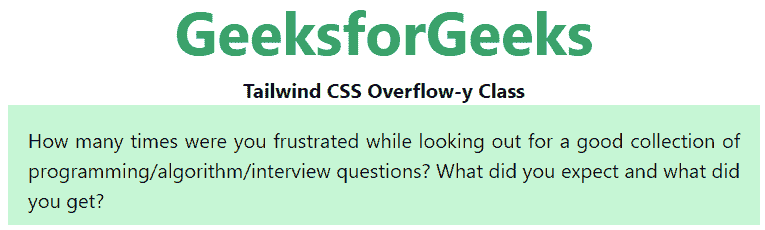**

****overflow-y-scroll:** 用于剪辑内容，还提供了滚动机制。**

****语法:****

```html
<element class="overflow-y-scroll">...</element>
```

****示例:****

## **超文本标记语言**

```html
<!DOCTYPE html>

<head>
    <link href=
"https://unpkg.com/tailwindcss@^1.0/dist/tailwind.min.css"
        rel="stylesheet">
</head>

<body class="text-center">
    <center>
        <h1 class="text-green-600 text-5xl font-bold">
            GeeksforGeeks
        </h1>
        <b>Tailwind CSS Overflow-y Class</b>
        <div class="overflow-y-scroll bg-green-200 
            p-4 mx-16 h-24 text-justify">
            How many times were you frustrated while 
            looking out for a good collection of 
            programming/algorithm/interview questions? 
            What did you expect and what did you get?
        </div>
    </center>
</body>

</html>
```

****输出:****

**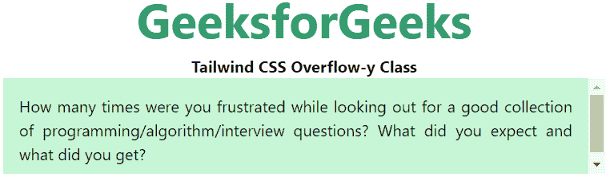**