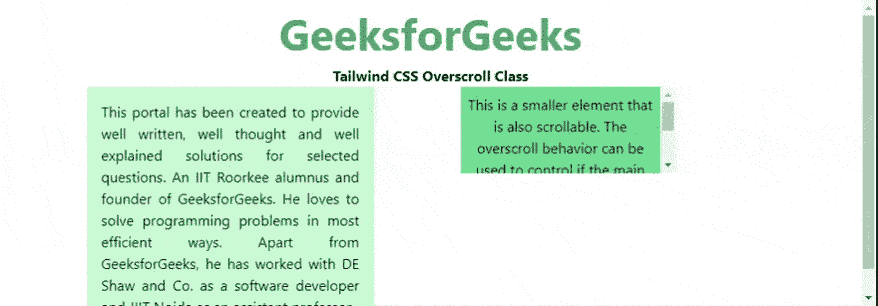
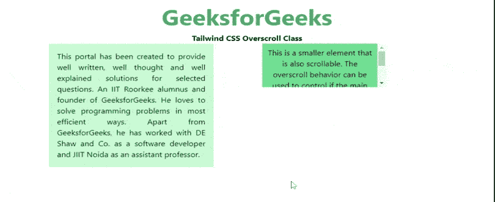
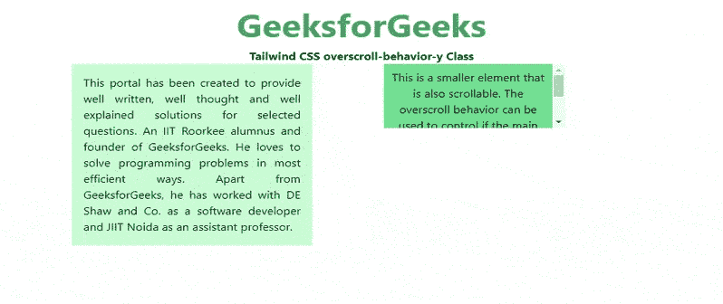
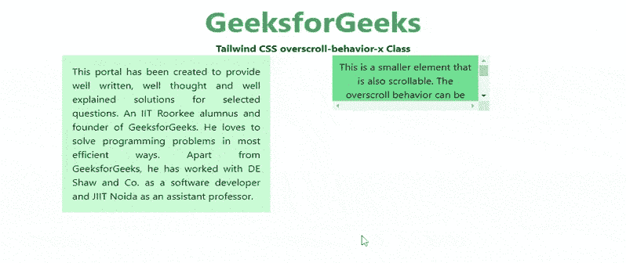

# 顺风 CSS 过卷行为

> 原文:[https://www . geesforgeks . org/tail wind-CSS-over croll-behavior/](https://www.geeksforgeeks.org/tailwind-css-overscroll-behavior/)

该类在[顺风 CSS](https://www.geeksforgeeks.org/css-tailwind-introduction/) 中接受多个值。它是 [**CSS 超临界行为属性**](https://www.geeksforgeeks.org/css-overscroll-behavior-property/) 的替代品。此类用于设置到达滚动区域边界时浏览器的行为。此属性可用于防止在有多个滚动区域的页面中出现不必要的滚动。

[**CSS overcroll-behavior-x**](https://www.geeksforgeeks.org/css-overscroll-behavior-x-property/)和**[**CSS Overflow-behavior-y**](https://www.geeksforgeeks.org/css-overscroll-behavior-y-property/)在 CSS 中有单独的属性，但我们将在这一篇文章中介绍它。**

****过卷行为类:****

*   **超临界自动**
*   **超临界容器**
*   **超卖-无**
*   **超低价汽车**
*   **超临界 y 型容器**
*   **超低价**
*   **超临界 x-自动**
*   **超临界 x 容器**
*   **超卷-x-无**

****过卷自动:**用于将滚动行为设置为默认。即使到达元素的边界，整个页面和元素也会滚动。这是默认值。**

****语法:****

```
<element class="overscroll-auto">...</element>
```

****示例:****

## **超文本标记语言**

```
<!DOCTYPE html>
<head>
    <link href=
"https://unpkg.com/tailwindcss@^1.0/dist/tailwind.min.css"
        rel="stylesheet">
</head>

<body class="text-center">
    <center>
        <h1 class="text-green-600 text-5xl font-bold">
            GeeksforGeeks
        </h1>

        <b>Tailwind CSS Overscroll Class</b>

        <div class="flex">
            <div class="overscroll-contain bg-green-200 p-4 
                mx-24 w-1/3 text-justify">
                This portal has been created to provide well
                written, well thought and well explained 
                solutions for selected questions. An IIT 
                Roorkee alumnus and founder of GeeksforGeeks. 
                He loves to solve programming problems in 
                most efficient ways. Apart from GeeksforGeeks,
                he has worked with DE Shaw and Co. as a 
                software developer and JIIT Noida as an 
                assistant professor.
            </div>

            <div class="overscroll-auto overflow-y-scroll 
                bg-green-400 p-2 w-1/4 h-24">
                This is a smaller element that is also 
                scrollable. The overscroll behavior can 
                be used to control if the main content 
                behind would scroll when this element's 
                vertical boundary is reached.
            </div>
        </div>
    </center>
</body>

</html>
```

****输出:****

****

****过滚动-包含:**用于将滚动行为设置为仅在使用的元素上默认。在元素到达边界后进一步滚动它不会滚动它后面的元素。在相邻的滚动区域中不会出现滚动链接。**

****语法:****

```
<element class="overscroll-contain">...</element>
```

****示例:****

## **超文本标记语言**

```
<!DOCTYPE html> 
<head> 
    <link href=
"https://unpkg.com/tailwindcss@^1.0/dist/tailwind.min.css" 
          rel="stylesheet"> 
</head> 

<body class="text-center"> 
<center>
    <h1 class="text-green-600 text-5xl font-bold">
        GeeksforGeeks
    </h1> 
    <b>Tailwind CSS Overscroll Class</b> 
    <div class="flex">
    <div class="overscroll-contain bg-green-200 p-4 
                mx-24 w-1/3 text-justify">
      This portal has been created to provide well written,   
      well thought and well explained solutions for selected   
      questions. An IIT Roorkee alumnus and founder of   
      GeeksforGeeks. He loves to solve programming problems  
      in most efficient ways. Apart from GeeksforGeeks, he   
      has worked with DE Shaw and Co. as a software developer   
      and JIIT Noida as an assistant professor.
    </div> 
    <div class="overscroll-contain overflow-y-scroll 
                bg-green-400 p-2 w-1/4 h-24">
      This is a smaller element that is also 
      scrollable. The overscroll behavior 
      can be used to control if the main 
      content behind would scroll when this 
      element's vertical boundary is reached.
    </div>
    </div>
</center>
</body> 

</html>
```

****输出:****

****

****过卷-无:**用于防止所有元素的滚动链接。默认的滚动溢出行为也被阻止。**

****语法:****

```
<element class="overscroll-none">...</element>
```

****示例:****

## **超文本标记语言**

```
<!DOCTYPE html> 
<head> 
    <link href=
"https://unpkg.com/tailwindcss@^1.0/dist/tailwind.min.css" 
          rel="stylesheet"> 
</head> 

<body class="text-center"> 
<center>
    <h1 class="text-green-600 text-5xl font-bold">
        GeeksforGeeks
    </h1> 
    <b>Tailwind CSS Overscroll Class</b> 
    <div class="flex">
    <div class="overscroll-contain bg-green-200 p-4 
                mx-24 w-1/3 text-justify">
      This portal has been created to provide well written,   
      well thought and well explained solutions for selected   
      questions. An IIT Roorkee alumnus and founder of   
      GeeksforGeeks. He loves to solve programming problems  
      in most efficient ways. Apart from GeeksforGeeks, he   
      has worked with DE Shaw and Co. as a software developer   
      and JIIT Noida as an assistant professor.
    </div> 
    <div class="overscroll-none overflow-y-scroll 
                bg-green-400 p-2 w-1/4 h-24">
      This is a smaller element that is also 
      scrollable. The overscroll behavior 
      can be used to control if the main 
      content behind would scroll when this 
      element's vertical boundary is reached.
    </div>
    </div>
</center>
</body> 

</html>
```

****输出:****

****

****overcroll-behavior-y:**这个类用于设置当到达滚动区域的垂直边界时浏览器的行为。这可以在有多个滚动区域的网站中使用，滚动一个区域不会影响整个页面。这种效果称为滚动链接，可以相应地启用或禁用。**

****过卷-y-auto:** 用于将 y 轴上的滚动行为设置为所有元素的默认值。即使到达元素的边界，整个页面也会滚动。这是默认值。**

****语法:****

```
<element class="overscroll-y-auto">...</element>
```

****示例:****

## **超文本标记语言**

```
<!DOCTYPE html> 
<head> 
    <link href=
"https://unpkg.com/tailwindcss@^1.0/dist/tailwind.min.css" 
          rel="stylesheet"> 
</head> 

<body class="text-center"> 
<center>
    <h1 class="text-green-600 text-5xl font-bold">
        GeeksforGeeks
    </h1> 
    <b>Tailwind CSS overscroll-behavior-y Class</b> 
    <div class="flex">
    <div class="overscroll-contain bg-green-200 p-4 
                mx-24 w-1/3 text-justify">
      This portal has been created to provide well written,   
      well thought and well explained solutions for selected   
      questions. An IIT Roorkee alumnus and founder of   
      GeeksforGeeks. He loves to solve programming problems  
      in most efficient ways. Apart from GeeksforGeeks, he   
      has worked with DE Shaw and Co. as a software developer   
      and JIIT Noida as an assistant professor.
    </div> 
    <div class="overscroll-behavior-y-auto overflow-y-scroll 
                bg-green-400 p-2 w-1/4 h-24">
      This is a smaller element that is also 
      scrollable. The overscroll behavior 
      can be used to control if the main 
      content behind would scroll when this 
      element's vertical boundary is reached.
    </div>
    </div>
</center>
</body> 

</html>
```

****输出:****

****

****过卷-y-contain:** 用于将 y 轴上的滚动行为设置为仅在使用的元素上默认。相邻的滚动区域不会出现滚动链接，后面的元素也不会滚动。**

****语法:****

```
<element class="overscroll-y-contain">...</element>
```

****示例:****

## **超文本标记语言**

```
<!DOCTYPE html> 
<head> 
    <link href=
"https://unpkg.com/tailwindcss@^1.0/dist/tailwind.min.css" 
          rel="stylesheet"> 
</head> 

<body class="text-center"> 
<center>
    <h1 class="text-green-600 text-5xl font-bold">
        GeeksforGeeks
    </h1> 
    <b>Tailwind CSS overscroll-behavior-y Class</b> 
    <div class="flex">
    <div class="overscroll-contain bg-green-200 p-4 
                mx-24 w-1/3 text-justify">
      This portal has been created to provide well written,   
      well thought and well explained solutions for selected   
      questions. An IIT Roorkee alumnus and founder of   
      GeeksforGeeks. He loves to solve programming problems  
      in most efficient ways. Apart from GeeksforGeeks, he   
      has worked with DE Shaw and Co. as a software developer   
      and JIIT Noida as an assistant professor.
    </div> 
    <div class="overscroll-behavior-y-contain overflow-y-scroll 
                bg-green-400 p-2 w-1/4 h-24">
      This is a smaller element that is also 
      scrollable. The overscroll behavior 
      can be used to control if the main 
      content behind would scroll when this 
      element's vertical boundary is reached.
    </div>
    </div>
</center>
</body> 

</html>
```

****输出:****

****

****过卷-y-none:** 用于防止所有元素在 y 轴上滚动链接。默认的滚动溢出行为也被阻止。**

****语法:****

```
<element class="overscroll-y-none">...</element>
```

****示例:****

## **超文本标记语言**

```
<!DOCTYPE html> 
<head> 
    <link href=
"https://unpkg.com/tailwindcss@^1.0/dist/tailwind.min.css" 
          rel="stylesheet"> 
</head> 

<body class="text-center"> 
<center>
    <h1 class="text-green-600 text-5xl font-bold">
        GeeksforGeeks
    </h1> 
    <b>Tailwind CSS overscroll-behavior-y Class</b> 
    <div class="flex">
    <div class="overscroll-contain bg-green-200 p-4 
                mx-24 w-1/3 text-justify">
      This portal has been created to provide well written,   
      well thought and well explained solutions for selected   
      questions. An IIT Roorkee alumnus and founder of   
      GeeksforGeeks. He loves to solve programming problems  
      in most efficient ways. Apart from GeeksforGeeks, he   
      has worked with DE Shaw and Co. as a software developer   
      and JIIT Noida as an assistant professor.
    </div> 
    <div class="overscroll-behavior-y-none overflow-y-scroll 
                bg-green-400 p-2 w-1/4 h-24">
      This is a smaller element that is also 
      scrollable. The overscroll behavior 
      can be used to control if the main 
      content behind would scroll when this 
      element's vertical boundary is reached.
    </div>
    </div>
</center>
</body> 

</html>
```

****输出:****

****

****overcroll-behavior-x:**这个类用于设置当到达滚动区域的水平边界时浏览器的行为。这可以在有多个滚动区域的网站中使用，滚动一个区域不会影响整个页面。**

****过卷-x-auto:** 用于将 x 轴上的滚动行为设置为所有元素的默认值。即使到达元素的边界，整个页面也会滚动。这是默认值。**

****语法:****

```
<element class="overscroll-x-auto">...</element>
```

****示例:****

## **超文本标记语言**

```
<!DOCTYPE html> 
<head> 
    <link href=
"https://unpkg.com/tailwindcss@^1.0/dist/tailwind.min.css" 
          rel="stylesheet"> 
</head> 

<body class="text-center"> 
<center>
    <h1 class="text-green-600 text-5xl font-bold">
        GeeksforGeeks
    </h1> 
    <b>Tailwind CSS overscroll-behavior-x Class</b> 
    <div class="flex">
    <div class="overscroll-contain bg-green-200 p-4 
                mx-24 w-1/3 text-justify">
      This portal has been created to provide well written,   
      well thought and well explained solutions for selected   
      questions. An IIT Roorkee alumnus and founder of   
      GeeksforGeeks. He loves to solve programming problems  
      in most efficient ways. Apart from GeeksforGeeks, he   
      has worked with DE Shaw and Co. as a software developer   
      and JIIT Noida as an assistant professor.
    </div> 
    <div class="overscroll-behavior-x-auto overflow-x-scroll 
                bg-green-400 p-2 w-1/4 h-24">
      This is a smaller element that is also 
      scrollable. The overscroll behavior 
      can be used to control if the main 
      content behind would scroll when this 
      element's vertical boundary is reached.
    </div>
    </div>
</center>
</body> 

</html>
```

****输出:****

****

****over croll-x-contain:**用于将 x 轴上的滚动行为设置为仅在使用的元素上默认。相邻的滚动区域不会出现滚动链接，后面的元素也不会滚动。**

****语法:****

```
<element class="overscroll-x-contain">...</element>
```

****示例:****

## **超文本标记语言**

```
<!DOCTYPE html> 
<head> 
    <link href=
"https://unpkg.com/tailwindcss@^1.0/dist/tailwind.min.css" 
          rel="stylesheet"> 
</head> 

<body class="text-center"> 
<center>
    <h1 class="text-green-600 text-5xl font-bold">
        GeeksforGeeks
    </h1> 
    <b>Tailwind CSS overscroll-behavior-x Class</b> 
    <div class="flex">
    <div class="overscroll-contain bg-green-200 p-4 
                mx-24 w-1/3 text-justify">
      This portal has been created to provide well written,   
      well thought and well explained solutions for selected   
      questions. An IIT Roorkee alumnus and founder of   
      GeeksforGeeks. He loves to solve programming problems  
      in most efficient ways. Apart from GeeksforGeeks, he   
      has worked with DE Shaw and Co. as a software developer   
      and JIIT Noida as an assistant professor.
    </div> 
    <div class="overscroll-behavior-x-contain overflow-x-scroll 
                bg-green-400 p-2 w-1/4 h-24">
      This is a smaller element that is also 
      scrollable. The overscroll behavior 
      can be used to control if the main 
      content behind would scroll when this 
      element's vertical boundary is reached.
    </div>
    </div>
</center>
</body> 

</html>
```

****输出:****

****

****过卷-x-none:** 用于防止所有元素在 x 轴上滚动链接。默认的滚动溢出行为也被阻止。**

****语法:****

```
<element class="overscroll-x-none">...</element>
```

****示例:****

## **超文本标记语言**

```
<!DOCTYPE html> 
<head> 
    <link href=
"https://unpkg.com/tailwindcss@^1.0/dist/tailwind.min.css" 
          rel="stylesheet"> 
</head> 

<body class="text-center"> 
<center>
    <h1 class="text-green-600 text-5xl font-bold">
        GeeksforGeeks
    </h1> 
    <b>Tailwind CSS overscroll-behavior-x Class</b> 
    <div class="flex">
    <div class="overscroll-contain bg-green-200 p-4 
                mx-24 w-1/3 text-justify">
      This portal has been created to provide well written,   
      well thought and well explained solutions for selected   
      questions. An IIT Roorkee alumnus and founder of   
      GeeksforGeeks. He loves to solve programming problems  
      in most efficient ways. Apart from GeeksforGeeks, he   
      has worked with DE Shaw and Co. as a software developer   
      and JIIT Noida as an assistant professor.
    </div> 
    <div class="overscroll-behavior-x-none overflow-x-scroll 
                bg-green-400 p-2 w-1/4 h-24">
      This is a smaller element that is also 
      scrollable. The overscroll behavior 
      can be used to control if the main 
      content behind would scroll when this 
      element's vertical boundary is reached.
    </div>
    </div>
</center>
</body> 

</html>
```

****输出:****

****