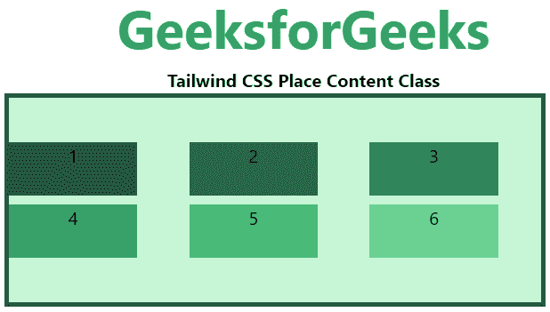
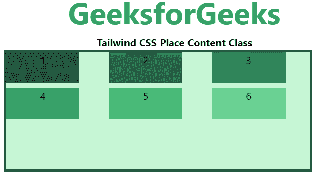
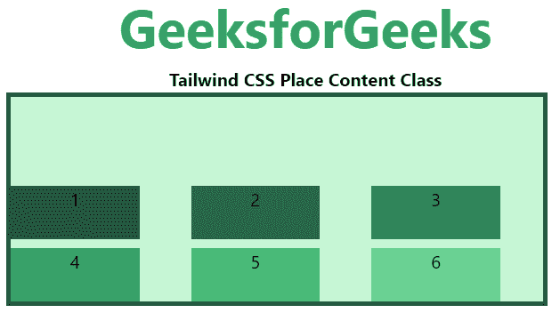
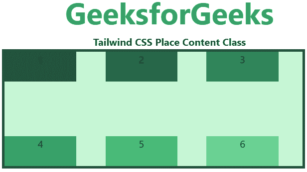
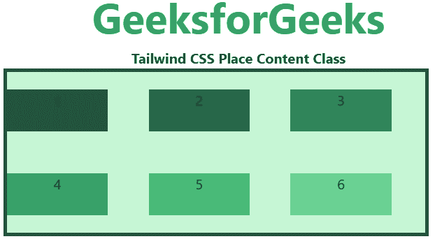
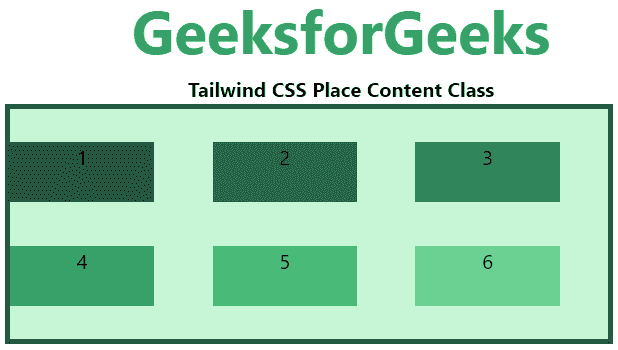
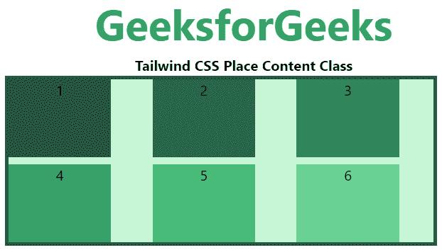

# 顺风 CSS 放置内容

> 原文:[https://www.geeksforgeeks.org/tailwind-css-place-content/](https://www.geeksforgeeks.org/tailwind-css-place-content/)

这个类接受[顺风 CSS](https://www.geeksforgeeks.org/css-tailwind-introduction/) 中的很多值。它是 [CSS Place Content 属性](https://www.geeksforgeeks.org/css-place-content-property/)的替代物。此类用于控制内容如何同时对齐和对齐。在一个类中设置多个属性值。这里*位置内容*类可以保存*对齐内容*和*对齐内容*类的值。

**放置内容类:**

*   地点-内容-中心
*   地点-内容-开始
*   地点-内容-结束
*   中间位置-内容
*   地点-内容-周围
*   位置-内容-均匀
*   放置-内容-拉伸

**放置-内容-中心:**这个类将伸缩项对齐在容器的中心。

**语法:**

```html
<element class="place-content-center">...</element>
```

**示例:**

## 超文本标记语言

```html
<!DOCTYPE html> 
<head> 
    <link href=
"https://unpkg.com/tailwindcss@^1.0/dist/tailwind.min.css" 
          rel="stylesheet"> 
</head> 

<body class="text-center"> 
    <h1 class="text-green-600 text-5xl font-bold">
        GeeksforGeeks
    </h1> 
    <b>Tailwind CSS Place Content Class</b> 
    <div id="main" class="ml-24 h-48 w-2/3 grid grid-cols-3 gap-2 
                          place-content-center 
                          h-48 bg-green-200 border-solid border-4 
                          border-green-900"> 
        <div class="bg-green-900 w-3/4 h-12">1</div>
        <div class="bg-green-800 w-3/4 h-12">2</div>
        <div class="bg-green-700 w-3/4 h-12">3</div>
        <div class="bg-green-600 w-3/4 h-12">4</div>
        <div class="bg-green-500 w-3/4 h-12">5</div>
        <div class="bg-green-400 w-3/4 h-12">6</div>
    </div> 
</body> 

</html>
```

**输出:**



**place-content-start:** 这个类在容器的开头对齐 flex 项。

**语法:**

```html
<element class="place-content-start">...</element>
```

**示例:**

## 超文本标记语言

```html
<!DOCTYPE html> 
<head> 
    <link href=
"https://unpkg.com/tailwindcss@^1.0/dist/tailwind.min.css" 
          rel="stylesheet"> 
</head> 

<body class="text-center"> 
    <h1 class="text-green-600 text-5xl font-bold">
        GeeksforGeeks
    </h1> 
    <b>Tailwind CSS Place Content Class</b> 
    <div id="main" class="ml-24 h-48 w-2/3 grid grid-cols-3 gap-2 
                          place-content-start 
                          h-48 bg-green-200 border-solid border-4 
                          border-green-900"> 
        <div class="bg-green-900 w-3/4 h-12">1</div>
        <div class="bg-green-800 w-3/4 h-12">2</div>
        <div class="bg-green-700 w-3/4 h-12">3</div>
        <div class="bg-green-600 w-3/4 h-12">4</div>
        <div class="bg-green-500 w-3/4 h-12">5</div>
        <div class="bg-green-400 w-3/4 h-12">6</div>
    </div> 
</body> 

</html>
```

**输出:**



**place-content-end:** 这个类在容器的末尾对齐 flex 项。

**语法:**

```html
<element class="place-content-end">...</element>
```

**示例:**

## 超文本标记语言

```html
<!DOCTYPE html> 
<head> 
    <link href=
"https://unpkg.com/tailwindcss@^1.0/dist/tailwind.min.css" 
          rel="stylesheet"> 
</head> 

<body class="text-center"> 
    <h1 class="text-green-600 text-5xl font-bold">
        GeeksforGeeks
    </h1> 
    <b>Tailwind CSS Place Content Class</b> 
    <div id="main" class="ml-24 h-48 w-2/3 grid grid-cols-3 gap-2 
                          place-content-end 
                          h-48 bg-green-200 border-solid border-4 
                          border-green-900"> 
        <div class="bg-green-900 w-3/4 h-12">1</div>
        <div class="bg-green-800 w-3/4 h-12">2</div>
        <div class="bg-green-700 w-3/4 h-12">3</div>
        <div class="bg-green-600 w-3/4 h-12">4</div>
        <div class="bg-green-500 w-3/4 h-12">5</div>
        <div class="bg-green-400 w-3/4 h-12">6</div>
    </div> 
</body> 

</html>
```

**输出:**



**place-content-between:** 这个类分配柔线空间，它们之间的空间相等。

**语法:**

```html
<element class="place-content-between">...</element>
```

**示例:**

## 超文本标记语言

```html
<!DOCTYPE html> 
<head> 
    <link href=
"https://unpkg.com/tailwindcss@^1.0/dist/tailwind.min.css" 
          rel="stylesheet"> 
</head> 

<body class="text-center"> 
    <h1 class="text-green-600 text-5xl font-bold">
        GeeksforGeeks
    </h1> 
    <b>Tailwind CSS Place Content Class</b> 
    <div id="main" class="ml-24 h-48 w-2/3 grid grid-cols-3 gap-2 
                          place-content-between 
                          h-48 bg-green-200 border-solid border-4 
                          border-green-900"> 
        <div class="bg-green-900 w-3/4 h-12">1</div>
        <div class="bg-green-800 w-3/4 h-12">2</div>
        <div class="bg-green-700 w-3/4 h-12">3</div>
        <div class="bg-green-600 w-3/4 h-12">4</div>
        <div class="bg-green-500 w-3/4 h-12">5</div>
        <div class="bg-green-400 w-3/4 h-12">6</div>
    </div> 
</body> 

</html>
```

**输出:**



**环绕放置内容:**该类在伸缩线周围平均分配空间。

**语法:**

```html
<element class="place-content-around">...</element>
```

**示例:**

## 超文本标记语言

```html
<!DOCTYPE html> 
<head> 
    <link href=
"https://unpkg.com/tailwindcss@^1.0/dist/tailwind.min.css" 
          rel="stylesheet"> 
</head> 

<body class="text-center"> 
    <h1 class="text-green-600 text-5xl font-bold">
        GeeksforGeeks
    </h1> 
    <b>Tailwind CSS Place Content Class</b> 
    <div id="main" class="ml-24 h-48 w-2/3 grid grid-cols-3 gap-2 
                          place-content-around 
                          h-48 bg-green-200 border-solid border-4 
                          border-green-900"> 
        <div class="bg-green-900 w-3/4 h-12">1</div>
        <div class="bg-green-800 w-3/4 h-12">2</div>
        <div class="bg-green-700 w-3/4 h-12">3</div>
        <div class="bg-green-600 w-3/4 h-12">4</div>
        <div class="bg-green-500 w-3/4 h-12">5</div>
        <div class="bg-green-400 w-3/4 h-12">6</div>
    </div> 
</body> 

</html>
```

**输出:**



**位置-内容-均匀:**这个类定义了它们之间具有相等间距的位置，但是与角的间距不同。

**语法:**

```html
<element class="place-content-evenly">...</element>
```

**示例:**

## 超文本标记语言

```html
<!DOCTYPE html> 
<head> 
    <link href=
"https://unpkg.com/tailwindcss@^1.0/dist/tailwind.min.css" 
          rel="stylesheet"> 
</head> 

<body class="text-center"> 
    <h1 class="text-green-600 text-5xl font-bold">
        GeeksforGeeks
    </h1> 
    <b>Tailwind CSS Place Content Class</b> 
    <div id="main" class="ml-24 h-48 w-2/3 grid grid-cols-3 gap-2 
                          place-content-evenly 
                          h-48 bg-green-200 border-solid border-4 
                          border-green-900"> 
        <div class="bg-green-900 w-3/4 h-12">1</div>
        <div class="bg-green-800 w-3/4 h-12">2</div>
        <div class="bg-green-700 w-3/4 h-12">3</div>
        <div class="bg-green-600 w-3/4 h-12">4</div>
        <div class="bg-green-500 w-3/4 h-12">5</div>
        <div class="bg-green-400 w-3/4 h-12">6</div>
    </div> 
</body> 

</html>
```

**输出:**



**place-content-stretch:** 这个类定义了被拉伸以占据 flex 容器剩余空间的线。这是默认值。

**语法:**

```html
<element class="place-content-evenly">...</element>
```

**示例:**

## 超文本标记语言

```html
<!DOCTYPE html> 
<head> 
    <link href=
"https://unpkg.com/tailwindcss@^1.0/dist/tailwind.min.css" 
          rel="stylesheet"> 
</head> 

<body class="text-center"> 
    <h1 class="text-green-600 text-5xl font-bold">
        GeeksforGeeks
    </h1> 
    <b>Tailwind CSS Place Content Class</b> 
    <div id="main" class="ml-24 h-48 w-2/3 grid grid-cols-3 gap-2 
                          place-content-stretch 
                          h-48 bg-green-200 border-solid border-4 
                          border-green-900"> 
        <div class="bg-green-900 w-3/4">1</div>
        <div class="bg-green-800 w-3/4">2</div>
        <div class="bg-green-700 w-3/4">3</div>
        <div class="bg-green-600 w-3/4">4</div>
        <div class="bg-green-500 w-3/4">5</div>
        <div class="bg-green-400 w-3/4">6</div>
    </div> 
</body> 

</html>
```

**输出:**

