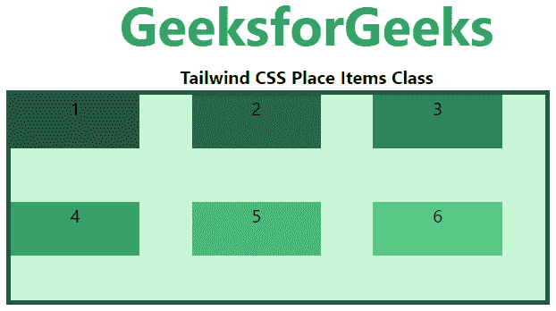
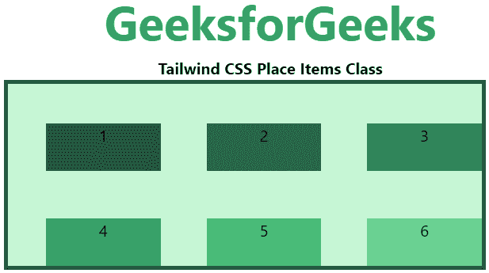
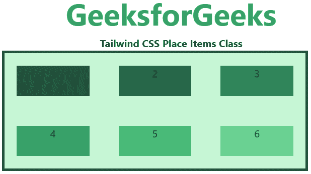
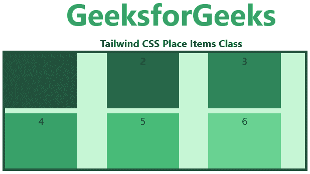

# 顺风 CSS 放置物品

> 原文:[https://www.geeksforgeeks.org/tailwind-css-place-items/](https://www.geeksforgeeks.org/tailwind-css-place-items/)

这个类接受[顺风 CSS](https://www.geeksforgeeks.org/css-tailwind-introduction/) 中的很多值。它是 [CSS 放置物品属性](https://www.geeksforgeeks.org/css-place-items-property/)的替代物。此类用于控制同时对齐和对齐项目的方式。因此*放置物品*类可以保存*对齐物品*和*对齐物品*类的值。

**放置物品类别:**

*   自动放置物品
*   地点-项目-开始
*   放置项目结束
*   放置-物品-中心
*   放置-物品-拉伸

**放置-项目-自动:**如果项目没有父项目，则使用该类定义绝对定位。

**语法:**

```css
<element class="place-items-auto">...</element>
```

**示例:**

## 超文本标记语言

```css
<!DOCTYPE html> 
<head> 
    <link href=
"https://unpkg.com/tailwindcss@^1.0/dist/tailwind.min.css" 
          rel="stylesheet"> 
</head> 

<body class="text-center"> 
    <h1 class="text-green-600 text-5xl font-bold">
        GeeksforGeeks
    </h1> 
    <b>Tailwind CSS Place Items Class</b> 
    <div id="main" class="ml-24 h-48 w-2/3 grid grid-cols-3 gap-2 
                          place-items-auto 
                          h-48 bg-green-200 border-solid border-4 
                          border-green-900"> 
        <div class="bg-green-900 w-3/4 h-12">1</div>
        <div class="bg-green-800 w-3/4 h-12">2</div>
        <div class="bg-green-700 w-3/4 h-12">3</div>
        <div class="bg-green-600 w-3/4 h-12">4</div>
        <div class="bg-green-500 w-3/4 h-12">5</div>
        <div class="bg-green-400 w-3/4 h-12">6</div>
    </div> 
</body> 

</html>
```

**输出:**



**放置-物品-开始:**该类显示柔性容器开始处的行。

**语法:**

```css
<element class="place-items-start">...</element>
```

**示例:**

## 超文本标记语言

```css
<!DOCTYPE html> 
<head> 
    <link href=
"https://unpkg.com/tailwindcss@^1.0/dist/tailwind.min.css" 
          rel="stylesheet"> 
</head> 

<body class="text-center"> 
    <h1 class="text-green-600 text-5xl font-bold">
        GeeksforGeeks
    </h1> 
    <b>Tailwind CSS Place Items Class</b> 
    <div id="main" class="ml-24 h-48 w-2/3 grid grid-cols-3 gap-2 
                          place-items-start 
                          h-48 bg-green-200 border-solid border-4 
                          border-green-900"> 
        <div class="bg-green-900 w-3/4 h-12">1</div>
        <div class="bg-green-800 w-3/4 h-12">2</div>
        <div class="bg-green-700 w-3/4 h-12">3</div>
        <div class="bg-green-600 w-3/4 h-12">4</div>
        <div class="bg-green-500 w-3/4 h-12">5</div>
        <div class="bg-green-400 w-3/4 h-12">6</div>
    </div> 
</body> 

</html>
```

**输出:**


**放置-物品-结束:**该类显示柔性容器末端的柔性线。

**语法:**

```css
<element class="place-items-end">...</element>
```

**示例:**

## 超文本标记语言

```css
<!DOCTYPE html> 
<head> 
    <link href=
"https://unpkg.com/tailwindcss@^1.0/dist/tailwind.min.css" 
          rel="stylesheet"> 
</head> 

<body class="text-center"> 
    <h1 class="text-green-600 text-5xl font-bold">
        GeeksforGeeks
    </h1> 
    <b>Tailwind CSS Place Items Class</b> 
    <div id="main" class="ml-24 h-48 w-2/3 grid grid-cols-3 gap-2 
                          place-items-end 
                          h-48 bg-green-200 border-solid border-4 
                          border-green-900"> 
        <div class="bg-green-900 w-3/4 h-12">1</div>
        <div class="bg-green-800 w-3/4 h-12">2</div>
        <div class="bg-green-700 w-3/4 h-12">3</div>
        <div class="bg-green-600 w-3/4 h-12">4</div>
        <div class="bg-green-500 w-3/4 h-12">5</div>
        <div class="bg-green-400 w-3/4 h-12">6</div>
    </div> 
</body> 

</html>
```

**输出:**



**放置-物品-中心:**这个类将伸缩物品排列在容器的中心。

**语法:**

```css
<element class="place-items-center">...</element>
```

**示例:**

## 超文本标记语言

```css
<!DOCTYPE html> 
<head> 
    <link href=
"https://unpkg.com/tailwindcss@^1.0/dist/tailwind.min.css" 
          rel="stylesheet"> 
</head> 

<body class="text-center"> 
    <h1 class="text-green-600 text-5xl font-bold">
        GeeksforGeeks
    </h1> 
    <b>Tailwind CSS Place Items Class</b> 
    <div id="main" class="ml-24 h-48 w-2/3 grid grid-cols-3 gap-2 
                          place-items-center 
                          h-48 bg-green-200 border-solid border-4 
                          border-green-900"> 
        <div class="bg-green-900 w-3/4 h-12">1</div>
        <div class="bg-green-800 w-3/4 h-12">2</div>
        <div class="bg-green-700 w-3/4 h-12">3</div>
        <div class="bg-green-600 w-3/4 h-12">4</div>
        <div class="bg-green-500 w-3/4 h-12">5</div>
        <div class="bg-green-400 w-3/4 h-12">6</div>
    </div> 
</body> 

</html>
```

**输出:**



**放置-项目-拉伸:**这个类定义了线被拉伸以占据伸缩容器的剩余空间。这是默认值。

**语法:**

```css
<element class="place-items-stretch">...</element>
```

**示例:**

## 超文本标记语言

```css
<!DOCTYPE html> 
<head> 
    <link href=
"https://unpkg.com/tailwindcss@^1.0/dist/tailwind.min.css" 
          rel="stylesheet"> 
</head> 

<body class="text-center"> 
    <h1 class="text-green-600 text-5xl font-bold">
        GeeksforGeeks
    </h1> 
    <b>Tailwind CSS Place Items Class</b> 
    <div id="main" class="ml-24 h-48 w-2/3 grid grid-cols-3 gap-2 
                          place-items-stretch 
                          h-48 bg-green-200 border-solid border-4 
                          border-green-900"> 
        <div class="bg-green-900 w-3/4">1</div>
        <div class="bg-green-800 w-3/4">2</div>
        <div class="bg-green-700 w-3/4">3</div>
        <div class="bg-green-600 w-3/4">4</div>
        <div class="bg-green-500 w-3/4">5</div>
        <div class="bg-green-400 w-3/4">6</div>
    </div> 
</body> 

</html>
```

**输出:**

