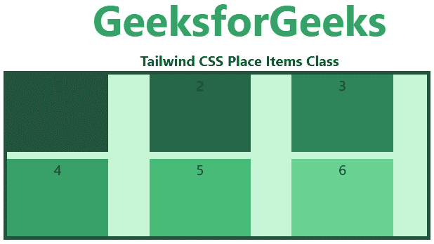

# 顺风 CSS 放置自身

> 原文:[https://www.geeksforgeeks.org/tailwind-css-place-self/](https://www.geeksforgeeks.org/tailwind-css-place-self/)

这个类接受[顺风 CSS](https://www.geeksforgeeks.org/css-tailwind-introduction/) 中的很多值。它是 [CSS 放置物品属性](https://www.geeksforgeeks.org/css-place-self-property/)的替代物。此类用于控制如何同时对齐和对齐单个项目。在这个类中，您可以在一个类中设置多个类值。

**放置自身类:**

*   自动放置
*   地点-自启动
*   自端定位
*   场所自我中心
*   自我伸展

**放置-自动:**如果项目没有父级，则使用该类。此类用于定义项目的绝对位置。

**语法:**

```
<element class="place-self-auto">...</element>
```

**示例:**

## 超文本标记语言

```
<!DOCTYPE html> 
<head> 
    <link href=
"https://unpkg.com/tailwindcss@^1.0/dist/tailwind.min.css" 
          rel="stylesheet"> 
</head> 

<body class="text-center"> 
    <h1 class="text-green-600 text-5xl font-bold">
        GeeksforGeeks
    </h1> 
    <b>Tailwind CSS Place Self Class</b> 
    <div id="main" class="ml-24 h-48 w-2/3 grid grid-cols-3 gap-2 
                          place-items-stretch 
                          h-48 bg-green-200 border-solid border-4 
                          border-green-900"> 
        <div class="bg-green-900 w-3/4">1</div>
        <div class="bg-green-800 place-self-auto w-3/4">2</div>
        <div class="bg-green-700 w-3/4">3</div>
        <div class="bg-green-600 w-3/4">4</div>
        <div class="bg-green-500 w-3/4">5</div>
        <div class="bg-green-400 w-3/4">6</div>
    </div> 
</body> 

</html>
```

**输出:**


**place-self-start:** 这个类用于显示 flex 容器开始处的行。

**语法:**

```
<element class="place-self-start">...</element>
```

**示例:**

## 超文本标记语言

```
<!DOCTYPE html> 
<head> 
    <link href=
"https://unpkg.com/tailwindcss@^1.0/dist/tailwind.min.css" 
          rel="stylesheet"> 
</head> 

<body class="text-center"> 
    <h1 class="text-green-600 text-5xl font-bold">
        GeeksforGeeks
    </h1> 
    <b>Tailwind CSS Place Self Class</b> 
    <div id="main" class="ml-24 h-48 w-2/3 grid grid-cols-3 gap-2 
                          place-items-stretch 
                          h-48 bg-green-200 border-solid border-4 
                          border-green-900"> 
        <div class="bg-green-900 w-3/4">1</div>
        <div class="bg-green-800 place-self-start w-3/4">2</div>
        <div class="bg-green-700 w-3/4">3</div>
        <div class="bg-green-600 w-3/4">4</div>
        <div class="bg-green-500 w-3/4">5</div>
        <div class="bg-green-400 w-3/4">6</div>
    </div> 
</body> 

</html>
```

**输出:**


**place-self-end:** 该类用于显示 flex 容器末端的 flex 线。

**语法:**

```
<element class="place-self-end">...</element>
```

**示例:**

## 超文本标记语言

```
<!DOCTYPE html> 
<head> 
    <link href=
"https://unpkg.com/tailwindcss@^1.0/dist/tailwind.min.css" 
          rel="stylesheet"> 
</head> 

<body class="text-center"> 
    <h1 class="text-green-600 text-5xl font-bold">
        GeeksforGeeks
    </h1> 
    <b>Tailwind CSS Place Self Class</b> 
    <div id="main" class="ml-24 h-48 w-2/3 grid grid-cols-3 gap-2 
                          place-items-stretch 
                          h-48 bg-green-200 border-solid border-4 
                          border-green-900"> 
        <div class="bg-green-900 w-3/4">1</div>
        <div class="bg-green-800 place-self-end w-3/4">2</div>
        <div class="bg-green-700 w-3/4">3</div>
        <div class="bg-green-600 w-3/4">4</div>
        <div class="bg-green-500 w-3/4">5</div>
        <div class="bg-green-400 w-3/4">6</div>
    </div> 
</body> 

</html>
```

**输出:**


**放置-自动居中:**该类用于将柔性物品与容器中心对齐。

**语法:**

```
<element class="place-self-center">...</element>
```

**示例:**

## 超文本标记语言

```
<!DOCTYPE html> 
<head> 
    <link href=
"https://unpkg.com/tailwindcss@^1.0/dist/tailwind.min.css" 
          rel="stylesheet"> 
</head> 

<body class="text-center"> 
    <h1 class="text-green-600 text-5xl font-bold">
        GeeksforGeeks
    </h1> 
    <b>Tailwind CSS Place Self Class</b> 
    <div id="main" class="ml-24 h-48 w-2/3 grid grid-cols-3 gap-2 
                          place-items-stretch 
                          h-48 bg-green-200 border-solid border-4 
                          border-green-900"> 
        <div class="bg-green-900 w-3/4">1</div>
        <div class="bg-green-800 place-self-center w-3/4">2</div>
        <div class="bg-green-700 w-3/4">3</div>
        <div class="bg-green-600 w-3/4">4</div>
        <div class="bg-green-500 w-3/4">5</div>
        <div class="bg-green-400 w-3/4">6</div>
    </div> 
</body> 

</html>
```

**输出:**


**place-self-stretch:** 这个类定义了被拉伸以占据 flex 容器剩余空间的线。这是默认值。

**语法:**

```
<element class="place-self-stretch">...</element>
```

**示例:**

## 超文本标记语言

```
<!DOCTYPE html> 
<head> 
    <link href=
"https://unpkg.com/tailwindcss@^1.0/dist/tailwind.min.css" 
          rel="stylesheet"> 
</head> 

<body class="text-center"> 
    <h1 class="text-green-600 text-5xl font-bold">
        GeeksforGeeks
    </h1> 
    <b>Tailwind CSS Place Self Class</b> 
    <div id="main" class="ml-24 h-48 w-2/3 grid grid-cols-3 gap-2 
                          place-items-stretch 
                          h-48 bg-green-200 border-solid border-4 
                          border-green-900"> 
        <div class="bg-green-900 w-3/4">1</div>
        <div class="bg-green-800 place-self-stretch w-3/4">2</div>
        <div class="bg-green-700 w-3/4">3</div>
        <div class="bg-green-600 w-3/4">4</div>
        <div class="bg-green-500 w-3/4">5</div>
        <div class="bg-green-400 w-3/4">6</div>
    </div> 
</body> 

</html>
```

**输出:**

