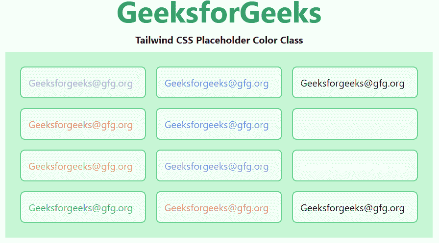

# 顺风 CSS 占位符颜色

> 原文:[https://www . geesforgeks . org/tail wind-CSS-placeholder-color/](https://www.geeksforgeeks.org/tailwind-css-placeholder-color/)

这个类在 [<u>顺风 CSS</u>](https://www.geeksforgeeks.org/css-tailwind-introduction/) 中接受大量的值，其中所有的属性都以类的形式被覆盖。通过使用这个类，我们可以给任何占位符文本着色。在 CSS 中，我们通过使用 [<u>CSS 颜色属性来实现。</u>](https://www.geeksforgeeks.org/css-color-property/)

**占位符颜色类别:**

*   **占位符-透明:**占位符文本颜色将是透明的。
*   **占位符-当前:**占位符文本的颜色将取决于父元素的颜色。
*   **占位符-黑色:**占位符文本颜色将为黑色。
*   **占位符-白色:**占位符文本颜色将为白色。
*   **占位符-灰色-50:** 占位符文本颜色将为灰色。
*   **占位符-红色-50:** 占位符文本颜色将为红色。
*   **占位符-蓝色-50:** 占位符文本颜色将为蓝色。
*   **占位符-indigo-50:** 占位符文本颜色将为 indigo。
*   **占位符-紫色-50:** 占位符文本颜色将为紫色。
*   **占位符-绿色-50:** 占位符文本颜色将为绿色。
*   **占位符-黄色-50:** 占位符文本颜色将为黄色。
*   **占位符-粉色-50:** 占位符文本颜色将为粉色。

**注意:**颜色的值可以根据你的需要在 50-900 之间变化，跨度应该是 100，100 之后。

**语法:**

```html
<element class="placeholder-{color}">...</element>
```

**示例:**本示例涵盖了所有可能的类，可以更改颜色值使其更具对比度或使其更褪色。

## 超文本标记语言

```html
<!DOCTYPE html> 
<head> 
    <link href=
"https://unpkg.com/tailwindcss@^1.0/dist/tailwind.min.css" 
          rel="stylesheet"> 
</head> 

<body class="text-center mx-4 space-y-2"> 
    <h1 class="text-green-600 text-5xl font-bold">
        GeeksforGeeks
    </h1> 
    <b>Tailwind CSS Placeholder Color Class</b> 
    <div class="mx-14 bg-green-200 grid grid-rows-4
                grid-flow-col text-justify p-4">
        <input class="placeholder-gray-500 p-3 m-2 rounded-lg 
                      border-2 border-green-400 bg-green-100" 
               placeholder="Geeksforgeeks@gfg.org">
        <input class="placeholder-red-500 p-3 m-2 rounded-lg 
                      border-2 border-green-400 bg-green-100" 
               placeholder="Geeksforgeeks@gfg.org">
        <input class="placeholder-yellow-500 p-3 m-2 rounded-lg 
                      border-2 border-green-400 bg-green-100" 
               placeholder="Geeksforgeeks@gfg.org">
        <input class="placeholder-green-500 p-3 m-2 rounded-lg 
                      border-2 border-green-400 bg-green-100" 
               placeholder="Geeksforgeeks@gfg.org">
        <input class="placeholder-blue-500 p-3 m-2 rounded-lg 
                      border-2 border-green-400 bg-green-100" 
               placeholder="Geeksforgeeks@gfg.org">
        <input class="placeholder-indigo-500 p-3 m-2 rounded-lg 
                      border-2 border-green-400 bg-green-100" 
               placeholder="Geeksforgeeks@gfg.org">
        <input class="placeholder-purple-500 p-3 m-2 rounded-lg 
                      border-2 border-green-400 bg-green-100" 
               placeholder="Geeksforgeeks@gfg.org">
        <input class="placeholder-pink-500 p-3 m-2 rounded-lg 
                      border-2 border-green-400 bg-green-100" 
               placeholder="Geeksforgeeks@gfg.org">
        <input class="placeholder-current p-3 m-2 rounded-lg 
                      border-2 border-green-400 bg-green-100" 
               placeholder="Geeksforgeeks@gfg.org"> 
        <input class="placeholder-transparent p-3 m-2 rounded-lg 
                      border-2 border-green-400 bg-green-100" 
               placeholder="Geeksforgeeks@gfg.org"> 
        <input class="placeholder-white p-3 m-2 rounded-lg 
                      border-2 border-green-400 bg-green-100" 
               placeholder="Geeksforgeeks@gfg.org"> 
        <input class="placeholder-black p-3 m-2 rounded-lg 
                      border-2 border-green-400 bg-green-100" 
               placeholder="Geeksforgeeks@gfg.org"> 
    </div>
</body> 

</html> 
```

**输出:**



占位符颜色