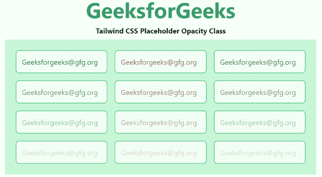

# 泰风 CSS 占位符不透明

> 原文:[https://www . geesforgeks . org/tail wind-CSS-占位符-不透明度/](https://www.geeksforgeeks.org/tailwind-css-placeholder-opacity/)

这个类在[顺风 CSS](https://www.geeksforgeeks.org/css-tailwind-introduction/) 中接受很多值，其中所有的属性都以类的形式被覆盖。通过使用这个类，我们可以设置任何占位符文本的不透明度。在 CSS 中，我们通过使用 [CSS 不透明度属性来实现。](https://www.geeksforgeeks.org/css-opacity-transparency/)

**占位符不透明度类别:**

*   **占位符-不透明度-0:** 使用*占位符-不透明度-{amount}* 实用程序控制元素占位符颜色的不透明度。

**注意:**不透明度的数量可以在 0 到 100 之间变化，跨度为 5。

**语法:**

```css
<element class="placeholder-{opacity}">...</element>
```

**示例:**

## 超文本标记语言

```css
<!DOCTYPE html> 
<head> 
    <link href=
"https://unpkg.com/tailwindcss@^1.0/dist/tailwind.min.css" 
          rel="stylesheet"> 
</head> 

<body class="text-center mx-4 space-y-2"> 
    <h1 class="text-green-600 text-5xl font-bold">
        GeeksforGeeks
    </h1> 
    <b>Tailwind CSS Placeholder Opacity Class</b> 
    <div class="mx-14 bg-green-200 grid grid-rows-4
                grid-flow-col text-justify p-4">
        <input class="placeholder-green-800 p-3 m-2 rounded-lg 
                      placeholder-opacity-100 border-2 
                      border-green-400 bg-green-100" 
               placeholder="Geeksforgeeks@gfg.org">
        <input class="placeholder-green-800 p-3 m-2 rounded-lg 
                      placeholder-opacity-75 border-2 
                      border-green-400 bg-green-100" 
               placeholder="Geeksforgeeks@gfg.org">
        <input class="placeholder-green-800 p-3 m-2 rounded-lg 
                      placeholder-opacity-50 border-2 
                      border-green-400 bg-green-100" 
               placeholder="Geeksforgeeks@gfg.org">
        <input class="placeholder-green-800 p-3 m-2 rounded-lg 
                      placeholder-opacity-25 border-2 
                      border-green-400 bg-green-100" 
               placeholder="Geeksforgeeks@gfg.org">
        <input class="placeholder-yellow-800 p-3 m-2 rounded-lg 
                      placeholder-opacity-100 border-2 
                      border-green-400 bg-green-100" 
               placeholder="Geeksforgeeks@gfg.org">
        <input class="placeholder-yellow-800 p-3 m-2 rounded-lg 
                      placeholder-opacity-75 border-2
                      border-green-400 bg-green-100" 
               placeholder="Geeksforgeeks@gfg.org">
        <input class="placeholder-yellow-800 p-3 m-2 rounded-lg 
                      placeholder-opacity-50 border-2 
                      border-green-400 bg-green-100" 
               placeholder="Geeksforgeeks@gfg.org">
        <input class="placeholder-yellow-800 p-3 m-2 rounded-lg 
                      placeholder-opacity-25 border-2 
                      border-green-400 bg-green-100" 
               placeholder="Geeksforgeeks@gfg.org">
        <input class="placeholder-indigo-800 p-3 m-2 rounded-lg 
                      placeholder-opacity-100 border-2 
                      border-green-400 bg-green-100" 
               placeholder="Geeksforgeeks@gfg.org">
        <input class="placeholder-indigo-800 p-3 m-2 rounded-lg 
                      placeholder-opacity-75 border-2 
                      border-green-400 bg-green-100" 
               placeholder="Geeksforgeeks@gfg.org">
        <input class="placeholder-indigo-800 p-3 m-2 rounded-lg 
                      placeholder-opacity-50 border-2 
                      border-green-400 bg-green-100" 
               placeholder="Geeksforgeeks@gfg.org">
        <input class="placeholder-indigo-800 p-3 m-2 rounded-lg 
                      placeholder-opacity-25 border-2 
                      border-green-400 bg-green-100" 
               placeholder="Geeksforgeeks@gfg.org">

    </div>
</body> 

</html> 
```

**输出:**



占位符不透明度