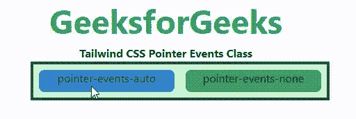

# 顺风 CSS 指针事件

> 原文:[https://www.geeksforgeeks.org/tailwind-css-pointer-events/](https://www.geeksforgeeks.org/tailwind-css-pointer-events/)

这个类在[顺风 CSS](https://www.geeksforgeeks.org/css-tailwind-introduction/) 中接受很多值，其中所有的属性都以类的形式被覆盖。此类用于指定元素是显示给指针事件还是不显示在指针上。在 CSS 中，我们通过使用 [CSS 指针事件属性](https://www.geeksforgeeks.org/css-pointer-events-property/)来实现。

**指针事件类:**

*   **指针事件-无:**此类用于指定元素不对指针事件做出反应。
*   **指针事件-自动:**该类用于指定元素必须对指针事件做出反应。

**语法:**

```
<element class="pointer-events-{behaviour}">...</element>
```

**示例:**

## 超文本标记语言

```
<!DOCTYPE html>
<html>
<head> 
    <link href= 
"https://unpkg.com/tailwindcss@^1.0/dist/tailwind.min.css"
        rel="stylesheet"> 
</head> 

<body class="text-center"> 
    <h1 class="text-green-600 text-5xl font-bold"> 
        GeeksforGeeks 
    </h1> 
    <b>Tailwind CSS Pointer Events Class</b> 
    <div id="main" class="p-2 justify-around ml-32 h-26 w-2/3 flex 
                          items-stretch 
                          bg-green-200 border-solid border-4 
                          border-green-900 gap-4"> 
        <div class="pointer-events-auto bg-blue-600 
                    w-full h-8 rounded-lg">
            pointer-events-auto

        </div> 
        <div class="pointer-events-none bg-green-600 
                    w-full h-8 rounded-lg">
            pointer-events-none

        </div> 
    </div> 
</body> 

</html>
```

**输出:**

