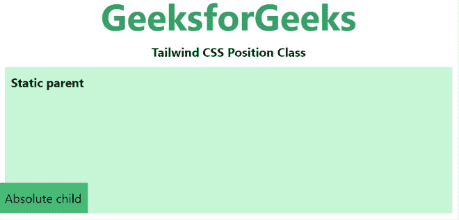
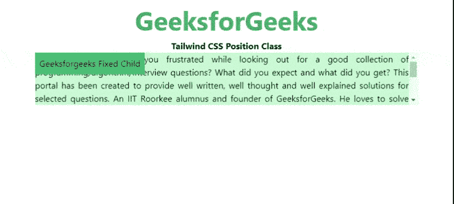
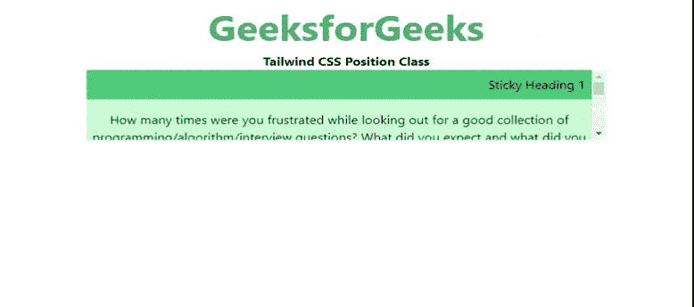

# 顺风 CSS 位置

> 原文:[https://www.geeksforgeeks.org/tailwind-css-position/](https://www.geeksforgeeks.org/tailwind-css-position/)

该类在[顺风 CSS](https://www.geeksforgeeks.org/css-tailwind-introduction/) 中接受多个值。它是 [**CSS 位置属性**](https://www.geeksforgeeks.org/css-positioning-elements/) 的替代品。这个类用于控制元素在 DOM 中的位置。

**位置等级:**

*   静电
*   固定的；不变的
*   绝对的
*   亲戚
*   粘的

**静态:**此类用于根据文档的正常流程设置元素的位置。

**语法:**

```
<element class="static">...</element>
```

**示例:**

## 超文本标记语言

```
<!DOCTYPE html>
<head>
    <link href=
"https://unpkg.com/tailwindcss@^1.0/dist/tailwind.min.css"
          rel="stylesheet">
</head>

<body class="text-center">
<center>
    <h1 class="text-green-600 text-5xl font-bold">
        GeeksforGeeks
    </h1>
    <b>Tailwind CSS Position Class</b>
        <div class="static text-left p-2 m-2 bg-green-200 h-48">       
        <p class="font-bold">Static parent</p>

        <div class="absolute bottom-0 left-0 p-2
                    bg-green-500">

<p>Absolute child</p>

        </div>
    </div>
</center>
</body>

</html>
```

**输出:**



**固定:**该类将定位固定到视口。具有固定位置的元素允许它保持在相同的位置，即使我们滚动页面。我们可以使用顶部、右侧、底部、左侧来设置元素的位置。

**语法:**

```
<element class="fixed">...</element>
```

**示例:**

## 超文本标记语言

```
<!DOCTYPE html>
<head>
    <link href=
"https://unpkg.com/tailwindcss@^1.0/dist/tailwind.min.css"
          rel="stylesheet">
</head>

<body class="text-center">
<center>
    <h1 class="text-green-600 text-5xl font-bold">
        GeeksforGeeks
    </h1>
    <b>Tailwind CSS Position Class</b>
    <div class="overflow-auto bg-green-200
                mx-16 h-24 text-justify">
    <div class="float-right fixed">
        <p class="bg-green-500 p-2">
          Geeksforgeeks Fixed Child
        </p>

    </div>

<p>
        How many times were you frustrated while looking out  
        for a good collection of programming/algorithm/interview 
        questions? What did you expect and what did you get?  
        This portal has been created to provide well written,  
        well thought and well explained solutions for selected  
        questions. An IIT Roorkee alumnus and founder of  
        GeeksforGeeks. He loves to solve programming problems 
        in most efficient ways. Apart from GeeksforGeeks, he  
        has worked with DE Shaw and Co. as a software developer  
        and JIIT Noida as an assistant professor.It is a good  
        platform to learn programming. It is an educational  
        website. Prepare for the Recruitment drive of product  
        based companies like Microsoft, Amazon, Adobe etc with 
        a free online placement preparation course.
      </p>

    </div>
</center>
</body>

</html>
```

**输出:**



**绝对:**此类用于设置文档正常流程之外元素的位置，导致相邻元素的行为就像该元素不存在一样。

**语法:**

```
<element class="absolute">...</element>
```

**示例:**

## 超文本标记语言

```
<!DOCTYPE html>
<head>
    <link href=
"https://unpkg.com/tailwindcss@^1.0/dist/tailwind.min.css"
          rel="stylesheet">
</head>

<body class="text-center">
<center>
    <h1 class="text-green-600 text-5xl font-bold">
        GeeksforGeeks
    </h1>
    <b>Tailwind CSS Position Class</b>
        <div class="static text-left p-2 m-2 bg-green-200 h-48">       
        <p class="font-bold">Static parent</p>

        <div class="absolute bottom-0 left-0 p-2
                    bg-green-500">

<p>Absolute child</p>

        </div>
    </div>
</center>
</body>

</html>
```

**输出:**


**相对:**此类用于设置元素相对于文档正常流程的位置。

**语法:**

```
<element class="relative">...</element>
```

**示例:**

## 超文本标记语言

```
<!DOCTYPE html>
<head>
    <link href=
"https://unpkg.com/tailwindcss@^1.0/dist/tailwind.min.css"
          rel="stylesheet">
</head>

<body class="text-center">
<center>
    <h1 class="text-green-600 text-5xl font-bold">
        GeeksforGeeks
    </h1>
    <b>Tailwind CSS Position Class</b>
    <div class="static text-left p-2 m-2 bg-green-200 h-48">       
        <p class="font-bold">Static parent</p>

        <div class="relative p-2 inline-block
                    bg-green-500">

<p>Relative child</p>

        </div>
        <div class="relative p-2 inline-block
                    bg-green-600">

<p>Relative Sibling child</p>

        </div>
    </div>
</center>
</body>

</html>
```

**输出:**


**sticky:** 这个类用于将元素的位置设置为相对的，直到它越过指定的阈值，然后它将它视为固定的，直到它的父元素离开屏幕。

**语法:**

```
<element class="sticky">...</element>
```

**示例:**

## 超文本标记语言

```
<!DOCTYPE html>
<head>
    <link href=
"https://unpkg.com/tailwindcss@^1.0/dist/tailwind.min.css"
          rel="stylesheet">
</head>

<body class="text-center">
<center>
    <h1 class="text-green-600 text-5xl font-bold">
        GeeksforGeeks
    </h1>
    <b>Tailwind CSS Position Class</b>
    <div class="w-3/4 bg-green-200 h-24 overflow-auto">
    <div>
        <div class="p-2 sticky top-0 bg-green-500 text-right">
            Sticky Heading 1
        </div>
        <p class="py-4">
            How many times were you frustrated while looking out  
            for a good collection of programming/algorithm/interview 
            questions? What did you expect and what did you get?  
            This portal has been created to provide well written,  
            well thought and well explained solutions for selected  
            questions.
        </p>

    </div>
    <div>
        <div class="p-2 sticky top-0 bg-green-500 text-right">
            Sticky Heading 2
        </div>
        <p class="py-4">
            How many times were you frustrated while looking out  
            for a good collection of programming/algorithm/interview 
            questions? What did you expect and what did you get?  
            This portal has been created to provide well written,  
            well thought and well explained solutions for selected  
            questions.
         </p>

    </div>
    <div>
        <div class="p-2 sticky top-0 bg-green-500 text-right">
            Sticky Heading 3
        </div>
        <p class="py-4">
            How many times were you frustrated while looking out  
            for a good collection of programming/algorithm/interview 
            questions? What did you expect and what did you get?  
            This portal has been created to provide well written,  
            well thought and well explained solutions for selected  
            questions.
        </p>

    </div>
    </div>
</center>
</body>

</html>
```

**输出:**

