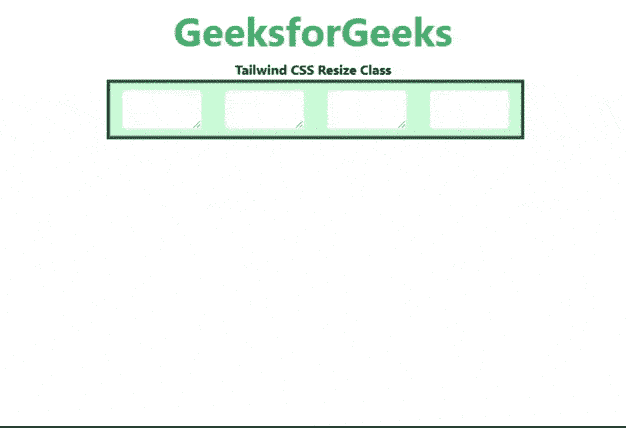

# 顺风 CSS 调整大小

> 原文:[https://www.geeksforgeeks.org/tailwind-css-resize/](https://www.geeksforgeeks.org/tailwind-css-resize/)

这个类在[顺风 CSS](https://www.geeksforgeeks.org/css-tailwind-introduction/) 中接受很多值，其中所有的属性都作为一个类形式被覆盖。这个类用于根据用户需求调整元素的大小。它不适用于内联元素或溢出可见的块元素。在 CSS 中，我们通过使用 [CSS 调整属性](https://www.geeksforgeeks.org/css-resize-property/#:~:text=The%20resize%20property%20in%20CSS,elements%20where%20overflow%20is%20visible.&text=none%3A%20The%20user%20is%20not,It%20is%20a%20default%20value.)来做到这一点。

**调整尺寸**

*   **调整大小-无:**这个类是为了防止一个元素被调整大小。
*   **resize-y:** 这个类是让一个元素可以垂直调整大小。
*   **resize-x:** 这个类是让一个元素可以水平调整大小。
*   **调整大小:**这个类是让一个元素可以水平和垂直调整大小。

**语法:**

```
<element class="pointer-{axis-boolean}">...</element>
```

**示例:**

## 超文本标记语言

```
<!DOCTYPE html>
<html>
<head>
    <link href=
"https://unpkg.com/tailwindcss@^1.0/dist/tailwind.min.css"
        rel="stylesheet">
</head>

<body class="text-center">
    <h1 class="text-green-600 text-5xl font-bold">
        GeeksforGeeks
    </h1>
    <b>Tailwind CSS Resize Class</b>
    <div id="main" class="p-2 justify-around ml-32 h-26 w-2/3 flex
                          items-stretch
                          bg-green-200 border-solid border-4
                          border-green-900 gap-4">
        <textarea class="resize border rounded-md
                         w-24 h-12"></textarea>
        <textarea class="resize-y border rounded-md
                         w-24 h-12"></textarea>
        <textarea class="resize-x border rounded-md
                         w-24 h-12"></textarea>
        <textarea class="resize-none border rounded-md
                         w-24 h-12"></textarea>

    </div>
</body>

</html>
```

**输出:**



顺风 CSS 调整类大小