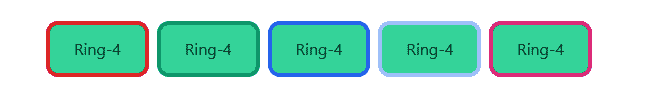

# 顺风 CSS 戒指颜色

> 原文:[https://www.geeksforgeeks.org/tailwind-css-ring-color/](https://www.geeksforgeeks.org/tailwind-css-ring-color/)

这个类在 [<u>顺风 CSS</u>](https://www.geeksforgeeks.org/css-tailwind-introduction/) 中接受大量的值，其中所有的属性都包含在类形式中。通过使用这个类，我们可以给任何戒指上色。在 CSS 中，我们通过使用[<u>CSS Color 属性</u>](https://www.geeksforgeeks.org/css-color-property/) 来实现。

**戒指颜色等级:**

*   **环透明:**环的颜色会是透明的。
*   **环电流:**环颜色将取决于父元素颜色。
*   **戒指-黑色:**戒指颜色将为黑色。
*   **环白:**环色将为白色。
*   **戒指-灰色-50:** 戒指颜色将为灰色。
*   **戒红-50:** 戒色会是红色。
*   **戒蓝-50:** 戒色会是蓝色。
*   **环-靛蓝-50:** 环的颜色会是靛蓝。
*   **戒指-紫色-50:** 戒指颜色会是紫色。
*   **戒指-绿色-50:** 戒指颜色会是绿色。
*   **环黄-50:** 环色将为黄色。
*   **戒指-粉色-50:** 戒指颜色会是粉色。

**注意:**颜色的值可以根据你的需要在 50-900 之间变化，跨度应为 100。

**语法:**

```html
<button class="ring-{color}">...</button >
```

**示例:**

## 超文本标记语言

```html
<!DOCTYPE html>  
<html>  
<head>  
    <link
    href="https://unpkg.com/tailwindcss@^1.0/dist/tailwind.min.css"
    rel="stylesheet">  
</head>  

<body class="text-center"> 
    <div class="mx-16 grid grid-cols-5 gap-4 p-2">
        <button class="ring-4 ring-red-600 bg-green-400 
                       w-full h-12 rounded-lg">
            Ring-4
        </button>
                <button class="ring-4 ring-green-600 bg-green-400 
                       w-full h-12 rounded-lg">
            Ring-4
        </button>
        <button class="ring-4 ring-blue-600 bg-green-400 
                       w-full h-12 rounded-lg">
            Ring-4
        </button>
        <button class="ring-4 ring-yellow-600 bg-green-400 
                       w-full h-12 rounded-lg">
            Ring-4
        </button>
        <button class="ring-4 ring-pink-600 bg-green-400 
                       w-full h-12 rounded-lg">
            Ring-4
        </button>
    </div>
  </body>
</html>
```

**注意:**目前浏览器不支持 Tailwind CSS Ring Color，所以对于输出，我分享一下输出的链接(tailswind CSS 游乐场)

**输出:**



顺风戒指颜色