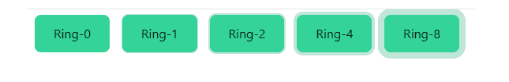

# 泰风 CSS 环不透明

> 原文:[https://www.geeksforgeeks.org/tailwind-css-ring-opacity/](https://www.geeksforgeeks.org/tailwind-css-ring-opacity/)

这个类在[顺风 CSS](https://www.geeksforgeeks.org/css-tailwind-introduction/) 中接受很多值，其中所有的属性都以类的形式被覆盖。通过使用这个类，我们可以设置任何环的不透明度。在 CSS 中，我们通过使用 [CSS 不透明度](https://www.geeksforgeeks.org/css-opacity-function/)属性来实现。

**环形不透明度等级:**

*   **环形不透明度-0:** 使用*环形不透明度-{amount}* 工具控制元素占位符颜色的不透明度。

**注意:**不透明度的数量可以在 0 到 100 之间变化，跨度为 5。

**语法:**

```html
<button class="ring-{opacity}">...</button>
```

**示例:**

## 超文本标记语言

```html
<!DOCTYPE html> 
<html> 
<head> 
    <link
    href="https://unpkg.com/tailwindcss@^1.0/dist/tailwind.min.css"
    rel="stylesheet"> 
</head> 

<body class="text-center"> 
    <h1 class="text-green-600 text-5xl font-bold"> 
    GeeksforGeeks 
    </h1> 
    <b>Tailwind CSS Ring Opacity Class</b> 
    <div class="mx-16 grid grid-cols-5 gap-2  p-2">
        <button class="ring-0 ring-green-600 bg-green-400 
                       ring-opacity-25 w-full h-12 rounded-lg">
            Ring-0
        </button>
        <button class="ring-1 ring-green-600 bg-green-400 
                       ring-opacity-25 w-full h-12 rounded-lg">
            Ring-1
        </button>
        <button class="ring-2 ring-green-600 bg-green-400 
                       ring-opacity-25 w-full h-12 rounded-lg">
            Ring-2
        </button>
        <button class="ring-4 ring-green-600 bg-green-400 
                       ring-opacity-25 w-full h-12 rounded-lg">
            Ring-4
        </button>
        <button class="ring-8 ring-green-600 bg-green-400 
                       ring-opacity-25 w-full h-12 rounded-lg">
            Ring-8
        </button>

    </div>
</body> 
</html>
```

**注意:**目前浏览器不支持 Tailwind CSS Ring Width，所以输出参考输出的链接。(顺风 CSS 游乐场)

**输出:**



环形不透明度

**参考:**T2**https://play.tailwindcss.com/oyrZcKTljL**T5】