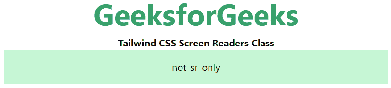

# 顺风 CSS 屏幕阅读器

> 原文:[https://www.geeksforgeeks.org/tailwind-css-screen-readers/](https://www.geeksforgeeks.org/tailwind-css-screen-readers/)

这个类在[顺风 CSS](https://www.geeksforgeeks.org/css-tailwind-introduction/) 中接受很多值，其中所有的属性都以类的形式被覆盖。该类用于提高屏幕阅读器的可访问性。

**屏幕阅读器类:**

*   **sr-only:** 这个类用于隐藏一个元素，而不会对屏幕阅读器隐藏它
*   **非-sr-only:** 这个类是用来撤销 *sr-only* 类效果的。

**语法:**

```css
<svg class="sr-only|not-sr-only">...</svg>
```

**示例:**

## 超文本标记语言

```css
<!DOCTYPE html> 
<html>
<head>     
    <link href= 
    "https://unpkg.com/tailwindcss@^1.0/dist/tailwind.min.css"
    rel="stylesheet"> 
</head> 

<body class="text-center"> 
<center> 
    <h1 class="text-green-600 text-5xl font-bold"> 
        GeeksforGeeks 
    </h1> 
    <b>Tailwind CSS Screen Readers Class</b> 
    <div class="bg-green-200 p-4 mx-16 space-y-4"> 
          <span class="sr-only">sr-only</span>
          <span class="not-sr-only">not-sr-only</span>
    </div> 
</center> 
</body> 

</html>
```

**输出:**



屏幕阅读器