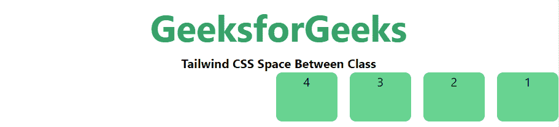

# 顺风 CSS

之间的空间

> 原文:[https://www.geeksforgeeks.org/tailwind-css-space-between/](https://www.geeksforgeeks.org/tailwind-css-space-between/)

这个类在[顺风 CSS](https://www.geeksforgeeks.org/css-tailwind-introduction/) 中接受很多值，其中所有的属性都以类的形式被覆盖。它是 CSS 间距属性的替代。这个类用于控制子元素之间的空间。

**类间间距:**

*   空格-y-0
*   空间-y-反转
*   -空格-y-0
*   空间-x-0
*   空间-x-反向
*   -space-x-0

**注意:**可以用有效的“rem”值更改数字“0”。

**space-y-0:** 这个类用于在 y 轴上执行空间。

**语法:**

```css
<element class="space-y-0">...</element>
```

**示例:**

## 超文本标记语言

```css
<!DOCTYPE html> 
<head> 
    <link href=
"https://unpkg.com/tailwindcss@^1.0/dist/tailwind.min.css" 
          rel="stylesheet"> 
</head> 

<body class="text-center"> 
    <h1 class="text-green-600 text-5xl font-bold">
        GeeksforGeeks
    </h1> 
    <b>Tailwind CSS Space Between Class</b> 
    <div class="mx-4 space-y-4">
        <div class="bg-green-400 h-16 rounded-lg 
                    border-2 border-green-800">1</div>
        <div class="bg-green-400 h-16 rounded-lg 
                    border-2 border-green-800">2</div>
        <div class="bg-green-400 h-16 rounded-lg 
                    border-2 border-green-800">3</div>
        <div class="bg-green-400 h-16 rounded-lg 
                    border-2 border-green-800">4</div>
    </div>
</body> 

</html>
```

**输出:**


**space-y-reverse:** 这个类用于在 y 轴上执行反向间距，但在此之前必须使用 *flex-reverse* 类。

**语法:**

```css
<element class="space-y-reverse">...</element>
```

**示例:**

## 超文本标记语言

```css
<!DOCTYPE html> 
<head> 
    <link href=
"https://unpkg.com/tailwindcss@^1.0/dist/tailwind.min.css" 
          rel="stylesheet"> 
</head> 

<body class="text-center"> 
    <h1 class="text-green-600 text-5xl font-bold">
        GeeksforGeeks
    </h1> 
    <b>Tailwind CSS Space Between Class</b> 
    <div class="mx-4 flex flex-col-reverse space-y-4 
                space-y-reverse">
        <div class="bg-green-400 h-16 rounded-lg">1</div>
        <div class="bg-green-400 h-16 rounded-lg">2</div>
        <div class="bg-green-400 h-16 rounded-lg">3</div>
        <div class="bg-green-400 h-16 rounded-lg">4</div>
    </div>
</body> 

</html>
```

**输出:**


**-space-y-0:** 此类用于 x 轴上的负间距。通过使用这个类，我们可以将一个元素放在另一个元素中。

**语法:**

```css
<element class="-space-y-0">...</element>
```

**示例:**

## 超文本标记语言

```css
<!DOCTYPE html> 
<head> 
    <link href=
"https://unpkg.com/tailwindcss@^1.0/dist/tailwind.min.css" 
          rel="stylesheet"> 
</head> 

<body class="text-center"> 
    <h1 class="text-green-600 text-5xl font-bold">
        GeeksforGeeks
    </h1> 
    <b>Tailwind CSS Space Between Class</b> 
    <div class="mx-4 -space-y-4">
        <div class="bg-green-400 h-16 rounded-lg 
                    border-2 border-green-800">1</div>
        <div class="bg-green-400 h-16 rounded-lg 
                    border-2 border-green-800">2</div>
        <div class="bg-green-400 h-16 rounded-lg 
                    border-2 border-green-800">3</div>
        <div class="bg-green-400 h-16 rounded-lg 
                    border-2 border-green-800">4</div>
    </div>
</body> 

</html>
```

**输出:**


**space-x-0:** 该类用于在 x 轴上执行空间。

**语法:**

```css
<element class="space-y-0">...</element>
```

**示例:**

## 超文本标记语言

```css
<!DOCTYPE html> 
<head> 
    <link href=
"https://unpkg.com/tailwindcss@^1.0/dist/tailwind.min.css" 
          rel="stylesheet"> 
</head> 

<body class="text-center"> 
    <h1 class="text-green-600 text-5xl font-bold">
        GeeksforGeeks
    </h1> 
    <b>Tailwind CSS Space Between Class</b> 
    <div class="ml-48 flex space-x-4">
        <div class="bg-green-400 w-20 h-16 rounded-lg">1</div>
        <div class="bg-green-400 w-20 h-16 rounded-lg">2</div>
        <div class="bg-green-400 w-20 h-16 rounded-lg">3</div>
        <div class="bg-green-400 w-20 h-16 rounded-lg">4</div>
    </div>
</body> 

</html>
```

**输出:**


**space-x-reverse:** 该类用于在 x 轴上执行反向间距，但在此之前必须使用 *flex-reverse* 类。

**语法:**

```css
<element class="space-y-reverse">...</element>
```

**示例:**

## 超文本标记语言

```css
<!DOCTYPE html> 
<head> 
    <link href=
"https://unpkg.com/tailwindcss@^1.0/dist/tailwind.min.css" 
          rel="stylesheet"> 
</head> 

<body class="text-center"> 
    <h1 class="text-green-600 text-5xl font-bold">
        GeeksforGeeks
    </h1> 
    <b>Tailwind CSS Space Between Class</b> 
    <div class="ml-48 flex flex-row-reverse space-x-4 
                space-x-reverse">
        <div class="bg-green-400 w-20 h-16 rounded-lg">1</div>
        <div class="bg-green-400 w-20 h-16 rounded-lg">2</div>
        <div class="bg-green-400 w-20 h-16 rounded-lg">3</div>
        <div class="bg-green-400 w-20 h-16 rounded-lg">4</div>
    </div>
</body> 

</html>
```

**输出:**



**-space-x-0:** 这个类用于 x 轴上的负间距通过使用这个类我们可以将一个元素放在另一个元素里面。

**语法:**

```css
<element class="-space-y-0">...</element>
```

**示例:**

## 超文本标记语言

```css
<!DOCTYPE html> 
<head> 
    <link href=
"https://unpkg.com/tailwindcss@^1.0/dist/tailwind.min.css" 
          rel="stylesheet"> 
</head> 

<body class="text-center"> 
    <h1 class="text-green-600 text-5xl font-bold">
        GeeksforGeeks
    </h1> 
    <b>Tailwind CSS Space Between Class</b> 
    <div class="ml-48 flex -space-x-4">
        <div class="bg-green-400 w-20 h-16 rounded-lg 
                    border-2 border-green-800">1</div>
        <div class="bg-green-400 w-20 h-16 rounded-lg 
                    border-2 border-green-800">2</div>
        <div class="bg-green-400 w-20 h-16 rounded-lg 
                    border-2 border-green-800">3</div>
        <div class="bg-green-400 w-20 h-16 rounded-lg 
                    border-2 border-green-800">4</div>
    </div>
</body> 

</html>
```

**输出:**

